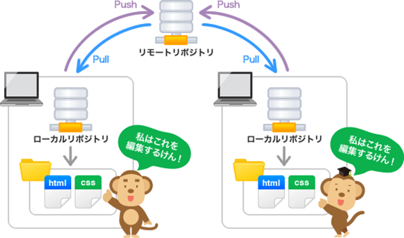
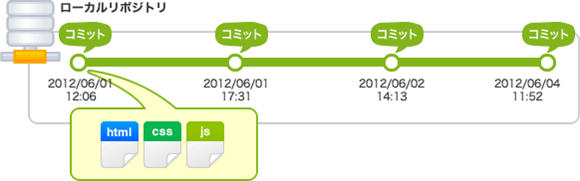
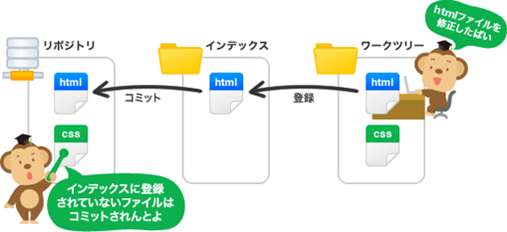
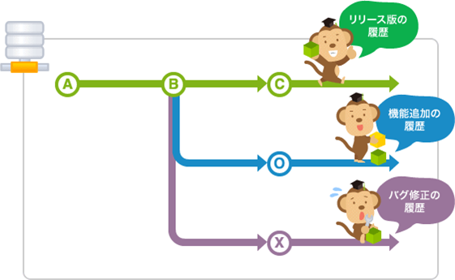
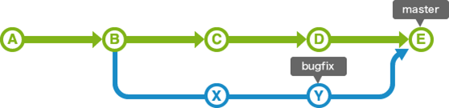
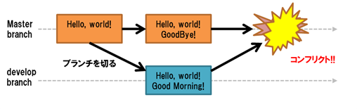

## 1. はじめに

ターミナルとGitについて学びます。

ターミナルは、GitやRuby, Railsと言った開発ツールを使うためには必須のものです。  
開発現場では、絶対に求められる知識なのでここで基礎を覚えておきましょう。  
まずは、全ての開発ツールの基礎となるターミナルを学びましょう。


## 2. ターミナル

Gitや、Ruby, Railsなどの便利なツールを扱うためにはターミナルを学ぶ必要があるので、ターミナルの概要を学び、最低限扱えるようになりましょう。  
ターミナルとは、コマンド(命令文)を用いてコンピュータの操作をおこなうツールです。

## 3. ターミナルのコマンド

当面覚えておけばよいコマンドは、以下のとおりです。  
ここでは、必須コマンドのみ記載しています。  
勉強会中は、当面このコマンドだけ覚えておけばなんとかなります。

### 3-1. pwd(print working directory)
ターミナル上で、現在いるフォルダを表示するコマンドです。

```
$ pwd
```

### 3-2. ls(list segments)
ファイルの一覧を返すコマンドです。

```
$ ls
```

### 3-3. mkdir(make directory)
ディレクトリを新規に作成するコマンドです。  
現在のディレクトリを`カレントディレクトリ`といいます。

```
$ mkdir /tmp/tutorial
```

### 3-4. cd(change directory)

cdコマンドは、現在ディレクトリ(フォルダ)を移動するコマンドです。

**カレントディレクトリから任意のディレクトリに移動**

```
$ cd /tmp/tutorial
$ pwd
/tmp/tutorial
```

**ホームディレクトリに移動**

```
$ cd
$ pwd
/Users/nagakuray
```

**ひとつ上の階層のディレクトリに移動**

`cd ..`で一階層上のディレクトリに戻れます。

```
$ pwd
/tmp/tutorial

$ cd ..

$ pwd
/tmp
```

### 3.5 touch
ターミナルでファイルを新規に作成するコマンドです。

```
$ touch /tmp/tutorial/index.html
$ ls /tmp/tutorial
index.html
```

### 3.6 less

ターミナル上でファイル編集せずに参照だけしたい場合は`less`コマンドを使います。

```
$ echo "<title>Hello, Terminal</title>" >> /tmp/tutorial/index.html

$ less /tmp/tutorial/index.html
```

lessが立ち上がっている状態だとqキーを押せば終了できます。  
また、長いファイルだった場合は↑もしくはkで上方向、↓もしくはjで下方向へスクロールできます。


## 4. バージョン管理

ファイルを何度も更新していくなかで、必ず管理したいのがファイルの変更履歴です。ファイルの変更履歴を残せないと、一度保存したものを元に戻すことが難しくなります。
また、チームで開発をするようになると誰がどのファイルを変更したのか管理していかなければ、いつの間にか意図しなかった変更が入り込んでしまう可能性もあります。

ファイルの変更履歴の保存や、開発を円滑に進めるためにも、バージョン管理をしっかりと行う必要があります。


一般的には、ファイルサーバなどで、以下のようなファイル名に日付などを記載してバージョン管理をされている人も多いと思います。

```
index.html
index.html.backup
index.html.backup20160101
index.html.backup20160101_01
index.html.backup20160101_02
```
これがindex.htmlだけであれば、よいですが、ファイル数が増えたりすると、最新バージョンのファイルを探すのに手間がかかったりしてしまいます。


## 5. Gitとは

Gitとは、ソースコードや文書などのファイルの変更履歴を記録・追跡するためのバージョン管理システムです。
Gitのようなバージョン管理システムは、ファイル変更に対して、下記のような情報を付加して変更履歴として記録できます。

`いつ`,`誰が`,`どこを`,`どのように`

Gitはバージョン管理システムの中でも特に使われている世の中のデファクトスタンダードです。
数多くのオープンソースプロジェクトで利用されています。

### 5-1. リポジトリ

バージョン情報（いつ、だれが、どこを、どのように変更）を保存しておく先を`リポジトリ`といいます。

Gitの場合、リポジトリは2種類あります。

* ローカルリポジトリ
* リモートリポジトリ

ローカルリポジトリは、自分のPCやCloud9上で作成するリポジトリのことです。

リモートリポジトリは、チームでのリポジトリ共有やバックアップなどの用途（ほかにも色々ありますが）で利用されます。




[画像出典]サルでもわかるGit入門 バージョン管理を使いこなそう

### 5-2. コミットとプッシュ

Gitでは、1つ1つのバージョンのことを`コミット`といいます。  
1つ1つのコミットには、様々な情報が入っています。  
特に下記5つの情報は重要です。

**[5つの重要な情報]**

* リビジョン（1ega01eaga3323213543eadgapghのようなハッシュ生成された値）
* コミットした人、コミットのタイムスタンプ
* コミットしたときのファイルの内容
* コミットメッセージ
* 1つ前のコミットのリビジョン

リビジョンはコミットのバージョン番号です。コミットを一意に指定するためのIDと思ってください。  
コミットした人やタイムスタンプは、誰が、いつコミットをしたか確認するためのものです。  
コミットメッセージは、コミット時に必須のメッセージであり、どのような変更をコミットするのか、わかるようなメッセージにしなければなりません。  
Gitは、1つ前のコミットのリビジョンを保持しているので、コミットの履歴を遡ることができます。



[画像出典]サルでもわかるGit入門 バージョン管理を使いこなそう


### 5-3. Git開発の流れについて

Gitによる作業の流れは、以下のようになります。

1. ローカルでリポジトリを新規作成する(`git init`)、またはリモートリポジトリからローカルに複製します(`git clone`)。  
**※この作業は初回のみです。**
2. ファイルの作成、編集、削除したりします。
3. ファイルの作成/変更/削除の変更内容を`インデックス`に追加します(`git add`)。
4. インデックスに追加後に、変更内容をローカルリポジトリにコミットします(`git commit*`)。
5. ローカルリポジトリの変更内容をリモートリポジトリへ反映させます(`git push`)。




[画像出典]サルでもわかるGit入門 バージョン管理を使いこなそう

### 5-4. ブランチ

ひとつのプロジェクトから枝分かれさせ、別の作業を行うことを「ブランチを切る」といいます。
ブランチとは、「枝、分岐」といった意味があります。  
Gitのようなバージョン管理システムでブランチを切るというのは、「現行バージョンから枝分かれをさせて機能を開発する」という意味になります。

チームで開発を進めたい場合や、機能別に開発したい場合など、さまざまな側面が起因となり、並行開発する必要があります。このような場合に、ブランチを切ることによって効率的に開発ができます。



[画像出典]サルでもわかるGit入門 バージョン管理を使いこなそう

### 5-5. マージとコンフリクト

**マージ**  
マージとは、あるブランチに別のブランチの内容を取り込むことです。  
例えば、ローカル上で本流ブランチからブランチを切り支流ブランチで追加機能を開発した後、支流ブランチを本流のブランチに統合すると思います。これをマージすると言います。



[画像出典]サルでもわかるGit入門 バージョン管理を使いこなそう


**コンフリクト**  
コンフリクトとは、ファイルの競合を意味します。  
あるブランチと他のブランチが、それぞれファイルの同じ個所を異なる内容で変更してマージするような場合において、マージ機能が「どちらの変更を採用すればいいか判断できない」時に発生します。

このような場合は、コンフリクトが起こった部分をユーザが編集して、再コミットした上でマージする必要があります。



### 5-5. ブランチを用いた開発の流れ
この勉強会では、Railsのアプリケーション開発で新しい機能を開発するたびにブランチを切って開発することになります。 ブランチを用いた開発の流れは以下を想定しています。

1. masterブランチをもとに、ブランチを切る(`git branch 新しいブランチ名`)。
2. 作成したブランチに移動する(`git checkout 新ブランチ名`)。
3. 新ブランチで機能を開発してコミットする(`git add`、`git commit`)。
4. 新ブランチで機能開発が終わったら、元のブランチ(masterブランチなど)に戻る(`git checkout master`)。
5. 元のブランチに、新ブランチの内容を取り込む(`git merge 新ブランチ名`)。

## 6. ローカルGitコマンド

Gitのコマンドは数多くあり、目的に応じて使い分ける必要がありますが、この勉強会では、必要最低限のコマンドに絞って、重要なコマンドのみを記載します。
とりわけ、ローカル環境で利用するGitコマンドは必須ですので、きちんと覚えましょう。

### 6-1. リポジトリを作成する(git init)

`git init`コマンドは、Gitリポジトリを新規に作成するコマンドです。  
利用するタイミングとしては、バージョン管理をしていない既存のプロジェクトや、空の新規リポジトリを作成する際に利用します。

このコマンドは、バージョン管理を行いたいプロジェクト（リポジトリ）のフォルダの一番上位の階層で最初に一度だけ実行します。

```bash
$ cd プロジェクトのディレクトリ
$ git init
```

このコマンドを実行すると、`.git`ディレクトリが作成されます。  
`.git`ディレクトリにコミットの情報などのバージョン管理情報の実体が記録されます。

### 6-2. ファイルやディレクトリをインデックスに登録する(git add)

ワーキングツリーで作成、変更、削除されたファイルもしくはディレクトリの中から、次のコミットに含めたいファイルやディレクトリをインデックスに追加します。

```bash
$ git add ファイルパターン
```

`ファイルパターン`には、ファイル名を指定したり、正規表現で指定したり、ワーキングツリーで更新があったすべてのファイルを指定したりする方法があります。

**ファイル名を指定するパターン**

```bash
$ git add testfile.md
```

**正規表現で指定するパターン**

```bash
$ git add *.md
```
**ワーキングツリーで更新があったすべてのファイルを指定**

```bash
$ git add .
```

筆者の場合は、プロジェクトの雛形を作成した(フレームワークで多くのファイルを生成した)際は、`git add .`を利用し、それ以外の細々とした変更対象のファイルが少ない場合の機能開発のときには、`git add testfile.md`のように個別ファイル名を指定してコミットするようにしています。  
これによって、何が嬉しいかというと、コミット時の変更内容をもとに`git commit`でメッセージを打ち込みやすくなるからです。

### 6-3. ファイルをコミットする(`git commit`)

`git add`コマンドでインデックスに追加されたファイル更新をコミットします。  
以下のコマンドでコミットします。

```bash
$ git commit -m "コミットメッセージ"
```

もし、直前のコミットのメッセージを修正したくなったら、以下のコマンドを使ってメッセージを修正しましょう。

```bash
$ git commit --amend -m "修正コミットメッセージ"
```

### 6-4. コミットを取り消す(`git reset`)

`git reset`コマンドは、過去のコミットを取り消すためのコマンドです。

```$ bash
$ git reset 過去のコミット
```

例えば、直前の直前のコミットを取り消したい場合には、以下のコマンドを実行します。

```bash
$ git reset HEAD^
```

また、オプションも3つほど覚えておくとよいでしょう。  
特性を踏まえて使えるようになるとよいです。

* `git reset --soft 過去のコミット`  
ファイル変更は元に戻らないが、コミットだけが取り消されます。  
それまでのファイル変更は、インデックスに追加されます。

* `git reset --mixed 過去のコミット`  
ファイル変更は元に戻らないが、コミットだけが取り消されます。  
それまでのファイル変更は、ワーキングツリーに追加されます。


* `git reset --hard 過去のコミット`  
ファイル変更も過去に戻り、コミットも取り消されます。  
それまでのコミットは無かったことになります。


### 6-5. リポジトリの状態を確認する(git status)


リポジトリの状態を表示するコマンドです。  
新規追加されたファイルやファイルの一覧を表示できます。  

```bash
$ git status
```

### 6-6. 差分を表示する(git diff)

ファイルの変更差分を見ることができるコマンドです。

```bash
$ git diff
```

`git diff`には様々なオプションが用意されています。

* `git diff`  
ワーキングツリーとインデックスとの差分を表示します。
* `git diff --cached`  
インデックスとHEADとの差分を表示します。
* `git diff HEAD^..HEAD`
直前のコミットと、その更に前のコミットとの差分を表示します。

`HEAD`とは直前のコミットのことです。
`HEAD^`とは、`HEAD`の更に１つ前のコミットのことです。

作業中によく利用する`git diff`の使われ方を以下に示します。

1. ファイルを更新する
2. `git diff`や`git status`で変更を確認する
3. `git add ファイルパターン`で更新ファイルをインデックスに追加する。
4. `git diff --cache`、`git status`でコミットする内容のチェックをする。
5. `git commit -m "コミットメッセージ`でコミットする。


### 6-7. ログを確認する。(git log)
コミットの履歴を見るためのコマンドです。

```bash
$ git log
```

### 6-8. ブランチに関するコマンド(git branch, git checkout)

**ブランチの作成**

```bash
$ git branch ブランチ名
```

**ブランチの移動**

```bash
$ git checkout ブランチ名
```

**ブランチ作成と移動をまとめて行う**

```bash
$ git checkout -b ブランチ名
```

**ブランチの一覧を表示**

```bash
$ git branch
```

ブランチの一覧を表示すると、一覧の中に`* master`などブランチ名の前に*がついているものがあります。これが現在のブランチとなります。

`-a`オプションをつけると、登録したリモートリポジトリを含んだすべてのブランチの一覧を表示できるので、覚えておきましょう。

```bash
$ git branch -a
```

**ブランチを削除する**

```bash
$ git branch -d ブランチ名
```

マージなどの作業後、役割を終えたブランチは、削除してしまうのがよいでしょう。

### 6-9. ブランチを取り込む(git merge)

あるブランチに別のブランチの内容を取り込むためのコマンドです。

```bash
$ git checkout master
$ git merge develop
```

上記の例の場合、現在のブランチは`masterブランチ`です。  
`masterブランチ`に`developブランチ`の変更を取り込んでいます。

_コンフリクトが発生する場合_

masterでファイルの編集作業をしていた場合を考えてみます。

`masterブランチのsample.txt(最初のコミット状態)`

```
Hello, World!
```

次にmasterからdevelopブランチを切って移動します(`git checkout -b develop`)。  
そして、developブランチで同様のファイルを以下のように編集してコミットします。

`developブランチのsample.txt`

```
Hello, World!
Say Hello!!
```

さらに、masterブランチに戻って(`git checkout master`)ファイルを以下のように編集してコミットします。

`masterブランチのsample.txt`

```
Hello, World!
Good Bye!!
```

この状態で`masterブランチ`に`developブランチ`をマージすると、コンフリクトが発生します。

```bash
$ git merge develop
Auto-merging sample.txt
CONFLICT (content): Merge conflict in sample.txt
Automatic merge failed; fix conflicts and then commit the result.
```

_コンフリクトの解消と再マージ_

コンフリクトが発生しているファイルを開くと、以下のようになっています。

```
Hello, World!
<<<<<<< HEAD
Good Bye!!
=======
Say Hello!!
>>>>>>> develop
```

これは、

```
Hello, World!
<<<<<<< HEAD
masterブランチの変更内容
=======
developブランチの変更内容
>>>>>>> develop
```

という形式で表示されています。

コンフリクトを解消するためには、sample.txtをどう直すか決めた上で、編集しないといけません。  
今回の場合は、どちらの変更も採用することにします。

masterブランチでsample.txtを以下のように編集します。

```
Hello, World!
Good Bye!!
Say Hello!!
```

編集後に、`git adder`、`git commit -m "コミットメッセージ"`でマージコンフリクトの解消は完了です。


## 7. リモートGitコマンド

### 7-1. リモートリポジトリからの複製(git clone)

インターネット上などに構築されたアクセス権のあるリポジトリをローカル環境に複製するコマンドです。

```bash
$ git clone リモートリポジトリ
```

リモートリポジトリの接続方式には、以下2種類ありますが、勉強会では、HTTPS方式を採用して接続します。

* HTTPS方式(HTTP含む)  
`git clone https://github.com/ユーザ名(もしくは、グループ名)/リポジトリ名.git`
* SSH方式  
`git clone git@github.com:ユーザ名(もしくはグループ名)/リポジトリ名.git`

### 7-2. リモートリポジトリを操作する(git remote)

**リモートリポジトリを登録する**

ローカルリポジトリにリモートリポジトリを登録するコマンドです。  
登録することによって、はじめて`git pull`, `git push`などのリモートリポジトリと通信できるようになります。

```bash
$ git remote add 登録名 リモートリポジトリ
```

登録名は、以下の慣習に基づいて設定します。

* 自分が管理しているリポジトリ: `origin`とします。
* 他人が管理しているリポジトリ: `upstream`とします。

また、リモートリポジトリには`git clone`と同様に、HTTPS方式とSSH方式があります。
たとえば、HTTPS方式でGithubにある自分が管理しているリモートリポジトリを登録する場合には、以下のコマンドを実行します。

```
$ git remote add origin https://github.com/ユーザ名/リポジトリ名.git
```

初めに一度登録してしまいさえすれば、今後はリモートリポジトリを`origin`や`upstream`として扱えるようになります。


### 7-3. リモートリポジトリへ変更を反映する(git push)

ローカルリポジトリのコミット内容をリモートリポジトリに反映させるコマンドです。

```bash
$ git push 登録名 ブランチ名

# 自分が管理しているリモートリポジトリにローカルのmasterブランチの更新内容を送信する場合の例
$ git push origin master
```

### 7-4. リモートリポジトリの変更を取り込む(git pull)

指定したリモートリポジトリの更新をローカルリポジトリに取り込みマージします。
`git merge`のリモート版のようなものです。

```bash
$ git pull 登録名 ブランチ名
```
最も頻繁に使うコマンドは、以下のようなものです。

```bash
$ git checkout master
$ git pull origin master
```

上の例では、自分が管理していリモートリポジトリのmasterブランチの更新をローカルリポジトリのmasterブランチにマージしています。

これは、非常に大事ですが、  
**プルでもコンフリクトが起こる場合があります。**  

チームで開発をしているケースにおいて、他メンバーがファイルを変更してリモートリポジトリに`git push`した一方で、自分がローカルリポジトリの同じファイルに異なる変更をしてローカルコミットし、そのあとに`git pull`するようなケースです。  
このような場合でも、コンフリクトの対処方法は同じですが、他のメンバと`話し合いで解決`が必要となります。
