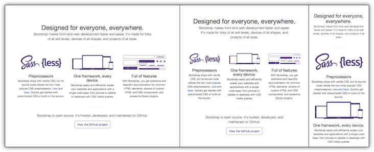

## 1. Bootstrapの基本

## 1-1. Bootstrapとは
BootstrapはTwitterが開発したCSSのフレームワークです。
フレームワークのルールに沿って記述すれば、デザインの知識がなくても効率的に整ったデザインを作成できるようになっています。

また、Bootstrap は、スマートフォンなどのモバイル端末にも対応し、レスポンシブデザインを採用した HTML, CSS, JavaScript フレームワークです。

**公式ページ**  
http://getbootstrap.com/


**対応ブラウザ**  
http://getbootstrap.com/getting-started/#support-browsers


**Mobile Device**

| | Chrome | Firefox | Safari |
|:-----------|:------------|:------------|:------------|
| Android | Supperted | Supported | N/A |
| iOS | Supperted | Supported | Supported |

**Desktop browsers**

| | Chrome | Firefox | Internet Explorer |  Opera | Safari |
|:-----|:------|:-------|:-------|:-------|:-------|
| Mac | Supperted | Supported | N/A |Supported |Supported |
| Windows | Supperted | Supported | Supported |  Supported | Not supported |

Internet Explorer 7以下とFireFox3.6以下はサポートされません。

また、本勉強会では紹介しませんが、競合のCSSフレームワークには、以下のようなものがあります。

* Pure
* Foundation
* Material UI
* Semantic UI
* Web Starter Kit
* Materialize
* Uikit
* Cardinal
* Layers CSS

## 1-2. レスポンシブデザインとは

ユーザのデバイス（パソコン、タブレット、モバイル）に関係なく、同じURLで同じHTMLコードを使っても、画面サイズに応じて（つまり、レスポンシブに）表示を変えることができるデザインです。
レスポンシブデザインの場合、どのデバイスに対しても共通のHTML、CSS、URLを使用するため、例えば、スマホでは表示できるけど、タブレットでは表示エラーが起きるといった事象を避けることができます。

補足ですが、Googleはレスポンシブルデザインを推奨しています。表示エラーが少ないと、ユーザビリティが向上するという点や、Google検索エンジンのクローラーの巡回の手間が少なくなるといった利点があるからです。

Booststrapを使えば、レスポンシブデザインが効率的に実装できます。





## 2. Bootstrapを使う準備

Bootstrapを使うには、BootstrapとjQuery（JavaScriptのライブラリ）を読み込む必要があります。読み込みの方法は以下の2パターンです。今回はCDNから読み込む方法を採用します。

* ソースをダウンロードして、ローカルに配置して読み込む
* インターネット上のキャッシュサーバから読み込む(CDN)

### 2-1. フォルダの作成

Bootstrapの学習に使う用のフォルダをCloud9上で準備します。
サイドバーのファイルツリーの部分を右クリックして「New Folder」クリック、フォルダ名を「bootstrap」として作成します。

### 2-2. ベースのHTMLファイルを用意する

Bootstrapを使うためのサンプルHTMLを用意しておきます。「bootstrap」フォルダを右クリックして「New File」でファイルを新規作成し、ファイル名を`index.html`として、下記コードをコピペしてください。

**index.html**

```html
<!DOCTYPE html>
<html lang="ja">
  <head>
    <meta charset="utf-8">
    <meta http-equiv="X-UA-Compatible" content="IE=edge">
    <meta name="viewport" content="width=device-width, initial-scale=1">
    <title>Bootstrap Sample</title>
    <!-- BootstrapのCSS読み込み -->
    <link rel="stylesheet" href="https://maxcdn.bootstrapcdn.com/bootstrap/3.3.7/css/bootstrap.min.css">
    <!-- jQuery読み込み -->
    <script src="https://ajax.googleapis.com/ajax/libs/jquery/1.11.3/jquery.min.js"></script>
    <!-- BootstrapのJS読み込み -->
    <script src="https://maxcdn.bootstrapcdn.com/bootstrap/3.3.7/js/bootstrap.min.js"></script>
  </head>
  <body>
    <h1>Hello, world!</h1>
    <!-- この下にコードをどんどん追加していきます。 -->
  </body>
</html>
```

**コードの解説**

```html
<meta http-equiv="X-UA-Compatible" content="IE=edge">
```
InternetExplorerのブラウザではバージョン毎に異なるレンダリングがされてしまって崩れることがあるので、互換表示をさせないために設定するmetaタグです。

```html
<meta name="viewport" content="width=device-width, initial-scale=1">
```
レスポンシブ・ウェブデザインにするために必要なmetaタグです。

```html
<!-- BootstrapのCSS読み込み -->
<link rel="stylesheet" href="https://maxcdn.bootstrapcdn.com/bootstrap/3.3.7/css/bootstrap.min.css">
<!-- jQuery読み込み -->
<script src="https://ajax.googleapis.com/ajax/libs/jquery/1.11.3/jquery.min.js"></script>
<!-- BootstrapのJS読み込み -->
<script src="https://maxcdn.bootstrapcdn.com/bootstrap/3.3.7/js/bootstrap.min.js"></script>
```

重要なのは、BootstrapのJSより、jQueryを先に読み込むことです。
そうしないとBootstrapのJavaScriptを使う動きが動作しないからです。


## 3. コンテナ

### 3-1. 固定的コンテナ
コンテナはページの基本シートとなる要素です。Bootstrapの各要素をコンテナの中に記述します。
`container`は固定的コンテナを生成します。

コンテナは、ウィンドウの横幅に応じて段階的に横幅が変動します。

* スマートフォンサイズ(768px未満)の場合は全幅  
* タブレットサイズ(768～991px)の場合は750px固定  
* 中型ディスプレイ(992～1199px)の場合は970px固定  
* 大型ディスプレイ(1200px以上)の場合は1170px固定  

となります。コンテナはセンタリングされます。左右には15pxのパディングが付きます。


```html
<div class="container bg-info">
固定的コンテナ
</div>
```

### 3-2. 流動的コンテナ
`container-fluid`は、流動的コンテナを生成します。
ウィンドウの横幅に応じて横幅が変動します。


```html
<div class="container-fluid bg-info">
流動的コンテナ
</div>
```

### 3-3. 固定的コンテナ(container)と流動的コンテナ(container-fluid)の使い分け

**container**

* 固定幅のコンテナ
* コンテナの幅要素は、表示画面に収まるサイズで決められた画面幅(`xs`,`sm`,`md`...)に自動的に調整される。
* 画面の表示幅が崩れないので、作成者が意図した通りのレイアウトでデザインできる。

**container-fluid**

* 可変幅のコンテナ
* コンテナ要素の幅は、常にブラウザの横幅いっぱいに広がって表示される。
* ブラウザの画面全体を使ってコンテナを表示させたい場合に効果的。


## 4. グリッドシステム

### 4-1. グリッド、マルチデバイス対応
Bootstrapでは、コンテナを12個のグリッドに分割してレイアウトを制御します。

**使用ルール**

1. class=”container”か”container-fluid”の中に
2. class=”row”の中に
3. class=”col-{prefix}-{columns}”の形式で
4. {columns}は合計値が12になるように指定


[画像出典] http://getbootstrap.com/css/#grid 


このように col-{prefix}-{columns} の形式で合計値12を振り分けることで、簡単にマルチデバイスに対応したレイアウトを作成できるのがグリッドシステムの特徴となります。

グリッドシステムのprefixの画面サイズの対応表は、以下のとおりになります。


| 対応デバイス| 画面サイズ | prefixの指定方法（*は数値） | prefixの意味 |
|:-----|:------|:-------|:-------|
| デスクトップ | 1200px以上 | col-lg-* | Large |
| デスクトップ | 992px以上、1200px未満 | col-md-* | Medium |
| タブレット | 768px以上、992px未満 | col-sm-* | Small |
| モバイル | 768px以下 | col-xs-* | Xtra Small |


言葉では伝わりづらいので、具体例を見てみましょう。

```html
<div class="container-fluid">
    <div class="row">
        <div class="col-md-2 bg-danger">
            こんちくは
        </div>
        <div class="col-md-8 bg-success">
            こんちくり
        </div>
        <div class="col-md-2 bg-warning">
            こんにちは
        </div>
    </div>
</div>
```

`col-md-*`クラスで指定された`div`要素が3つ並んでいます。 

_ブラウザ幅がmdサイズ以上(992px以上)_

この状態で、`md`のサイズ以上(992px以上）にブラウザ幅を広げると、4グリッド分の横幅を持ったブロック要素が3つ**横並び**に表示されます。


_ブラウザ幅がmdサイズ未満(992px未満)_

一方、`md`のサイズ未満(992px未満)にブラウザ幅を狭めると、通常のブロック要素のように、コンテナ要素の幅全体まで幅を使うようになります。今度は3つの要素が**縦並び**になりました。


**指定した画面サイズ以上で、指定した幅のグリッドシステムを反映する**という動きが実現できているのがわかります。

Bootstrapでは、このグリッドが適用されるかどうかが切り替わる画面サイズを<u>ブレイクポイント(Breakpoint)</u>と呼んだりするので合わせて覚えておきましょう。

**いかなる時も常にグリッドを使用したい**、という場合は、最小サイズである`xs`を指定することによって、つねにグリッドシステムを使用できます。


### 4-2. オフセット

`col-*-offset-*`を指定することにより、カラムとカラムの間に隙間を開けることができます。下記の例では、5カラムと 6カラムの間に 1カラムの隙間を開けています。


```html
<div class="container-fluid">
  <div class="row">
    <div class="col-xs-5 bg-info">col-xs-5</div>
    <div class="col-xs-offset-1 col-xs-6 bg-success">col-xs-6</div>
  </div>
</div>
```

## 5. テーブル
tableタグでテーブルレイアウト（表組み）を簡単に装飾できます。

**使用ルール**

1. class=”container”の中に
2. table要素に対してclass=”table”をつける

使用ルール1.は必須ではありませんが、固定的コンテナの中で定義するのが一般的なようです。

### 5-1.基本テーブル


```html
<div class="container">
  <table class="table">
    <tr><th>Name</th><th>Age</th></tr>
    <tr><td>Yamada</td><td>16</td></tr>
    <tr><td>Suzuki</td><td>26</td></tr>
    <tr><td>Tanaka</td><td>36</td></tr>
  </table>
</div>
```

### 5-2. ストライプテーブル

1行おきに背景色をつけます。


```html
<div class="container">
  <table class="table table-striped">
    <tr><th>Name</th><th>Age</th></tr>
    <tr><td>Yamada</td><td>16</td></tr>
    <tr><td>Suzuki</td><td>26</td></tr>
    <tr><td>Tanaka</td><td>36</td></tr>
  </table>
</div>
```

### 5-3. ボーダー付きテーブル
テーブルの各セルにボーダーをつけます。


```html
<div class="container">
  <table class="table table-bordered">
    <tr><th>Name</th><th>Age</th></tr>
    <tr><td>Yamada</td><td>16</td></tr>
    <tr><td>Suzuki</td><td>26</td></tr>
    <tr><td>Tanaka</td><td>36</td></tr>
  </table>
</div>
```

### 5-4. ホバーテーブル

htmlテーブルの列にマウスを乗せた際に背景色を変更します。

```html
<div class="container">
  <table class="table table-hover">
    <tr><th>Name</th><th>Age</th></tr>
    <tr><td>Yamada</td><td>16</td></tr>
    <tr><td>Suzuki</td><td>26</td></tr>
    <tr><td>Tanaka</td><td>36</td></tr>
  </table>
</div>
```

### 5-5. コンテキストクラス
`.active`, `success`, `.info`, `.warning`, `.danger`はテーブルの列に状況に応じた色をつけます。


```html
<div class="container">
  <table class="table">
    <tr class="active"><th>Name</th><th>Age</th></tr>
    <tr class="success"><td>Yamada</td><td>16</td></tr>
    <tr class="info"><td>Suzuki</td><td>26</td></tr>
    <tr class="warning"><td>Tanaka</td><td>36</td></tr>
    <tr class="danger"><td>Nagakura</td><td>300</td></tr>
  </table>
</div>
```

### 5-6. レスポンシブルテーブル
`div class="container"` とtable要素の間に `div class="table-responsive"` を追加すると、タブレットやスマホでテーブルが全て表示されない場合にtable要素内にスクロールバーが付きます。

```html
<div class="container">
  <div class="table-responsive">
    <table class="table">
      <tr><th>Name</th><th>Age</th></tr>
      <tr><td>Yamada</td><td>16</td></tr>
      <tr><td>Suzuki</td><td>26</td></tr>
      <tr><td>Tanaka</td><td>36</td></tr>
      <tr><td>Nagakura</td><td>300</td></tr>
    </table>
  </div>
</div>
```

その他の詳しいオプションは公式サイトを確認しましょう。  
http://getbootstrap.com/css/#tables


## 6. ボタン

**使用ルール**

`a要素`、または、`button要素の`classに対して、`"btn btn-{プロパティ}"`を付与付与することによって、ボタンにスタイルを付与できます。

プロパティは、以下を設定できます。

| プロパティ名| 表示 |
|:-----|:------|
| default | 白地に黒文字 |
| primary |青地に白文字 |
| success | 緑地に白文字 |
| info | 水色地に白文字 |
| warning |オレンジ色地に白文字 |
| danger | 赤色地に白文字 |
| link | 白地に青文字 |

### 6-1. サンプル


```html
<div class="container">
  <!-- button要素に記述した例-->
  <div>
    <button class="btn btn-default">Default button1</button>
    <button class="btn btn-primary">Primary button1</button>
    <button class="btn btn-success">Success button1</button>
    <button class="btn btn-info">Info button1</button>
    <button class="btn btn-warning">Warning button1</button>
    <button class="btn btn-danger">Danger button1</button>
    <button class="btn btn-link">Link button1</button>
  </div>
  <hr>
  <!-- a要素に記述した例-->
  <div>
    <a href="#" class="btn btn-default">Default button2</a>
    <a href="#" class="btn btn-primary">Primary button2</a>
    <a href="#" class="btn btn-success">Success button2</a>
    <a href="#" class="btn btn-info">Info button2</a>
    <a href="#" class="btn btn-warning">Warning button2</a>
    <a href="#" class="btn btn-danger">Danger button2</a>
    <a href="#" class="btn btn-link">Link button2</a>
  </div>
</div>
```

### 6-2. ボタンの大きさ
`a要素`、または、`button要素の`classに対して、`"btn-{プロパティ名}"`を追加すると、ボタンの大きさを指定できます。
プロパティ名には、以下があります。

| プロパティ名| ボタンの大きさ |
|:-----|:------|
| lg | Large |
| sm | Small |
| xs | Extra Small |
| なにも指定しない | Default |


```html
<div class="container">
  <button class="btn btn-primary btn-lg">Large</button>
  <button class="btn btn-info btn-lg">Large</button>

  <button class="btn btn-primary">Default</button>
  <button class="btn btn-info">Default</button>

  <button class="btn btn-primary btn-sm">Small</button>
  <button class="btn btn-info btn-sm">Small</button>

  <button class="btn btn-primary btn-xs">Extra-small</button>
  <button class="btn btn-info btn-xs">Extra-small</button>
</div>
```

### 6-3. ブロックボタン
横幅いっぱいのブロックボタンを表示します。
`a要素`、または、`button要素の`classに対して、`"btn-block"`を追加すると、ブロックボタンを指定できます。


```html
<div class="container">
  <button type="button" class="btn btn-primary btn-lg btn-block">Block level button</button>
  <button type="button" class="btn btn-default btn-lg btn-block">Block level button</button>
</div>
```

その他の詳しいオプションは公式サイトを確認しましょう。  
http://getbootstrap.com/css/#buttons


## 7. フォーム

効率的にデザインの整ったフォームが作成できるようになっています。

**使用ルール**

1. formタグの中に
2. class="form-group"を入れて
3. inputタグ、textareaタグ、selectタグにclass="form-control"をつける

### 7-1. 基本フォーム


```html
<div class="container">
  <form>
    <div class="form-group">
      <label for="name">Name</label>
      <input type="text" name="name" class="form-control">
    </div>
    <div class="form-group">
      <label for="description">Description</label>
      <textarea name="description" class="form-control"></textarea>
    </div>
    <div class="form-group">
      <label for="selection">Selection</label>
      <select name="selection" class="form-control">
        <option>selectA</option>
        <option>selectB</option>
      </select>
    </div>
    <input type="button" class="btn btn-primary" value="OK">
  </form>
</div>
```

### 7-2. インラインフォーム
フォームをインラインで並べたい場合は、formタグに`class="form-inline"`を追加します。


```html
<div class="container">
  <form class="form-inline">
    <div class="form-group">
      <label for="name">Name</label>
      <input type="text" name="name" class="form-control">
    </div>
    <div class="form-group">
      <label for="description">Email</label>
      <input name="description" class="form-control"></textarea>
    </div>
    <input type="button" class="btn btn-success" value="Send">
  </form>
</div>
```

### 7-3. 水平フォーム

ラベルと入力欄を垂直に並べるのではなく、水平に並べたい場合は、formタグに`class="form-horizontal"`を付けます。


```html
<div class="container">
  <form class="form-horizontal">
    <div class="form-group">
      <label for="name" class="col-sm-1">Name</label>
      <div class="col-sm-11">
        <input type="text" name="name" class="form-control col-sm-10">
      </div>
    </div>
    <div class="form-group">
      <label for="description" class="col-sm-1">Email</label>
      <div class="col-sm-11">
        <input name="description" class="form-control col-sm-10"></textarea>
      </div>
    </div>
    <input type="button" class="btn btn-primary" value="Send">
  </form>
</div>
```

その他の詳しいオプションは公式サイトを確認しましょう。  
http://getbootstrap.com/css/#forms


## 8. 演習

「とってもあやしい会社」の「人生のお悩みに関する相談」ページを完成させましょう。  
以下のコードをコピーし、`TODO`の部分をコーディングしてください。

`navbar`、`glyphicons`、`panels`については、上で説明していませんが、Bootstrapのサイトを確認しておいてください。

**design.html**

```html
<!DOCTYPE html>
<html lang="ja">
  <head>
    <meta charset="utf-8">
    <meta http-equiv="X-UA-Compatible" content="IE=edge">
    <meta name="viewport" content="width=device-width, initial-scale=1">
    <title>Bootstrap Sample</title>
    <!-- BootstrapのCSS読み込み -->
    <link rel="stylesheet" href="https://maxcdn.bootstrapcdn.com/bootstrap/3.3.7/css/bootstrap.min.css">
    <!-- jQuery読み込み -->
    <script src="https://ajax.googleapis.com/ajax/libs/jquery/1.11.3/jquery.min.js"></script>
    <!-- BootstrapのJS読み込み -->
    <script src="https://maxcdn.bootstrapcdn.com/bootstrap/3.3.7/js/bootstrap.min.js"></script>

    <script src="https://use.fontawesome.com/ae5cdfa3ca.js"></script>

    <style>
      .icon .glyphicon{
        font-size: 50px;
        margin-top: 15px;
      }

      .copyright {
        padding: 20px 0;
        font-size: 12px;
        text-align: center;
        color: #666;
      }


    </style>
  </head>
  <body>

    <header>
      <nav class="navbar navbar-inverse">
        <div class="container-fluid">
          <div class="navbar-header">
            <button type="button" class="navbar-toggle collapsed" data-toggle="collapse" data-target="#site-menu">
              <span class="sr-only">Toggle navigation</span>
              <span class="icon-bar"></span>
              <span class="icon-bar"></span>
              <span class="icon-bar"></span>
            </button>
            <a class="navbar-brand" href="#">とってもあやしい会社</a>
          </div>
          <div class="collapse navbar-collapse" id="site-menu">
            <ul class="nav navbar-nav navbar-right">
              <li><a href="#">会社情報</a></li>
              <li><a href="#">事業情報</a></li>
              <li class="active"><a href="#">人生のお悩みに関する相談</a></li>
              <li class="dropdown">
                <a href="#" class="dropdown-toggle" data-toggle="dropdown" role="button" aria-expanded="false">
                  カウンセラーの募集
                  <span class="caret"></span>
                </a>
                <ul class="dropdown-menu" role="menu">
                  <li><a href="#">新卒採用</a></li>
                  <li><a href="#">キャリア採用</a></li>
                  <li><a href="#">スタッフ採用</a></li>
                </ul>
              </li>
            </ul>
          </div>

        </div>
      </nav>
    </header>
    

    <div class="container">
      <div class="page-header">
        <h1>人生のお悩みに関する相談</h1>
      </div>

      <div class="row">
        <div class="icon col-sm-2 hidden-xs">
          <!-- <i class="fa fa-phone-square" aria-hidden="true"></i> -->
          <span class="glyphicon glyphicon-earphone"></span>
        </div>
        <div class="col-sm-10">
          <h2>お電話による相談</h2>
          <p>該当する内容の電話番号におかけください。</p>
          <div>
            <table class="table table-striped table-bordered">
              <thead>
                <tr>
                  <th>内容</th>
                  <th>電話番号</th>
                  <th>担当</th>
                </tr>
              </thead>
              <tbody>
                <tr>
                  <td>セクシャルハラスメントに関する相談</td>
                  <td>090-xxxx-xxxx</td>
                  <td>セクハラ太郎</td>
                </tr>
                <tr>
                  <td>モラルハラスメントに関する相談</td>
                  <td>090-xxxx-xxxx</td>
                  <td>モラル万次郎</td>
                </tr>
                <tr>
                  <td>パワーハラスメントに関する相談</td>
                  <td>090-xxxx-xxxx</td>
                  <td>パワ腹すかし子</td>
                </tr>
                <tr>
                  <td>借金支払いに関する相談</td>
                  <td>080-xxxx-xxxx</td>
                  <td>一文無し花子</td>
                </tr>
                <tr>
                  <td>どうしようもない相談</td>
                  <td>070-xxxx-xxxx</td>
                  <td>とにかく明るい森山</td>
                </tr>
              </tbody> 
            </table>
          </div>

          <div class="panel panel-success">
            <div class="panel-heading">
              <h3 class="panel-title">営業時間</h3>
            </div>
            <div class="panel-body">
              平日23時〜30時（土日・祝日は対応しておりません）
            </div>
          </div>

        </div>

      </div>

      <hr>

      <div class="row">
        <div class="icon col-sm-2 hidden-xs">
          <span class="glyphicon glyphicon-home"></span>
        </div>

        <div class="col-sm-10">
          <h2>カウンセラー訪問による相談</h2>
          <p>カウンセラーが直接ご家庭まで訪問いたしますので、必要事項を記入の上、送信ボタンを押してください。</p>
          <!-- TODO フォームを自分で作ってみる -->
          <!-- 必要なフォーマットを自分で考えてつくってみましょう。  -->
        </div>
      </div>

      <hr>

      <!-- TODO 料金表を作ってみる-->
      <div class="row">
        <div class="icon col-sm-2 hidden-xs">
          <span class="glyphicon glyphicon-yen"></span>
        </div>

        <div class="col-sm-10">
          <h2>料金表</h2>
          <p>お電話による相談とカウンセラー訪問による相談の料金表はこちらになります。</p>

          <!-- TODO 相談に関する料金表を作ってみましょう。-->
          <!-- 必要な表の項目を自分で考えてみましょう。 -->
        </div>
      </div>


    </div>

    <footer>
      <div class="copyright">© 2017 とってもあやしい会社 Inc.</div>
    </footer>

  </body>
</html>
```


