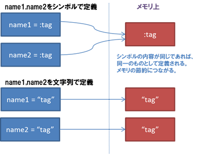

## 1. はじめに

世の中には200種類以上のプログラミング言語があると言われていますが、インターネットが広く普及して以降、Rubyの人気は徐々に上がってきており、プログラミング言語のシェア率で見てもベスト10に入っています。

Rubyは、まつもとゆきひろ氏により開発されたオブジェクト指向スクリプト言語です。

CやJavaといったコンパイラ言語は、プログラムを実行するためにはコンパイルという手続き（人間が書いたソースコードを機械命令に変換）を介して初めて実行ができます。
しかし、スクリプト言語はこう言った手続きが一切不要で、そのまま実行することができるため、コンパイラ言語に比べてプログラミングを手軽に行うことができます。

また、オブジェクト指向言語なので、すべてのデータがオブジェクトとして表現されています。
つまり継承などといったオブジェクト指向ならではの機能を使うことができます。

Rubyはシンプルでわかりやすい文法でプログラムを書くことができるので、プログラミング初心者におすすめです。

以上のような説明書きはよくインターネットで見ると思います。

実際にプログラミング初心者にとっては、高度なことをしない、小規模なコードがほとんどですので、簡単に書けると思います。

しかし、動的に型付けされる（型がない）ということは、変数がどんな型なのかをすべて把握する、型が異なっていても耐えうる設計・実装が求められます。これはコードの規模が大きくなればなるほど大変になってきます。

プログラミング言語、利用するフレームワークによって適材適所は大きく変わってきます。  
特性を踏まえた上でRubyを利用できるようになるのがよいでしょう。
以下は例です。

* 運用ツール: Ruby, Python..
* DSL(domain-specific language): Ruby, Scala..
* Webアプリ: Ruby, Java, Scala..
* バッチ処理: Java, Scala..


## 2. Rubyを使ってみよう

### 2-1. はじめてのRubyプログラム実行

はじめてのRubyプログラミングです。

Cloud9のターミナルで`practice`ディレクトリを作成して移動しましょう。
そして、`hello.rb`というファイルを作ります。

```bash
$ mkdir practice
$ cd practice
$ touch hello.rb
```

`hello.rb`に以下の内容を記述して保存してください。  
Cloud9のエディタで行ってください。

**hello.rb**

```ruby
puts "Hello, Ruby!"
```

putsの部分は、文字列`"Hello, Ruby!"`を画面に改行して出力するメソッドと呼ばれます。  
上記のプログラムは、以下のようにputsに括弧をつけて書いても動作しますが、慣習的に、`puts`メソッドの場合は括弧をつけません。

```ruby
puts("Hello, Ruby!")
```

実行は、以下のコマンドで実行します。

```bash
$ ruby hello.rb
```

以下のように表示されるはずです。

```bash
Hello, Ruby!
```

ちなみにですが、同様のプログラムをJavaで書くと、以下のようなコードになります。

```java
public class Hello {
    public static void main(String[] args) {
        System.out.println("Hello, Java!");
    }
}
```

簡単なプログラムであれば、Rubyのほうが短く書けることがわかると思います。

### 2-2. REPLでの実行

上記のプログラム程度であれば、わざわざソースコードを作らずとも`対話型環境`で実行できます。この対話型環境のことを`REPL(Read-eval-print loop)`と言いますので覚えておきましょう。ちょっとした検証をしたい時などに非常によく使います。

Rubyには、REPLを使うためのパッケージとしてすでに`irb`がインストールされていますので、早速使ってみましょう。  
コマンドラインに以下のコマンドを打ち込んでください。REPLが起動します。

```bash
$ irb
>
```

`>` 以降の部分に、以下のコードを打ち込んでみましょう。

```ruby
> "Hello, Ruby!"
=> "Hello, Ruby!
```

これ以降は、irbのプロンプトを「`>` 」で記し、実行結果は「`=>` 」の後に掲載しています。
「`>` 」以降の内容を実際にirbに入力していって実行結果を確かめてください。

`irb`の終了は、`exit`を入力してください。

```ruby
> exit
```

**補足 〜 pryによるREPL利用**

`irb`のREPLだと、補完機能やシンタックスが効いておらず、少しやりづらさを感じるかもしれません。REPLには、`pry`を利用することも可能です。pryを使うと、これらが解消されます。  
pryはインストールが必要になるので、以下のようにインストールします。

```bash
$ gem install pry
```

pryの起動は、以下のコマンドです。

```bash
$ pry
>
```

pryの終了は`irb`と同じで`exit`です。

```ruby
> exit
```

### 2-3. 簡単な計算をしてみよう

REPLを起動して簡単な演算をしてみましょう。

まずは、簡単な足し算です。

```ruby
> 1 + 1
=> 2
```

Rubyでは`+`、`-`、`*`、`/`の算術演算子で加減乗除の計算を行うことができます。

```ruby
> 100 * 1.08
=> 108
```

ここで、100は整数、1.08は浮動小数点数（小数点を含む数）で、計算に浮動小数点数が含まれる場合にRubyは自動的に計算結果を浮動小数点数に変換します。

## 2-4. rubyでのコメント

コメントの表記は、パウンド記号（`#`）の後がコメントになるので、動作に影響を与えないメモ書きを書いておくのに便利です。

また複数行一気にコメントにしたい場合には、`=begin`と`=end`で囲みます。

以下は例です。

**comment.rb**

```ruby
# これはコメント行です。

puts "ここはコメント行ではありません。"

=begin
ここから
ここまでコメント行です。
=end
```

実行すると、以下のようになるはずです。

```bash
$ ruby comment.rb
ここはコメント行ではありません。
```

### 2-5. putsメソッドとprintメソッドとpメソッドの違い

`puts`メソッドと似たようなメソッドで`printメソッド`と`pメソッド`があります。  
`puts`メソッドは、改行がつくという特徴があります。  
`print`メソッドは、改行はつきません。  
`p`メソッドは、デバッグ用になります。

デバッグ用とは何かが分かりづらいと思うので、コードを書いて試してみましょう。

**printout.rb**

```ruby
print "Ruby!"
puts "Java!" # +改行
p "Python!" # デバッグ用
```

実行すると、以下の結果が得られるはずです。

```bash
$ ruby printout.rb
Ruby!Java!
"Python!"
```

最後の`"Python"`の部分がダブルコーテションで囲まれています。  
これは、オブジェクトの種類がわかりやすいように表示してくれています。  
上記の例の場合、これは文字列であることがわかるように、ダブルコーテションで囲んで表示してくれているというわけです。

`puts`メソッドと`p`メソッドについては、あらゆるところで頻出しますので、よく理解しておきましょう。

## 3. 変数、定数を使ってみよう  

### 3-1. 変数

変数はデータにつけるラベルのようなものになります。
変数を使うことによって、複雑なデータにわかりやすい名前をつけたり、その名前で計算や使い回しができるようになります。

ただし、名前付けもルールがあるので注意してください。

* 英小文字かアンダーバーで始めないといけない
* Rubyの予約語は利用できない(if,end,case,..)

以下はシンプルは例です。

**variable.rb**

```ruby
# 変数に値を代入する
msg = "Hello, Ruby!"
puts msg

# 変数は書き換えることができる
msg = "Hello, Ruby again!"
puts msg
```

以下は実行結果です。

```bash
$ ruby variable.rb
Hello, Ruby!
Hello, Ruby again!
```

### 3-2. 定数

定数も変数と同じで値につけるラベルです。
ただし、変数と違って、プログラム中で値を書き換えたくないものに対して使います。

ただし、定数の名前の付け方にもルールがあります。

* 最初が英大文字ではないといけない  
慣習的には、全部大文字にすることが多いです。

以下は例です。

**constant.rb**

```ruby
VERSION = 1.0
puts VERSION

VERSION = 1.1
puts VERSION
```

以下は実行結果です。

```bash
$ ruby constant.rb
1.0
constant.rb:4: warning: already initialized constant VERSION
constant.rb:1: warning: previous definition of VERSION was here
1.1
```

最初に1.0と表示されるのですが、その後に警告が出ているのがわかるかと思います。

ただし、Rubyでは警告は出してくれますが、そこで処理が止まるわけではなくて、実際にはこのように値が書き換わって表示されてしまうので、その点に注意しつつ、こういった警告を無視せずにきちんと対処するようにしておいてください。

### 3-3. 変数や定数の文字列埋め込み

以下のように、`#{}`を使って、文字列の中に変数、定数を埋め込むことができるの覚えておきましょう。ありとあらゆるところで頻出します。

```ruby
> lang = "Ruby"
> "Hello, #{lang}!"
=> "Hello, Ruby!"
```

また、以下も埋め込み文字列を扱う上で大事ですので、覚えておきましょう。  
文字列は、「' '」（シングルクオート）と「" "」（ダブルクオート）のいずれかで囲むことができますが、**埋め込み文字列を使用する場合は、「' '」（シングルクオート）ではなく「" "」（ダブルクオート）を使用します**。

## 4. オブジェクトを理解しよう
Rubyでは、文字列、数値、時刻など全てのデータがオブジェクトになっています。  
オブジェクトは日本語にすれば「もの」であり、命令の対象となるデータのことだと考えてください。

`"Hello, Ruby!"`、`"nagakuray"`は**文字列オブジェクト**（あるいは**文字列**）、`1`、`100`、`1.08`は**数値オブジェクト**（あるいは**数値**）と呼ばれます。

オブジェクトととは何か、ということですが、この時点では便利な命令をいろいろ持っているデータ型と思ってください。  
オブジェクトのメソッドを実行するときは、以下のように記述します。

```
オブジェクト.メソッド名
```

irbかpryを起動して試してみましょう。

__文字列オブジェクトの場合の例__

文字列オブジェクトをすべて大文字にする場合

```ruby
> "Nagakuray".upcase
=> "NAGAKURAY"
```

文字列オブジェクトをすべて小文字にする場合

```ruby
> "NAGAKURAY".downcase
=> "nagakuray"
```

文字列オブジェクトを最初の文字だけ大文字にする場合

```ruby
> "nagakuray".capitalize
=> "Nagakuray"
```

__数値オブジェクトの場合の例__

数値オブジェクトを四捨五入する場合

```ruby
> 3.14.round
=> 3
```

数値オブジェクトを文字列に変換する場合

```ruby
> 3.14.to_s
=> "3.14"
```

## 5. !や?がついたメソッドを使おう 

Rubyのメソッドでよく見かけることになる`!`や`?`がついたメソッドについて見ていきます。

### 5-1. !がついたメソッド(破壊的メソッド)

まず、`!`がついたメソッドですが、例えば文字列オブジェクトを大文字にするためのメソッドであるupcaseというものがあります。

これとよく似たメソッドで、`upcase!`というものがあります。

これらの違いですが、`upcase`は文字列を大文字にしたものを返すだけ、`upcase!`は、文字列オブジェクトを大文字にしたものを返しつつ、元の文字列オブジェクトも大文字に書き換えるという違いがあります。

こうした`!`がついたメソッドを元のオブジェクトを書き換えてしまうという意味をもつため、**破壊的メソッド**と呼んだりします。  
名前がカッコイイので覚えやすいとおもいます。

実際に例を見ていきましょう。

```ruby
> # upcaseメソッドを呼び出してもnameオブジェクトは元のまま
> name = "nagakuray"
> name.upcase
=> "NAGAKURAY"
> name
=> "nagakuray"

> # upcase!メソッドを呼ぶと、nameオブジェクトが書き換えられる
> name.upcase!
=> "NAGAKURAY"
> name
=> "NAGAKURAY"
```

破壊的メソッド`upcase!`を使った場合には、元の`name`オブジェクトが書き換えられていることがわかります。

ただし、すべての破壊的メソッドに`!`が付いているわけではありません。  
`!`が付かないメソッドでも破壊的メソッドの場合もあります。  
たとえば、文字列オブジェクトに対する`replace`メソッドは文字を置換しますが、元のオブジェクトを書き換えます。

```ruby
> name = "nagakuray"
> name
=> "nagakuray"

> name.replace("moriyama")
> name
=> "moriyama"
```

`!`がついていない破壊的メソッドを紹介しておきます。覚える必要はないです。  
元のオブジェクトが書き換えられるので、利用時には注意して使いましょう。

**Stringクラスの!が付かない破壊的メソッド**

* insert
* replace
* concat

**Arrayクラスの!が付かない破壊的メソッド**

* push
* concat
* insert
* unshift
* fill
* replace
* delete_at
* delete
* clear
* shift
* pop

**Hashクラスの!が付いてないが破壊的なメソッド**

* delete
* delete_if
* replace
* shift
* update
* clear

### 5-2. ?がついたメソッド(真偽値を返すメソッド)

真偽値は、`true`または、`false`なのですが、条件判定や論理演算に使われるので、慣れておきましょう。  

例えば、文字列オブジェクトが空かどうかを調べたい時には、`empty?`メソッドで調べたりします。`empty?`メソッドの返す値は`true`か`false`です。

```ruby
> name = "nagakuray"
> name.empty?
=> false

> name = ""
> name.empty?
=> true
```

他にも、特定の文字列が含まれているかどうかを調べる`include?`というメソッドもあります。これも真偽値を返すので、メソッド名に`?`が付きます。

```ruby
> # 文字列に'ga'が含まれているかを判定する
> name = "nagakuray"
> name.include?("ga")
=> true

> name = "moriyama"
> name.include?("ga")
=> false
```

ここで注意ですが、Rubyの組み込みメソッドには、基本的に真偽値を返すメソッドには`?`が付いています。
開発者が自分でメソッドを作る場合には、`?`をつけるかどうかは開発者に委ねられます。

以下は例です。
2つのメソッドとして、メソッド名に?が付かないメソッド(`i_am_nagakuray`)と、メソッド名に?を付けたメソッド(`i_am_nagakuray?`)を定義しています。  
メソッド名だけに着目してください。（その他については無視してOKです。）

どちらがわかりやすいでしょうか。  
もちろん、`i_am_nagakuray?`の方がどんな値が返ってくるのかわかるので親切ですよね。

自分で真偽値を返すメソッドを定義する場合には、`?`をつけるようにしましょう。

```ruby
# オープンクラスを使って、Stringクラスを拡張する
# 文字列オブジェクトが"nagkuray"かどうかを判定するメソッドを追加
class String
    # ?をつけないメソッドだけど、真偽値を返す
    def i_am_nagakuray
        if self == "nagakuray"
            true
        else
            false
        end
    end

    # ?をつけるメソッド。真偽値を返す
    def i_am_nagakuray?
        if self == "nagakuray"
            true
        else
            false
        end
    end
end

# 結果は同じだけど、結果として何が返ってくるか推測ができやすいのは、
# i_am_nagakuray?メソッド
puts "nagakuray".i_am_nagakuray
puts "nagakuray".i_am_nagakuray?
```

## 6. 数値オブジェクト

数値に関するオブジェクトを見ていきましょう。
まず、表現方法ですが、とっても簡単で、`32`や`4.8`などと書けばOKです。

```ruby
> 32
=> 32

> 4.8
=> 4.8
```

オブジェクトがどのクラスに所属していて、どのようなメソッドを持つのか調べる方法もあるので、ここで紹介しておきます。  
とっても簡単です。

**オブジェクトが所属するclassを調べる方法**

```
オブジェクト名.class
```

**オブジェクトがどのうなメッソドを持つか調べる方法**

```
オブジェクト名.methods
```

実際にREPLで試してみましょう。

```ruby
> 1.1.class
=> Float

> 1.1.methods
=> [:%,
 :*,
 :+,
 :-,
 :/,
 :<,
 :>,
 ...
```

たくさん出てきましたが、数値オブジェクトの`1.1`は`Float`クラスに所属していて、メソッドはこういったものがある。ということがわかると思います。

出てきたメソッドに`+`や`-`の記号なども出てきたはずです。  
Rubyでは、こういった記号もメソッドだということです。

### 6-1. 数値オブジェクトの代表的なメソッド

まずは四則演算ですが、足し算は`＋`メソッド、引き算は`-`メソッド、掛け算は、`*`メソッド、割り算は、`/`を使えばOKです。  
これらは全部メソッドであることを抑えておきましょう。

また、繰り返しになりますが、こういったちょっとしたことをする場合にREPLは非常に便利です。今のうちから慣れて使えるようにすると便利です。

```ruby
# +メソッドの一番オーソドックスな書き方
> 1 + 2
=> 3

> # 上記は、+メソッドの引数なので、以下の書き方もできる
> 1 +(2)
=> 3

> # また、"オブジェクト.メソッド名の形式で記述できる。"
> 1.+(2)
=> 3

> # -メソッド
> 2 - 1
=> 1

> # *メソッド
> 4 * 2
=> 8

> # /メソッド
> 4 / 2
=> 2
```

べき乗は`**`メソッド、余りは`%`メソッドを使います。

```ruby
> # **メソッド
> 4 ** 2
=> 16

> # %メソッド
> 5 % 2
=> 1
```

さらに、浮動小数点にについても扱えます。

```ruby
> 4 * 2.3
=> 9.2

> # 割り算の結果を浮動小数点で表したい場合には、分子か分母のどちらかを浮動小数点にする
> 10.0 / 3
=> 3.3333333333333335
```

あまり、使う機会はないと思いますが、分数の計算もできます。  
参考程度に流してください。

```ruby
> # 2/5 と 2/3の足し算
> answer = Rational(2,5) + Rational(2,3)
 => (16/15)

> # 結果を浮動小数点で表す
> answer.to_f
=> 1.0666666666666667

> # 結果を整数で表す
> answer.to_i
=> 1
```

紹介した以外のメソッドも数多くRubyにはありますので、以下を参考にすると理解が深まるでしょう。

参考: るりまサーチ  
https://docs.ruby-lang.org/ja/search/class:Fixnum/


## 7. 文字列オブジェクト

文字列オブジェクトについて見ていきましょう。  
これまでも見てきたように、`"`(ダブルコーテション)で囲ってあげれば文字列オブジェクトです。

```ruby
> "ruby ni chotto naretekita"
=> "ruby ni chotto naretekita"
```

### 7-1. ダブルコーテーションとシングルコーテーションの違い

ダブルコーテションだけではなく、シングルコーテーションで囲っても文字列オブジェクトになるので、覚えておくとよいです。

```ruby
> 'ruby kantan rakusho'
=> "ruby kantan rakusho"
```

ただし、両者には違いがあります。  
ダブルコーテーションの場合には、特殊文字(`\n`や`\t`など)が使えたり、式展開ができますが、シングルコーテーションの場合にはできません。

まずは、特殊文字の出力の違いを確認してみましょう。

**single_double_diff_meta.rb**


```ruby
# ダブルコーテーションの場合
# \nで改行、\tでタブが有効になる
puts "Hello,\nMasashi\tMoriyama"

# シングルコーテーションの場合
# \nで改行、\tでタブは有効にならない
puts 'Hello,\nMasashi\tMoriyama'
```

実行すると、以下のようになります。  
シングルコーテーションの場合には、特殊文字がそのまま出力されているのが確認できます。

```bash
$ ruby single_double_diff_meta.rb
Hello,
Masashi	Moriyama
Hello,\nMasashi\tMoriyama
```

次に、式展開の違いについて確認してみましょう。

**single_double_diff_formula.rb**

```ruby
price = 1000

puts "my smile is #{price * 10} yen"
puts 'my smile is #{price * 10} yen'
```

実行結果です。  
シングルコーテーションで囲んだ場合には、式展開されていないのがわかります。

```bash
$ ruby single_double_diff_formula.rb
my smile is 10000 yen
my smile is #{price * 10} yen
```

ダブルコーテーションとシングルコーテーションの違いはぜひ抑えておいてください。


### 7-2. 文字列オブジェクトの代表的なメソッド

よく使う文字列オブジェクトのメソッドを見ていきましょう。
ここでは、連結`+`メソッドと繰り返しの`*`メソッドを紹介します。

**連結を表現する+メソッド**

文字列オブジェクト同士を結合するために利用します。

```ruby
> "John " + "Manjiro " + "is " + "hero"
=> "John Manjiro is hero"

> # オブジェクト.メソッド名(引数)の形式でも表現可能です
> "Jhon ".+("Manjiro ").+("is ").+("hero")
=> "John Manjiro is hero"
```

**繰り返しを表現する*メソッド**

文字列を繰り返し表示したりすることに使います。

```ruby
> "mori" * 10
=> "morimorimorimorimorimorimorimorimorimori"
```

これ以外のメソッドも数多くありますので、以下を参考にしてください。

参考: るりまサーチ  
https://docs.ruby-lang.org/ja/search/class:String/

## 8. ハッシュオブジェクト

ハッシュは、キーとキーとバリュー(値)のペアを並べたオブジェクトです。

### 8-1. ハッシュの表現方法

ハッシュには、いくつか書き方があるので、使い方と合わせて紹介します。

**キーに文字列を使った書き方**

```ruby
> japan = {"east" => "tokyo", "west" => "osaka", "north" => "hokkaido", "south" => "kyushu"}
  >> {"east"=>"tokyo", "west"=>"osaka", "north"=>"hokkaido", "south"=>"kyushu"}
```

最初のペアでは、"east"がキーで"tokyo"がバリューになっています。

文字列`"west"`がキーであるバリューを求めるには、以下のように記述します。

```
> japan["west"]
=> "osaka"
```

上記の例では、キーを文字列オブジェクトで表現しましたが、以下のような`シンボル`をキーとして書き方も可能です。シンボルオブジェクトについては、後述します。

**キーにシンボルを使った書き方1**

```ruby
> japan = {:east => "tokyo", :west => "osaka", :north => "hokkaido", :south => "kyushu"}
=> {:east=>"tokyo", :west=>"osaka", :north=>"hokkaido", :south=>"kyushu"}
```

Ruby2.1からは、もう少し短い書き方が可能になっています。  
上の例と書き方が異なりますが、これもシンボルを使った書き方になります。

**キーにシンボルを使った書き方2**

```ruby
> japan = {east: "tokyo", west: "osaka", north: "hokkaido", south: "kyushu"}
=> {:east=>"tokyo", :west=>"osaka", :north=>"hokkaido", :south=>"kyushu"}
```

シンボル`:west`がキーであるバリューを求めるには、以下のように記述します。

```
> japan[:west]
=> "osaka"
 ```

ここまででHashの基本的な書き方が3つでてきました。

```ruby
# 書き方A. キーを文字列オブジェクトで指定する方法
> japan = {"east" => "tokyo", "west" => "osaka", "north" => "hokkaido", "south" => "kyushu"}

# 書き方B. キーをシンボルオブジェクトで指定する方法1
> japan = {:east => "tokyo", :west => "osaka", :north => "hokkaido", :south => "kyushu"}

# 書き方C. キーをシンボルオブジェクトで指定する方法1
> japan = {east: "tokyo", west: "osaka", north: "hokkaido", south: "kyushu"}
```

**3つの書き方のうち、みなさんが覚えるべきは、一番最後のものです。**  
これだけ覚えておけば、その後の学習はOKです。問題なく進めるでしょう。  
ただし、他人のソースコードを読める必要もでてきますので、その時に混乱しないように、他にも書き方がある程度には、理解しておいてください。


### 8-2. ハッシュオブジェクトのバリューについて

キーについては、シンボルオブジェクトか文字列オブジェクトのどちらかを指定しましたが、**バリューについては、様々なオブジェクトを指定可能です**。

以下は、バリューに配列オブジェクト、数値オブジェクト、文字列オブジェクトを指定した例です。

```ruby
> mayuko = {keywords: ["朝霞市","自民党","議員","チョギ"], age: 42, birthday: "1974-10-10"}
=> :keywords=>["朝霞市", "自民党", "議員", "チョギ"], :age=>42, :birthday=>"1974-10-10"}
```

### 8-3. ハッシュオブジェクトの代表的なメソッド

ハッシュの代表的なメソッドをほんの一部紹介します。  

* 要素の数を取得する`size`  
* キーの一覧を取得する`keys`  
* バリューの一覧を取得する`values`  
* 指定したキーが存在するかどうかを調べる`has_key?`  


```ruby
> rash_words = {josuke: "ドラドラ", jotaro: "オラオラ", dio: "無駄無駄"}

> # 要素の数を取得するsizeメソッド
> rash_words.size
=> 3

> # キーの一覧を取得するkeysメソッド
> rash_words.keys
=> [:josuke, :jotaro, :dio]

> # バリューの一覧をvaluesメソッド
> rash_words.values
>  ["ドラドラ", "オラオラ", "無駄無駄"]

> # 指定したキーが存在するかどうかを調べる`has_key?` 
> rash_words.has_key?(:jotaro)
=> true
> rash_words.has_key?(:jonathan)
=> false
```

これ以外のメソッドの使い方は、るりまサーチを参考にしてみてください。

参考: るりまサーチ  
https://docs.ruby-lang.org/ja/search/class:Hash/


## 9. シンボルオブジェクト

シンボルは、Railsを使ってもよく出てきますので、補足で説明しておきます。  
シンボルの特徴は、以下の2つです。

* ハッシュのキーに使われる
* 文字列と異なり、名前に一意性をもたらす

順に説明します。

**ハッシュのキーに使われる**

前述しましたが、ハッシュは以下のような記述でキーとバリューのセットを表現したオブジェクトです。  
ハッシュのキーにシンボルを使った記法がデファクトスタンダードとなります。

```ruby
# キーをシンボルオブジェクトで定義したハッシュの定義
> japan = {east: "tokyo", west: "osaka", north: "hokkaido", south: "kyushu"}
# ハッシュのキーをシンボルオブジェクトで指定してバリューを取得する
> japan[:south]
```


**文字列とは異なり、名前に一意性をもたらす**

シンボルオブジェクトは、その名前に一意性を持たせることができます。  
つまり、同じ名前の場合、生成されるオブジェクトは同じものを指します。



わかりにくいので、コードで表現してみます。

**about_symbol.rb**

```ruby
#同じ名前の文字列同士とシンボル同士から生成されるオブジェクトを比較してみる

# これは文字列オブジェクト
jojo1 = "oraora"
jojo2 = "oraora"

# これはシンボルオブジェクト
dio1 = :mudamuda
dio2 = :mudamuda

# object_idメソッドはオブジェクトのIDを取得するメソッド
puts "jojo1 object_id: #{jojo1.object_id}"
puts "jojo2 object_id: #{jojo2.object_id}"
puts "dio1 object_id: #{dio1.object_id}"
puts "dio2 object_id: #{dio2.object_id}"

# equal?メソッドはオブジェクトを比較して同じ場合、真を返すメソッド
puts jojo1.equal?(jojo2)
puts dio1.equal?(dio2)
```

コードの実行結果です。

```bash
$ ruby about_symbol.rb
jojo1 object_id: 70216034257300
jojo2 object_id: 70216034257260
dio1 object_id: 900828
dio2 object_id: 900828
false
true
```

文字列オブジェクトの場合は、中身が同じでも異なるオブジェクトとなっています。
シンボルオブジェクトの場合には、中身が同じだったら同じオブジェクトとなっていることがわかります。

つまり、シンボルオブジェクトは中身が同じオブジェクトを生成しないので、文字列オブジェクトよりも効率がよく、生成されるオブジェクトを節約できることから、メモリの利用を節約することができます。


また、シンボルの場合では、処理速度も変わってきます。

**get_symbol_spped.rb**

```ruby
# キーが文字列のハッシュの値ひとつを2000万回取得する時間
hash_string = {"key" => "value"}
start_time = Time.now
20000000.times {hash_string["key"]}
end_time = Time.now
hash_string_time = end_time - start_time
puts "string hash time: #{hash_string_time}"

# キーがシンボルのハッシュの値ひとつを2000万回取得する時間
hash_symbol = {key: "value"}
start_time = Time.now
20000000.times {hash_symbol[:key]}
end_time = Time.now
hash_symbol_time = end_time - start_time
puts "symbol hash time: #{hash_symbol_time}"
```

筆者の環境で実行すると、以下の結果となり、シンボルの優位性が確認できました。  
ハッシュのキーの指定には、シンボルオブジェクトを指定しましょう。

```bash
$ ruby get_symbol_speed.rb
string hash time: 1.437172
symbol hash time: 0.952205
```

## 10. 配列オブジェクト
配列は複数のオブジェクトをまとめることのできるオブジェクトです。

### 10-1. 配列オブジェクトの表現方法

例えばいろいろな色の名前をcolorsという変数にまとめたかったとすると、以下のように定義します。

```ruby
> colors = ["red","blue","yellow"]
```

配列に含まれるオブジェクト（要素）は0から始まる番号（インデックス）で指定して取得することができます。存在しないインデックスを指定した場合には、Rubyの場合、`nil`が返却されます(`nil`については後述します)。

```ruby
> colors[0]
=> "red"
> colors[1]
=> "blue"
> colors[2]
=> "yellow"
> colors[3]
=> nil
```

また、インデックスには、マイナスの値も指定できます。  
インデックスに`-1`を指定すると末尾、`-2`を指定するとその前の値を取得できます。  

```ruby
> colors[-1]
=> yellow
> colors[-2]
=> blue
```

さらに、インデックスの範囲指定も可能です。

```ruby
> colors[0..1]
=> ["red", "blue"]
```

ここででてきた`0..1`は、`範囲オブジェクト`といいます。

```ruby
> (0..1).class
=> Range
```

空の配列を生成するには、以下のように`[]`とします。

```ruby
> japan = []
=> []
```

配列の要素には、文字列だけでなく、様々なオブジェクトを入れることが可能なので、覚えておいてください。  
以下は、配列の中に数値オブジェクト、ハッシュオブジェクト、配列オブジェクトを入れた場合の例となります。

```ruby
> complex = [100, {smile: 0, menu: "hamburger"}, ["red","blue","white"]]
=> [100, {:smile=>0, :menu=>"hamburger"}, ["red", "blue", "white"]]
```


紹介し忘れましたが、要素の書き換えは、以下のように書いてあげればOKです。

```ruby
> colors = ["red","blue","yellow"]
> colors[0]
=> "red"
> colors[0] = "purple"
> colors
=> ["pink", "blue", "yellow"]
```

### 10-2. 配列オブジェクトの集合演算

配列は、集合演算もできるので、確認しておくのがいいでしょう。
`共通集合`、`和集合`、`差集合`について見ていきます。

**共通集合 ary1 & ary2**

2つの集合のどちらにも含まれる要素を取り出して作成される集合です。

```ruby
> ary1 = ["aaa","bbb","ccc"]
> ary2 = ["bbb","ccc","ddd"]
> ary1 & ary2
=> ["bbb", "ccc"]
```

**和集合 ary1 | ary2**

どちらか一方にでも含まれる要素を集めて作成される集合です。

```ruby
> ary1 = ["aaa","bbb","ccc"]
> ary2 = ["bbb","ccc","ddd"]
> ary1 | ary2
=> ["aaa", "bbb", "ccc", "ddd"]
```

**差集合 ary1 - ary2**

ary2に存在しないaray1の要素を集めて作成される集合です。

```ruby
> ary1 = ["aaa","bbb","ccc"]
> ary2 = ["bbb","ccc","ddd"]
> ary1 - ary2
=> ["aaa"]
```

### 10-3. 配列オブジェクトの代表的なメソッド

配列オブジェクトの代表的なメソッドをほんの一部紹介します。  

* 要素の数を取得する`size`  
* 要素を並び替える`sort`  
* 末尾に要素を追加する`push`、`<<`

```ruby
> colors
=> ["pink", "blue", "yellow"]

> # 要素の数を取得する
> colors.size
=> 3

> # 要素の並び替えを行う
> colors.sort # 昇順で並び替え
=> ["blue", "pink", "yellow"]
> colors.sort.reverse
=> ["yellow", "pink", "blue"]

> # 要素を末尾に追加する。破壊的メソッド
> colors.push("orange")
> colors << "green"
> colors
=> ["pink", "blue", "yellow", "orange", "green"]
```

これ以外のメソッドの使い方は、るりまサーチを参考にしてみてください。

参考: るりまサーチ  
https://docs.ruby-lang.org/ja/search/class:Array/


## 11. nil

nilはオブジェクトが存在しないことを表す特別な値です。  
Javaの`Null`,Pythonの`None`に相当します。  

Rubyでは、例えば、配列やハッシュからオブジェクトを取得する場合に要素が存在しなかったら`nil`を返します。

以下の例では配列`heros`と、ハッシュ`season`を定義して、値が存在しない場合nilが返ることを確認します。

```ruby
> heros = ["superman","halk","spiderman"]
> heros[2]
=> "spiderman"
> heros[3]
=> nil
```

```ruby
> season = {winter: "cold", summer: "hot"}
> season[:winter]
=> "cold"
> season[:spring]
=> nil
```

また、Rubyでは、真偽の判定においてnilの扱いは、falseとなります。

```ruby
> value = nil
> if value
>   puts "This is not nil object"
> else
>  pust "This is nil object"
> end
=> "This is nil object"
```

## 11. 繰り返し処理

データの数など、決まった数だけ同じ処理を行うことを繰り返し処理と呼びます。

一通り代表的なメソッドを紹介しますが、**みなさんが勉強会中に利用するのは、`each`メソッドです。eachメソッドを使った、繰り返しだけは絶対に覚えてください。**

### 11-1. each

配列オブジェクトなどのすべての要素に対して、同じ処理をする場合には、`each`メソッドを利用します。  
繰り返しになりますが、eachメソッドは最もよく使うメソッドのひとつになりますので、よく覚えておいてください。

```ruby
(対応しているオブジェクト).each do |(要素)|
  (処理)
end
```

ここで、eachのすぐ後ろの`do`〜`end`で囲まれている部分を**ブロック**といいます。  
ブロックの冒頭には、`||`で囲まれた**変数**があり、今回は変数として配列の要素を1つずつ取り出して、ブロック内のメソッドで配列の要素に対して処理を行います。

**配列オブジェクトに対するeachメソッド**

配列の要素を1つずつ画面に出力する場合は、以下のようになります。

```ruby
> oshare_towns = ["shinjuku", "harajuku", "shibuya", "aoyama"]

> oshare_towns.each do |town|
>  puts town
> end

shinjuku
harajuku
shibuya
aoyama
```

ここでは、配列`oshare_towns`に入っている`"shinjuku"`、`"harajuku"`、`"shibuya"`、`"aoyama"`の文字列を`eachメソッド`で１つ1つブロックの変数`town`に渡し、`puts`メソッドによって、変数`town`の内容を画面に出力しています。

**範囲オブジェクトに対するeachメソッド**

範囲オブジェクト(3..10)などに対しても利用できます。

```ruby
> (3..10).each do |num|
>    puts num
> end
3
4
5
6
7
8
9
10
```

**ハッシュオブジェクトに対するeachメソッド**

ハッシュのキーとバリューを1つずつ取り出して、すべての要素を処理する場合にも`eachメソッド`で対応できます。  
文法は、以下のようになります。

```ruby
(ハッシュオブジェクト).each do |(要素のキー), (要素の値)|
  (要素に対して行う処理)
end
```

以下は例です。

```ruby
> japan = {east: "tokyo", west: "osaka", north: "hokkaido", south: "kyushu"}

> japan.each do |key,value|
>   puts "#{key}, #{value}"
> end
east, tokyo
west, osaka
north, hokkaido
south, kyushu
```

**`do`~ `end`で括らない書き方について**

これも大事なので、覚えておいてください。
Rubyでは、`do`~ `end`のブロックで括らずに、`{}` で囲む表記も用意されています。

構文は、以下のようになります。

```ruby
(対応しているオブジェクト).each { |(要素)| (処理) }
```

具体的な例を示します。

```ruby
> oshare_towns = ["shinjuku", "harajuku", "shibuya", "aoyama"]
> oshare_towns.each{|town| puts town}
shinjuku
harajuku
shibuya
aoyama
```

`do`~ `end`のブロックで括る場合と`{}`で囲む場合の使い分けですが、一般的には、以下のようです。使い分けができるようになるとよいです。

* `do` ~`end`を使う: 処理が複数行に渡る場合
* `{}`を使う: 処理が1行書ける場合

また、Javaの拡張for文に相当する文法もRubyにはあるのですが、Rubyでは**eachメソッドがデファクトスタンダード**になるので、使えるようになりましょう。

### 11-2. times

`timesメソッド`は、**決まった回数だけの処理を実行するメソッドです。**  
`timesメソッド`は、`eachメソッド`に次いでよく見ることになると思うので、覚えておきましょう。

```ruby
(整数値).times do 
  (処理)
end
```

以下は、5回、"Hello, Ruby!"を出力する例です。

```ruby
> 5.times do
>   puts "Hello, Ruby!"
> end
Hello, Ruby!
Hello, Ruby!
Hello, Ruby!
Hello, Ruby!
Hello, Ruby!
```

また、timesの回数を使いたいときは、`do`のすぐ後ろに`|(変数)|`を渡してください。

```ruby
> 10.times do |n|
>  puts "#" * (n + 1)
> end
#
##
###
####
#####
######
#######
########
#########
##########
```

### 11-3. while

おなじみの`while文`についてです。
基本的な構文は以下のとおりになります。

```ruby
while (条件式) do
  (処理)
end
```

実際の例を簡単に示します。

```ruby
i = 1
while i < 10 do
  puts "#{i}: Hello"
  i += 1
end
```

## 12. 条件分岐処理

### 12-1. 条件式と比較演算子

条件によって実行する処理を分けたい場合があります。ここでは「`if`」文及び「`unless`」文などの条件分岐の構文を使用して処理を分岐する方法について確認します。

まずはRubyで用意されている`比較演算子`と`論理演算子`の種類を確認します。

**比較演算子**

| 演算子 | 例 | 説明 |
|:------|:-------:|:-------|
| == | a == b| aとbが等しいか |
| != | a != b| aとbは等しくないか |
| > | a > b| aがbより大きいか |
| >= | a >= b| aがb以上か |
| < | a >= b| aがbより小さいか |
| <= | a <= b| aがb以下か |

**論理演算子**

| 演算子 | 別名 | 例 |説明 |
|:------|:-------:|:------|:-------|
| && | and | a && b | aとbが真のとき真|
| \|\| | or | a \|\| b | aまたはbが真のとき真|
| ! | not | !a | aが真のとき偽、aが偽のとき真|


### 12-2. if
 
`if`文はもっとも基本的な条件判断文で、(条件)を満たす場合に(処理)を実行します
心配無用と思いますが、必ず抑えておきましょう。

```ruby
if (条件)
　(処理)
end
```

以下は例です。

```ruby
> a = 1
> if a > 0
>   puts "a is bigger than 0"
> end
```

### 12-3. unless

`unless文`は(条件)を満たさない場合に(処理)を実行します。  
Railsの学習に入ったら出てくるので、こちらも押させておきましょう。

```ruby
unless (条件)
  (処理)
end
```

以下は例です。

```ruby
> a = 1
> unless a == 0
>   puts "a is not 0"
> end
```

### 12-4. else、elif

これも他の言語で定番です。  
if文などで条件にマッチしない場合の処理は、elseの後に処理を書きます。

```ruby
if (条件)
  (処理)
else
  (条件がfalseの場合の処理)
end
```

複数の条件を指定して、条件ごとの処理を記述する場合は`if`と`elsif`の後に条件と処理を書きます。

```ruby
if (条件1)
  (処理)
elsif (条件2)
  (条件1がfalseで、条件2がtrueの場合の処理)
else
  (条件1、条件2ともfalseの場合の処理)
end
```

**if文で値を返す**

Rubyでは、if文を使って値を返すこともできるので、覚えておくとよいでしょう。  
以下は、変数`answer`に判定条件によって文字列を返す例です。

```ruby
> a,b = 100,200
> answer = if a >b 
>  "a is bigger than b"
> elsif a == b
>  "a == b" 
> else
>  "a is smaller than b"
> end
>
> answer
=> "a is smaller than b" 
```


## 12-5. case

caseによる条件分岐について見ていきましょう。  
caseがJavaのswitchに相当します。  
基本的には、if文を使えばすむのですが、case文を使うとキレイに書ける場合もあるので、参考程度におさえておいてください。

```ruby
case (オブジェクト)
when 値1
  (値1と一致する場合に行う処理)
when 値2
  (値2と一致する場合に行う処理)
when 値3
  (値3と一致する場合に行う処理)
else
  (どの値にも一致しない場合に行う処理)
end
```

以下例です。

**case.rb**

```ruby
signal = "red"

case signal
when "red"
    puts "signal is red"
when "yellow"
    puts "signal is yellow"
when "blue"
    puts "signal is blue"
else
    puts "signal is unknown"
end
````

実行結果は、以下となります。

```bash
$ ruby case.rb
signal is red
```

また、case文でもif文と同様に変数に値を返すことができるので合わせて見ておきましょう。

**case_return_value.rb**

```ruby
signal = "blue"

answer = case signal
    when "red"
        "signal is red"
    when "yellow"
        "signal is yellow"
    when "blue"
        "signal is blue"
    else
        "signal is unknown"
    end

puts answer
```

実行結果です。

```bash
$ ruby case_return_value.rb
signal is blue
```

## 13. 演習

<u>**演習問題1(難易度:中)**</u>

1から100までの整数が降順に並ぶ配列`practice_array`を作成してください。

<u>**演習問題2(難易度:低)**</u>

`practice_array`の要素をすべて100倍した配列を作成した新しい配列`practice_array2`を作成してください。

また新しいオブジェクトを作らずに`practice_array`の要素を100倍して置き換えてください。

<u>**演習問題3(難易度:中)**</u>

1から100までの整数を含む配列`practice_array`から`1~10`、`11~20`、`21~30`というように、10個の要素を含む配列を10個取り出します。  
取り出したすべての配列を、順に別の配列resultに格納する時、以下の???の部分に当てはまる式を考えてください。

```ruby
practice_array = [1~100の整数を含む配列(昇順)]
result = []

10.times do |i|
 result << practice_array[???]
end

p result
```

出力結果

```
[[1, 2, 3, 4, 5, 6, 7, 8, 9, 10], [11, 12, 13, 14, 15, 16, 17, 18, 19, 20], [21, 22, 23, 24, 25, 26, 27, 28, 29, 30], [31, 32, 33, 34, 35, 36, 37, 38, 39, 40], [41, 42, 43, 44, 45, 46, 47, 48, 49, 50], [51, 52, 53, 54, 55, 56, 57, 58, 59, 60], [61, 62, 63, 64, 65, 66, 67, 68, 69, 70], [71, 72, 73, 74, 75, 76, 77, 78, 79, 80], [81, 82, 83, 84, 85, 86, 87, 88, 89, 90], [91, 92, 93, 94, 95, 96, 97, 98, 99, 100]]
```

<u>**演習問題4(難易度:中)**</u>

次の数値からなる配列num1とnum2に対して、それらの個々の要素を足して合わせた要素からなる配列を定義してください。

```ruby
num1 = [1,2,3]
num2 = [4,5,6]
result = []

num1.zip(num2) {???}

p result
```

出力結果

```
[5, 7, 9]
```

<u>**演習問題5(難易度:低)**</u>

曜日を表す英語と日本語の対応を表すハッシュオブジェクト`wday`を定義してください。

```ruby
p wday[:sunday]   #=> "日曜日"
p wday[:monday]   #=> "月曜日"
p wday[:saturday] #=> "土曜日"
```

<u>**演習問題6(難易度:低)**</u>

`eachメソッド`とハッシュオブジェクト`wday`を使って、以下の文字列を標準出力してください。

```ruby
「sunday」は日曜日のことです。
「monday」は月曜日のことです。
...
```
