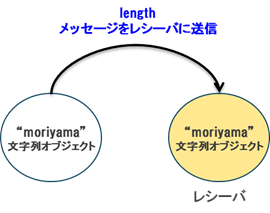
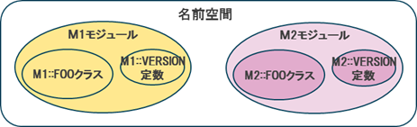

## 1. メソッドを定義してみよう

メソッドは、オブジェクトに定義されているもので、そのオブジェクトに関連する操作を行うために使われます。Rubyでは、すべての操作がメソッドとして実装されています。

最初に、メソッドの呼び出し方についておさらいです。

メソッドの呼び出しの構文は、以下でしたね。

```ruby
オブジェクト名.メソッド名(引数1,引数2,..)
```

上の構文の「オブジェクト」は**レシーバ**とも呼ばれます。  
Rubyでは、メソッドを実行することを「オブジェクトにメッセージを送る」、その結果として、「オブジェクトはメッセージを受け取る(レシーブ)」すると考えます。

```ruby
str_length = "moriyama".length
```



### 1-1. メソッドの分類
Rubyのメソッドは、レシーバによって3種類に分類することができます。

* インスタンスメソッド
* クラスメソッド
* 関数的メソッド

概要について説明します。

**インスタンスメソッド**

インスタンスメソッドは、これまで見てきたメソッドです。  
あるオブジェクト(インスタンス)があった時、その**オブジェクトをレシーバ**とするメソッドのことを`インスタンスメソッド`といいます。

```ruby
> "10,20,30,40,50".split(",")
=> ["10", "20", "30", "40", "50"]

> 1000.to_s
=> "1000"
```

**クラスメソッド**

レシーバがクラスそのものであった時、その**クラスをレシーバとするメソッド**とするメソッドのことを**クラスメソッド**といいます。

例えば、インスタンスを作るような場合には、クラスメソッドが利用されます。

```ruby
> # 新しい配列おジェクトをつくる
> Array.new
=> []

> # 新しいTimeオブジェクトをつくる
> Time.now
=> => 2017-08-07 22:45:10 +0900
```

**関数的メソッド**

**レシーバがない(省略されている)メソッド**を**関数的メソッド**といいます。  
関数的メソッドは、レシーバの状態によって結果が変わることのないように作られています。  
例えば、`puts`メソッドや`p`メソッドは、レシーバを必要としません。  
レシーバを必要としないメソッドは、関数的メソッドになります。

```ruby
> puts "Hello, Ruby~"
> sleep 10
```


**マニュアルなどのメソッドの表記について**

るりまサーチや、Rubyライブラリを参照する際に、困らないようにメソッドの表記について補足しておきます。  
**あくまでもドキュメント上の表記**になるので気をつけてください。

* インスタンスメソッド  
`クラス名#メソッド名`

* クラスメソッド  
`クラス名.メソッド名`  
`クラス名::メソッド名`

クラスメソッドの表記には、2つあるので注意しましょう。

### 1-3. 基本構文
メソッド定義の一般的な構文は次のようになります。  
この基本形は絶対に覚えてください。

```ruby
def メソッド名(引数, 引数2, ...)
    実行したい処理
end
```

以下、例です。  
helloメソッド（関数的メソッド）を定義して実行しています。

**method_basic.rb**

```ruby
# helloメソッドの定義
def hello(name)
    puts "Hello , #{name}"
end

hello("Ruby")
```

また、引数がないメソッドは`()`を省略できます。

```ruby
def goodbye
    puts "Goodbye, Ruby"
end

goodbye # ()を省略
goodbye()
```

関数的メソッドで`()`を省略してしまうと、メソッドか変数かよくわからなくなってしまうので、筆者はおすすめしません。


### 1-4. デフォルト引数

引数にデフォルト引数を指定しておけば、メソッド実行時にデフォルト引数で省略実行可能です。
デフォルト引数は、**引数名=値**の形式で書きます。

以下は、例です。

**default_arg.rb**

```ruby
def hello(name="Ruby")
    puts "Hello, #{name}"
end

hello() # 引数を省略してメソッド呼び出し
hello("Java") # 引数を省略せずにメソッド呼び出し
```

実行すると、以下の結果となります。

```bash
Hello, Ruby
Hello, Java
```

### 1-5. メソッドの戻り値

Rubyでは、JavaやPythonのように`return`文を使ってメソッドの戻り値を指定できますが、省略できます。  
省略する場合は、**最後に評価された値が戻り値となります。**

いくつか例を出していきます。

**return_val.rb**

```ruby
def volume(x,y,z)
    x * y * z
end

p volume(3,4,5) #=> 60
```

上記の例は、`60`が返ってきます。

また、メソッドの戻り値は見かけ上の最後の行の結果とは限りません。  
例として、`if`文や`case`文の実行結果を見てみましょう。

**case.rb**

```ruby
# 2つの値を比較して、大きい値を返すメソッド
def max_if(a,b)
    if a > b
        a
    else
        b
    end
end

# case文で色を判定するメソッド
def signal_case(signal)
    case signal
    when "red"
        "this is red"
    when "yellow"
        "this is yellow"
    when  "green"
        "this is green"
    else
        "unknown"
    end
end

p max_if(10,5)
p signal_case("green")
```

実行結果は、以下の通りとなります。

```bash
10
"this is green"
```

### 1-6. 引数の数が不定なメソッド

引数の数が決められていないメソッドは、次のように `*変数名`の形式で定義することによって、与えられた引数をまとめて配列として得られます。

```ruby
def bar(*args)
    args
end

p bar(1,2,3) #=> [1,2,3]
```

少なくとも1つは指定しなければならない引数があるメソッドを定義する場合は、以下のように書きます。

```ruby
def foo(arg, *args)
    [arg, args]
end

p foo(1)        #=> [1,[]]
p foo(1,2,3,4)  #=> [1,[2,3,4]]
```

## 1-7. キーワード引数

キーワード引数を使ったメソッド定義と呼び出しは、覚えておきましょう。

ここまでのメソッドは、メソッドを呼び出す際の引数は、メソッドを定義した時に決めた個数と順番に従って与える必要がありました。  
キーワード引数を使うことによって、引数名と値のペアで引数を渡せるようになります。

構文は、以下のようになります。

```ruby
def メソッド名(引数1: 引数1の値, 引数2: 引数2の値, ...)
    実行したい処理
end
```

`引数名: 値`の形式で引数名だけでなく、デフォルト値を指定します。

以下は、例になります。

**keyword_arg.rb**

```ruby
def area(x: 0, y: 0, z: 0)
    xy = x * y
    yz = y * z
    zx = z * x
    (xy + yz + zx) * 2
end

puts area() #=> 0
puts area(x: 1 , y: 2, z: 6) #=> 40
puts area(y: 4 , z: 2, x: 3) #=> 120

# ハッシュオブジェクトを引数にキーワード引数に渡すこともできる
hash = {x: 2, y: 10, z: 20}
puts area(hash) #=> 520
```

## 2. クラスを定義してみよう

### 2-1. クラスの作成
Rubyのプログラムでは、組み込みクラスを使用するだけはなく、ユーザーが独自にクラスを作成することができます。  
ここでは、時計を表す、`Clock`クラスを作ってみましょう。

クラスを作成するには、以下のように書きます。  
クラス名は、必ず大文字ではじまります。

```ruby
class Clock

end
```

### 2-2. インスタンスの作成
クラスからインスタンス(オブジェクト)を作成するには、クラスに対して`new`メソッドを呼び出します。

**instance.rb**

```ruby
class Clock
end

# インスタンス(オブジェクト)の生成
clock = Clock.new

puts clock.class
```

### 2-3. initializeメソッド

`initialize`メソッドは、特別なメソッドです。`new`メソッドによってインスタンスを生成すると、このメソッドが呼ばれます。  
このとき、newメソッドに渡した引数がそのまま`initialize`メソッドに渡されます。  
インスタンスにとって、必要な初期化処理は、`initialize`メソッドに記述します。  
`Java`における`コンストラクタ`です。  
但し、他のメソッドもそうですが、<u>メソッドのオーバーロード(多重定義)はできません。</u>

**initialize.rb**

```ruby
class Clock
    # 初期化処理の定義
    def initialize(owner)
        puts "This clock is #{owner.capitalize}'s"
    end
end

# newメソッドに引数を与えてinitizizeメソッドに渡してインスタンス生成
clock = Clock.new("moriyama")
```

### 2-4. インスタンス変数とインスタンスメソッド

`@`ではじまる変数をインスタンス変数と呼びます。  
インスタンス変数はインスタンスごとに異なる値を持ちます。

Rubyでは、オブジェクトの外部から、インスタンス変数を直接参照できません。  
オブジェクトの内部の情報にアクセスするには、メソッドを定義する必要があります。  
あるクラスのインスタンスが使用できるように定義されたメソッドを**インスタンスメソッド**と呼びます。

以下は、インスタンス変数とインスタンスメソッドの例です。

**instance_method_and_variable.rb**

```ruby
class Clock
    def initialize(owner)
        # @ownerがインスタンス変数
        @owner = owner
    end

    # インスタンスメソッドownerは、インスタンス変数@ownerを返す
    def owner
        @owner
    end
end

# Clockクラスからインスタンスを生成
clock1 = Clock.new("nagakura")
clock2 = Clock.new("moriyama")

# ownerメソッドを呼び出し
# インスタンス変数@ownerがインスタンスごとに異なる値を持っていることがわかる
p clock1.owner
p clock2.owner
```

### 2-5. アクセサ

`Clock`クラスに`@owner`の値を参照するメソッド(**ゲッターメソッド**)、値を変更をするメソッド(**セッターメソッド**)を定義する場合は、以下のようになります。

**getter_and_setter.rb**

```ruby
class Clock
    def initialize(owner)
        @owner = owner
    end

    # ゲッターメソッド
    def owner
        @owner
    end

    # セッターメソッド
    def owner=(value)
        @owner = value
    end
end

clock = Clock.new("moriyama")

# ゲッターメソッドの呼び出し
puts clock.owner
# セッターメソッドの呼び出し
clock.owner = "nagakura"
# ゲッターメソッドの呼び出し
puts clock.owner
```

Rubyでは、ゲッターメソッド、セッターメソッドの代わりに、クラスにアクセサ**attr_accessor**の後に変数を定義することによって、自動的にゲッターメソッド、セッターメソッドを定義できるようになります。

`attr_accessor`は構文の一種だと誤解されやすいですが、あくまでもインスタンス変数にアクセスするための**メソッド**です。

以下は、`attr_accessor`で`price`、`owner`のインスタンス変数定義、ゲッターメソッドを自動定義した例です。

**attr_accessor.rb**

```ruby
class Clock
    # attr_accessorでインスタンス変数、ゲッターメソッド、セッターメソッドを自動生成
    attr_accessor :owner, :price
end

# セッターメソッドが利用できる
clock.owner = "nagakura"
clock.price = 1000

# ゲッターメソッドが利用できる
puts clock.owner
puts clock.price
```

また、ゲッターのみ定義したかったり、セッターのみ定義したいことが場合によってはあると思います。  
そのような場合には、`attr_readerメソッド`、`attr_writerメソッド`を利用することもできます。  
役割分担は、以下のとおりです。

| メソッド名| 役割 |
|:-----|:------|
| attr_accessor | セッターメソッドとゲッターメソッドを共に定義する |
| attr_reader | ゲッターメソッドのみを定義する |
| attr_writer | セッターメソッドのみを定義する |

`attr_reader`、`attr_writer`の例を見ていきましょう。

**attr_reader_and_writer.rb**

```ruby
class Clock
    # attr
    attr_reader :owner
    attr_writer :price

    def initialize
        @owner = "Hanako"
    end
end

clock = Clock.new

# インスタンス変数ownerに対しては、セッターメソッドが利用できない
# clock.owner = "nagakura"

# インスタンス変数priceに対しては、セッターメソッドが利用できる
clock.price = 1000

# インスタンス変数ownerに対しては、ゲッターメソッドが利用できる
puts clock.owner

# インスタンス変数priceに対しては、ゲッターメソッドが利用できない
# puts clock.price
```


### 2-6. クラス変数とクラスメソッド

インスタンス変数に対して、クラス変数は`@@`ではじまり、クラスがもつ変数のことを指します。  
Rubyでは、**`@@`からはじまる変数名をクラス変数といいます。**

以下の例では、メソッドとして、`self.count`を定義しています。この場合の`self`はインスタンスではなく、`Clock`クラスのことを指しています。  
Rubyでは、**クラス定義の中に`self.メソッド名`として定義するものをクラスメソッドと言います。** 

前述しましたが、レシーバがクラスそのものであった時、その**クラスをレシーバとするメソッド**とするメソッドのことを`クラスメソッド`といいます。

**class_method_and_variable.rb**

```ruby
class Clock
    # クラス変数
    @@count = 0

    def initialize(owner)
        @owner = owner
        @@count += 1
    end

    # クラスメソッド
    def self.count
        @@count
    end
end

clock1 = Clock.new("nagakura")
# クラスメソッドの呼び出し
puts Clock.count

clock2 = Clock.new("moriyama")
# クラスメソッドの呼び出し
puts Clock.count
```

実行結果は、以下のようになるはずです。

```bash
$ ruby class_method_and_variable.rb
1
2
```

### 2-7. 定数
定数について説明を忘れていました。  
クラスの定義の中では、定数を定義できます。

クラスの持っている定数は、次のように`クラス名::定数名`を使って、次のように参照可能です。

**class_constant.rb**

```ruby
class Clock
  # 定数の定義
  VERSION = 1.0
end

puts Clock::VERSION
```

実行すると、以下になります。

```bash
$ ruby class_constant.rb
1.0
```

補足ですが、いままで出てきたクラスのクラス名も実は定数になります。

**class_constant2.rb**

```ruby
class Clock

  # Ownerクラスを定義
  class Owner
    def initialize(name)
        @name = name
        p "This clock owner is #{name}"
    end
  end

end

Clock::Owner.new("nagakuray") # => "This clock owner is nagakuray"
```

### 2-8. インスタンスメソッドのアクセス権

これまで紹介してきた方法でメソッドを定義すると、すべてインスタンスメソッドとしてオブジェクト(レシーバ)を介して外側から呼び出すことができます。  
しかし、外側に公開したくない、または公開する必要のないメソッドを定義したい場合も当然あります。

Rubyでは、3種類のアクセス制限のレベルが用意されており、必要に応じて変更することができます。  
本勉強会では、`protected`は利用しない想定であるため、割愛します。

* `public`  
メソッドをインスタンスメソッドとして使えるように公開する。  
何も修飾子を付けない場合はこれになる。

* `private`  
メソッドをオブジェクト(レシーバ)を介して呼び出せないようにする。  
つまり、クラス定義外部からインスタンスメソッドを実行できないように制限をかけられます。

* `protected`  
メソッドを同一のクラス(とそのサブクラス)であれば、インスタンスメソッドとして使えるようにする。  

`private`の定義の方法ですが、**メソッドの定義の前にこれらのアクセス制限レベルを指定した一行を追加します。**  
実際の例を見たほうがわかりやすいでしょう。  

**private_access.rb**


```ruby
class Clock

  def initialize
    print_now_time
  end

  # アクセスレベルをprivateで指定
  # これ以降定義したメソッドは、 「オブジェクト.メソッド名」の形式で呼び出せない
  private

  def print_now_time
    puts "Now time: #{Time.now.to_s}"
  end

end

clock = Clock.new

# print_now_timeメソッドは「オブジェクト.メソッド名」の形式で呼び出せないのでエラーとなる。
clock.print_now_time
```

実行すると、以下のようになります。

```bash
$ ruby private_access.rb
Now Time: 2017-08-10 12:02:40 +0900
NoMethodError: private method `print_now_time' called for #<Clock:0x007f86c58a79d0>
```

### 2-9. クラスの継承

Rubyでも、Javaなどのように、継承によって、既存のクラスに変更を加えずに新しい機能を追加したり、部分的にカスタマイズしたりして新しいクラスを作ることができます。

スーパークラス、サブクラスなどといった用語はJavaと変わらないため、説明は割愛します。  
また、RubyではPythonのようにクラスを複数継承する**多重継承はありません。**  
Rubyではモジュールによるミックスインが用意されているので、多重継承相当のことがやりたければ、モジュールを利用するようにしましょう。

継承の基本構文は、以下のとおりです。

```ruby
class クラス名 < スーパークラス名
   クラスの定義
end
```

実際に例を見ていきましょう。

`Animal`クラスをスーパークラスとして、`Elepahnt`クラスと`Dog`クラスを定義した例です。

**animal.rb**

```ruby
# Animal Class
class Animal
  def initialize(name)
      @name = name
  end

  def print_name
    puts "My name is #{@name}"
  end

  def print_kind
    puts "This is Animal"
  end
end

# Elephant Class
class Elephant < Animal
  # クラスメソッドの定義
  def self.shout
    puts "Shout is Paohooooon!!"
  end

  # メソッドのオーバーライド
  def print_kind
    super() # スーパークラスのメソッド呼び出し
    puts "This is Elephant"
  end
end

# Dog Class
class Dog < Animal
  # クラスメソッドの定義
  def self.shout
    puts "Shout is Wan wan wan!!"
  end

  # メソッドのオーバーライド
  def print_kind
     puts "This is Dog" 
  end
end

dog = Dog.new("Pochi")
dog.print_name
dog.print_kind
Dog.shout

puts "-----------------------"

elephant = Elephant.new("Hanako")
elephant.print_name
elephant.print_kind
Elephant.shout
```

サブクラス`Dog`、`Elephant`でスーパークラスで定義した`@name`、`print_name`メソッドの継承ができているのが分かると思います。  
また、サブクラスでは、スーパークラスで定義した`print_kind`メソッドのオーバーライド(上書き)、`super`でスーパークラスのメソッドを呼び出すこともできます。

以下は、`animal.rb`の実行結果になります。

```bash
$ ruby animal.rb
My name is Pochi
This is Dog
Shout is Wan wan wan!!
-----------------------
My name is Hanako
This is Animal
This is Elephant
Shout is Paohooooon!!
```

### 2-10. オープンクラス

`オープンクラス`とは、既存のクラスを好きな場所で再オープンし、メソッド修正・追加など任意の変更を加えられる**機能**のことです。(オープンというクラスがあるわけではありません。)

オープンクラスを使うことによって、組み込みクラスであっても拡張できるのがRubyの特徴になっています。

例えば、以下のような文字列オブジェクトを引数とするメソッドがあったととします。

```ruby
def love_ruby(str)
  str + " I love Ruby!"
end

p love_ruby("My name is Moriyama.") # => "My name is Moriyama. I love Ruby!"
```

この`love_ruby`メソッドを組み込みクラスStringを拡張して組み込むことが可能になっています。

```ruby
class String
  def love_ruby
    # love_rubyメソッドのレシーバ(self)は、文字列オブジェクトになります。
    self + " I love Ruby!"
  end
end

p "My name is Moriyama.".love_ruby # => "My name is Moriyama. I love Ruby!"
```

Stringクラスを継承したサブクラスを作って、<u>メソッドを定義せずとも</u>、Rubyではこのようなことが実現できるようになっています。

### 2-11. (補足)継承の関係について

## 3. モジュール

モジュールは、Rubyの特徴的な機能のひとつになります。

クラスは、実体と(データ)とふるまい(処理)を表現する機能ですが、モジュールは処理の部分だけをまとめる機能になります。  
クラスとモジュールは、以下の点で異なります。

* モジュールはインスタンスを持つことができない
* モジュールは継承できない

モジュールは、以下のように定義します。  
クラス名と同様に、モジュール名は大文字で始まる英文字としてください。

```ruby
module モジュール名
  メソッド、クラス、定数
end
```

モジュールの代表的な使い方として、以下の2つがあります。

* **名前空間の提供**
* **Mix-inによる機能の提供**

以下、この2つの使い方について説明していきます。


### 3-1. 名前空間の提供
**名前空間**とは、定数、メソッド、クラスの名前を区別して管理して管理する単位のことをいいます。  
たとえば、クラス定義をモジュールで囲むことによって、名前空間(ネームスペース)として利用できるようになります。



以下は、例となります。しっかり確認しておいてください。

**namespace.rb**

```ruby
# M1モジュールの定義
module M1
  # モジュールM1空間の定数
  VERSION = 1.0

  # モジュールM1空間のメソッド
  def greeting
    "Good morning!"
  end
  # メソッドをモジュール関数とする。M1.greetingとして呼び出すために必要
  module_function :greeting

  # モジュールM1空間のクラス
  class Foo
    def bar
      "I love Ruby."
    end
  end

end

# M2モジュールの定義
module M2
  # モジュールM2空間の定数
  VERSION = 2.0

  # モジュールM1空間のメソッド
  def greeting
    "Good night!"
  end
  # メソッドをモジュール関数とする。M2.greetingとして呼び出すために必要
  module_function :greeting

  # モジュールM2空間のクラス
  class Foo
    def bar
      "You love Ruby."
    end
  end

end

# 定数の参照
puts M1::VERSION
puts M2::VERSION

# モジュール関数の呼び出し
puts M1.greeting
puts M2.greeting

# インスタンスメソッドの呼び出し
puts M1::Foo.new.bar
puts M2::Foo.new.bar
```

### 3-2. Mix-inによる機能の提供

あるクラスにモジュールの機能を取り込むことを**Mix-in**といいます。  
クラスにモジュールをMix-inするにはクラス定義の中で`include`を使います。  

補足しておきますが、**includeは構文ではなく、メソッドです**(正確には、Objectクラスのインスタンスメソッドとなります)。インスタンスメソッドとして取り込むためのメソッドとして捉えてください。

```ruby
class (クラス名)
  include (モジュール名)
  ...
end
```

どのような場面で、Mix-inを使えばよいかというと、

* 2つ(以上)のクラスは似たような機能を持っているだけで、同じ種類(クラス)とは考えたくない時
* 多重継承のようなことがしたい場合(Rubyの継承は単一継承であり、複数のスーパークラスを持てない仕様となっている)

といった時などです。  
以下、例をそれぞれ紹介します。

<u>**2つ(以上)のクラスは似たような機能を持っているだけで、同じ種類(クラス)とは考えたくない時**</u>

以下に例を示します。  
`Takeuma`クラスと`Human`クラスに`Common`モジュールをインクルードし、`has_legs`メソッドをインスタンスメソッドとして利用できるようになっています。

```ruby
# モジュールCommonの定義
module Common
  def has_legs
    "two"
  end
end

class Takeuma
  # モジュールCommonのinclude
  include Common
end

class Human
  # モジュールCommonのinclude
  include Common
end

takeuma = Takeuma.new
puts takeuma.has_legs # => two

human = Human.new
puts human.has_legs # => two
```

<u>**多重継承のようなことがしたい場合**</u>

以下に例を示します。  
`PerfectHuman`クラスに`HumanSpec`モジュールと`UseLang`モジュールをインクルードし、それぞれのモジュールで定義したメソッドを利用します。  
複数のモジュールをクラスにインクルードできることによって、多重継承のようなことを実現しています。


```ruby
# HumanSpecモジュール
module HumanSpec
  def tell_me_salary
    puts "1,000,000 yen/month"
  end
  def tell_me_height
    puts "190.0 cm"
  end
end

# UseLangモジュール
module UseLang
  def speak_japanese
    puts "もちろんです"
  end
  def speak_english
    puts "of cource"
  end
end

class PerfectHuman
  # モジュールのinclude
  include HumanSpec
  include UseLang
end

human = PerfectHuman.new

# HumanSpecモジュール、UseLangモジュールで定義したメソッドが利用できる
human.print_salary
humam.tell_me_height
human.speak_japanese
human.speak_english
```

### 3-3. includeとextendについて

モジュールで定義されたメソッドをクラスで取り込む時に、`include`メソッドを使って取り込みました。includeで取り込んだメソッドは、インスタンスメソッドになります。

ここで、クラスメソッドとして取り込みたい場合には、`extend`メソッドを使います。

**include_and_extend.rb**

```ruby
module M1
  def greeting
    "Hello, World!"
  end
end

module M2
  def like_lang(lang)
    "I like #{lang}!"
  end
end

class User
  # M1で定義したメソッドをインスタンスメソッドとして取り込む
  include M1
  # M2で定義したメソッドをクラスメソッドとして取り込む
  extend M2
end

# インスタンスメソッドの呼び出し
puts User.new.greeting
# クラスメソッドの呼び出し
puts User.like_lang("Ruby")
```

実行結果です。  
`extend`を使って取り込んだ`like_lang`メソッドは、クラスメソッドとして呼び出せていることがわかります。

```bash
$ ruby include_and_extend.rb
Hello, World!
I like Ruby!
```

## 4. 例外処理

処理を定義して実行してみると、エラーが発生して処理が期待通りに動作しないことがよくあります。  
Rubyにも、エラーが発生した場合の例外処理が用意されています。

###  4-1. 例外処理の基本形

Rubyでは、例外処理は以下のように記述します。  
Javaにおける`try`~`catch`にあたります。

```ruby
begin
  # 例外が発生する可能性のある処理
rescue => ex # exは変数(例外オブジェクトが代入される変数)
  # 例外が起こった場合の処理
end
```

意図的に例外を発生させたコードの例となります。  
存在しないファイルを開こうとして例外を発生させています。

**exception_test.rb**

```ruby
begin
  File.open("/path/to/non_exit_file")
rescue => ex
  puts "種類: #{ex.class}"
  puts "メッセージ: #{ex.message}"
  puts "詳細情報: #{ex.backtrace}"
end
```

実行結果は、以下のようになります。

```bash
$ ruby exception_test.rb
種類: Errno::ENOENT
メッセージ: No such file or directory @ rb_sysopen - /path/to/non_exit_file
詳細情報: ["exception.rb:2:in `initialize'", "exception.rb:2:in `open'", "exception.rb:2:in `<main>'"]
```

`exception_test.rb`では、例外オブジェクト`ex`を介して`class`メソッド,`message`メソッド,`backtrace`メソッドを呼んで例外に関する情報を取得しています。  
それぞれのメソッドを実行して取得できる情報は次のようなものです。

| メソッド名 | 説明 |
|:-----|:------|
| Object#class | 例外の種類 |
| Exception#message | 例外のメッセージ |
| Exception#backtrace | 例外の発生した位置に関する情報 |

### 4-2. 後処理
例外が発生しようが、発生しまいが必ず実行したい処理がある場合には、`ensure`節に後処理を書きます。  
Javaの`try`~`catch`~`finally`に相当します。

```ruby
begin
  # 例外が発生する可能性のある処理
rescue => ex # exは変数(例外オブジェクトが代入される変数)
  # 例外が起こった場合の処理
ensure
  # 例外の発生有無に関わらず実行される処理
end
```

利用例になります。  
ファイルのコピー元を開き、コピー先にコピーしようとしているコードになります。  
コピー先が存在しようが存在しなかろうが、コピー元のファイルを閉じるように`ensure`節で記述しています。

**ensure.rb**

```ruby
# 指定されたコピー元ファイルを開いて代入
src = File.open("/tmp/exit_file")
begin
  # 指定されたコピー先ファイルを書き込みモードで開いて代入
  dst = File.open("/path/to/non_exit_file", "w")
  # コピー元を全て読み込んで代入
  data = src.read
  # 読み込んだコピー元をコピー先に代入
  dst.write(data)
  # コピー先ファイルを閉じる。
  dst.close
rescue => ex
  puts ex.class
  puts ex.message
ensure
  # 例外が起こっても起こらなくても実行したい時のコード
  # コピー元ファイルを必ず閉じる
  src.close
end
```

実行例です。

```bash
$ echo "Hello, Ruby" > /tmp/exit_file
$ ruby ensure.rb
Errno::ENOENT
No such file or directory @ rb_sysopen - /path/to/non_exit_file
```

### 4-3. 補足する例外の指定

複数の種類の例外が発生する可能性あり、それぞれを個別に対処必要な場合は、複数の`rescure`節を使って例外処理を分岐できます。

```ruby
begin
  # 例外が発生する可能性のある処理
rescue Execption1, Exception2 => ex(例外オブジェクトが代入される変数)
  # Exception1または、Exception2が発生した場合の処理
rescue Exception3 =>  ex(例外オブジェクトが代入される変数)
  # Exception3が発生した場合の処理
rescue
  # 上記以外の例外に対する処理
end
```

例外の種類を指定した例となります。

```ruby
begin
  # 例外を起こすかも知れないコード
  io = File.open("/path/to/non_exit_file")
rescue Errno::ENOENT, Errno::EACCES
  # Errno::ENOENT または Errno::EACCES に対する例外処理
  io = File.open("/tmp/exit_file")
  puts io.read
end
```

`Errno::ENOENT`はファイルが存在しなかったことを示す例外クラスです。  
`Errno::EACCES`はファイルを開く権限がなかったことを示す例外クラスです。  


## 5. 演習

<u>**演習問題1(難易度:中)**</u>

温度を表す時に、日本本では通常「摂氏(セルシウス)温度」という単位系が使われていますが、アメリカなどでは「華氏(ファーレンハイト)温度」という単位系が使われています。

まず、`Temperature`クラスを定義してみてください。  
次に、摂氏温度を華氏温度に変換するクラスメソッド`cels_to_fahr`を定義してください。  
また、華氏温度を摂氏温度に変換するクラスメソッド`fahr_to_cels`を定義してください。  
摂氏温度と華氏温度の変換の公式は以下になります。

```
華氏 = 摂氏 * 9 / 5 + 32
```

<u>**演習問題2(難易度:中)**</u>

整数が素数であるかどうかを調べるメソッド`prime?`を定義してください。素数とは「その数自身と1以外で割ることのできない数」です。

<u>(ヒント)</u>

* 自分で関数的メソッドやモジュールメソッドを定義するのも１つですが、`Integer`クラスをオープンクラスで拡張するのも１つの手段です。
* Integerクラスを拡張した方法と、関数的メソッドで定義した方法についての呼び出しメージは以下を想定しています。

```ruby
# 関数的メソッドの呼び出し
(1..100).each do |number|
  puts "#{number}: #{prime?(number)}"
end

# Integerクラスを拡張した呼び出し
(1..10).each do |number|
  puts "#{number}: #{number.prime?}"
end
```
