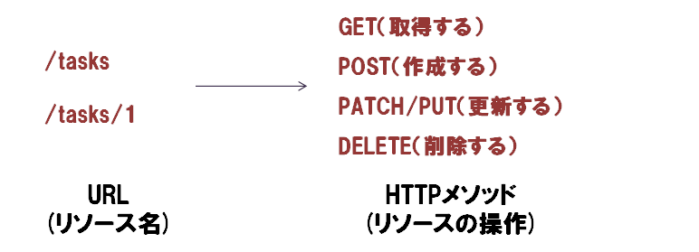
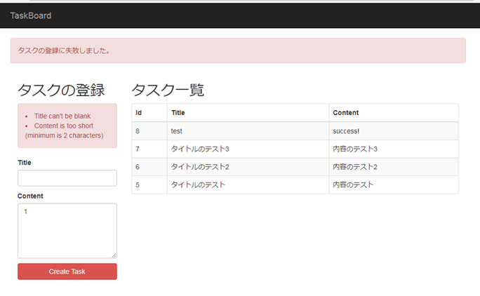

## 1. Ruby on Railsのことはじめ


今回からRuby on Railsの勉強にはいっていきます。  
はじめてのRailsアプリケーションとして、タスクボードを作っていきます。  
作りながらRailsの機能について説明していきます。


### 1-1. Ruby on Rails

Ruby on Railsは、Rubyプログラミング言語で記述された、Web開発のフレームワークです。  
David Heinemeier Hansson（DHH）氏によって作られました。  
現在では、動的なWebアプリケーションを開発するフレームワークとして最も有力かつ人気のあるフレームワークの１つとなっています。

Railsは、以下の設計哲学に基づいています。  
この先必要になってくる哲学ですので、覚えておいてください。

* DRY(Don't Repeat Yourself)  
  繰り返しを避ける、同じようなコードの記述を避ける、ということです。  
  コードの重複を減らし、効率的なアプリ実装を心がけましょう。

* 設定より規約  
  Railsアプリの開発では、あらかじめ決まった規約に従って開発することが大切です。  
  たとえば、データベースのテーブル名がtasks(複数形)であった場合には、モデルの名前をTask(単数形)で定義するといった具合です。

  Railsでは、このように英語の単数形や複数形を用途によって使い分けます。モデルの名前やファイル名などが深く関連してくるので、留意してください。

### 1-2. MVCパターン

Railsアプリケーションは、MVCパターンを採用して実装されています。  
おさらいになりますが、MVCパターンのM、V、Cの意味について簡単に確認しましょう。

* Model: データを扱う部分
* View: 表示の役割を担当する部分
* Controller: クライアントからのHTTPリクエストを処理し、結果を返す役割を担当

Railsアプリの基本的な処理の流れを簡単に示します。


補足説明します。主語に着目して読んでみてください。

__基本的な処理の流れ__

1. リクエストの送信  
  ブラウザは、リクエストを送信します。
2. ルーティング処理  
  リクエストURLを解析し、コントローラへルーティングします。あるリクエストに対して、どのコントローラのどのアクションで処理するかを`config/routes.rb`に定義されたルーティング情報をもとに決定します。
3. データの取得と操作  
  コントローラは、モデルを仲介してデータベースからデータ取得、加工したり、データベースを更新したりします。
4. ビューの描画  
  コントローラは、モデルから取得したデータをビューに渡します。  
  ビューは、データをテンプレートに埋め込み、HTMLやJavascriptなどを結果としてコントローラに渡します。
5. レスポンスの返却  
  コントローラは、ビューから受け取った結果をレスポンスとして、ブラウザに返却します。

Model,View,Controller以外にも、Routerという登場人物がでてきましたね。
RouterもMVCと同じくらい大事です。  
自分が今どの部分を実装しているか、MVC+Routerに当てはめ、考えながら実装していきましょう。

### 1-3. RESTについて

REST(REpresentational State Transfer)はアプリケーションの設計技法のひとつです。  
操作の対象(リソース)をURLを使って表現します。そのURLに対してHTTPのメソッド(GET/POST/PUT/DELETE)を使って操作します。



RESTに基づいたWebアプリを「RESTfulなWebアプリ」と言ったりします。

* リソースについて  
  リソースですが、Railsでは殆どの場合がモデルの複数形として定義されます。

* URLについて  
  URLには、リソース名を用いることになっています。  
  上図のように、`/tasks`、`/tasks/:id`のようなURLです。

* HTTPメソッドについて  
  HTTPリクエストに利用するHTTPメソッドは、以下の4つのメソッドを利用します。

  | HTTPメソッド| 役割 | 例 |
  |:-------------|:-----|:-----|
  | GET |リソースの取得|タスク一覧取得、タスク詳細取得|
  | POST |リソースの作成|タスクの登録|
  | PATCH/PUT |リソースの更新|タスクの更新|
  | DELETE |リソースの削除|タスクの削除|

### 1-4. データベース
 
データベースとModelは密接に関連しています。  
Railsでは、基本的にリレーショナルベースを利用してモデルオブジェクトのデータを永続的に保存します。  

Railsでは、「<u>ActiveRecord</u>」をORM (オブジェクトリレーショナルマッピング)として利用してリレーショナルデータベースに接続し、データをSQLを意識せずに取り扱うことができます。

今回は、データベースにMariaDBを利用して開発を進めたいと思いますので、以下の手順に従って、MySQLをインストールしてください。

**MariaDBのインストール**

```
$ sudo apt-get update
$ sudo apt-get install mariadb-server
```

**MariaDBの起動/停止/ステータス確認**

```bash
# MariaDB起動ステータス確認
$ sudo service mysql status
 * /usr/bin/mysqladmin  Ver 9.0 Distrib 5.5.57-MariaDB, for debian-linux-gnu on x86_64
Copyright (c) 2000, 2017, Oracle, MariaDB Corporation Ab and others.

Server version          5.5.57-MariaDB-1ubuntu0.14.04.1
Protocol version        10
Connection              Localhost via UNIX socket
UNIX socket             /var/run/mysqld/mysqld.sock
Uptime:                 6 sec

# MariaDB停止
$ sudo service mysql stop
 * Stopping MariaDB database server mysqld
   ...done.

# MariaDB起動
$ sudo service mysql start
 * Starting MariaDB database server mysqld
   ...done.
 * Checking for corrupt, not cleanly closed and upgrade needing tables.
```

**データベースとユーザの作成**

以降の設定簡易化のため、rootユーザでパスワードなしログインが可能なように設定しておき、データベース`ruby_lesson`を作成しましょう。

```
$ mysql -u root -p

MariaDB [(none)]> update mysql.user set password=password('') where user='root' and host='localhost';
Query OK, 1 row affected (0.00 sec)
Rows matched: 1  Changed: 1  Warnings: 0

MariaDB [(none)]> flush privileges;
Query OK, 0 rows affected (0.00 sec)

MariaDB [(none)]> create database ruby_lesson character set utf8;
Query OK, 1 row affected (0.01 sec)

MariaDB [(none)]> use ruby_lesson;
Database changed

MariaDB [ruby_lesson]> show databases;
+--------------------+
| Database           |
+--------------------+
| information_schema |
| mysql              |
| performance_schema |
| phpmyadmin         |
| ruby_lesson        |
+--------------------+
5 rows in set (0.00 sec)

MariaDB [ruby_lesson]> quit
```

## 2. Railsアプリケーションの準備

### 2-1. Railsのインストール

Railsアプリは、`rails`コマンドを介して作成していきます。  
まずは以下のコマンドを実行してRailsをインストールしましょう。  
少し古いのですが、バージョン`5.0.3`をインストールします。

```bash
$ gem install rails -v 5.0.3
```

インストールが完了したら、バージョンを確認してみてください。

```
$ rails -v
Rails 5.0.3
```

### 2-3. Railsアプリの準備

Railsで開発を始めるには、`rails new アプリケーション名`というコマンドを実行します。  
今回はアプリケーションの名前を`task-board`とします。

```bash
$ rails new task-board
...
Bundle complete! 15 Gemfile dependencies, 63 gems now installed.
Use `bundle info [gemname]` to see where a bundled gem is installed.
         run  bundle exec spring binstub --all
* bin/rake: spring inserted
* bin/rails: spring inserted
```

`tree`コマンドを実行すると、多数のファイルが生成されているのが確認できます。

```
$ tree task-board
task-board
├── Gemfile
├── Gemfile.lock
├── README.md
├── Rakefile
├── app
│   ├── assets
│   │   ├── config
│   │   │   └── manifest.js
│   │   ├── images
│   │   ├── javascripts
│   │   │   ├── application.js
│   │   │   ├── cable.js
│   │   │   └── channels
│   │   └── stylesheets
│   │       └── application.css
│   ├── channels
│   │   └── application_cable
│   │       ├── channel.rb
│   │       └── connection.rb
│   ├── controllers
│   │   ├── application_controller.rb
│   │   └── concerns
│   ├── helpers
│   │   └── application_helper.rb
│   ├── jobs
│   │   └── application_job.rb
│   ├── mailers
│   │   └── application_mailer.rb
│   ├── models
│   │   ├── application_record.rb
│   │   └── concerns
│   └── views
│       └── layouts
│           ├── application.html.erb
│           ├── mailer.html.erb
│           └── mailer.text.erb
├── bin
│   ├── bundle
│   ├── rails
│   ├── rake
│   ├── setup
│   ├── spring
│   ├── update
│   └── yarn
├── config
│   ├── application.rb
│   ├── boot.rb
│   ├── cable.yml
│   ├── database.yml
│   ├── environment.rb
│   ├── environments
│   │   ├── development.rb
│   │   ├── production.rb
│   │   └── test.rb
│   ├── initializers
│   │   ├── application_controller_renderer.rb
│   │   ├── assets.rb
│   │   ├── backtrace_silencers.rb
│   │   ├── cookies_serializer.rb
│   │   ├── filter_parameter_logging.rb
│   │   ├── inflections.rb
│   │   ├── mime_types.rb
│   │   └── wrap_parameters.rb
│   ├── locales
│   │   └── en.yml
│   ├── puma.rb
│   ├── routes.rb
│   ├── secrets.yml
│   └── spring.rb
├── config.ru
├── db
│   └── seeds.rb
├── lib
│   ├── assets
│   └── tasks
├── log
│   └── development.log
├── package.json
├── public
│   ├── 404.html
│   ├── 422.html
│   ├── 500.html
│   ├── apple-touch-icon-precomposed.png
│   ├── apple-touch-icon.png
│   ├── favicon.ico
│   └── robots.txt
├── test
│   ├── application_system_test_case.rb
│   ├── controllers
│   ├── fixtures
│   │   └── files
│   ├── helpers
│   ├── integration
│   ├── mailers
│   ├── models
│   ├── system
│   └── test_helper.rb
├── tmp
│   ├── cache
│   │   └── assets
│   ├── pids
│   ├── restart.txt
│   └── sockets
└── vendor
```

各ディレクトリ、ファイルの一部について簡単な説明です。  


| ディレクトリ、ファイル| 用途 |
|:-------------|:------------------------|
|app/|モデル、ビュー、コントローラ、ヘルパーなどを含む主要なアプリケーションのコード|
|app/assets|アプリケーションで利用するCSS、JavaScriptファイル、画像などのアセット|
|bin/|コード生成、コンソールの起動、ローカルのWebサーバの立ち上げなどで利用するRailsスクリプト|
|config/|アプリケーションの設定。ルーティング設定情報など|
|db/|データベース関連のファイル。スキーマ情報やマイグレーションファイルなど格納|
|doc/|マニュアルなどアプリケーションのドキュメント|
|lib/|ライブラリモジュール。自作のライブラリなど|
|log/|アプリケーションのログファイル|
|public/|公開ディレクトリ|
|test/|アプリケーションのテストコード|
|tmp/|一時ファイル|
|vendor/|サードパーティのプラグインやgemなど|
|README.md|アプリケーションの簡単な説明|
|Rakefile|rakeコマンドで使えるタスク|
|Gemfile|アプリケーションに必要なGemの定義ファイル|
|Gemfile.lock|アプリケーションで使われるgemのバージョンを確認するためのリスト|
|config.ru|Rackミドルウェア用の設定ファイル|
|.gitignore|Git管理対象外にしたいファイルを指定するためのファイル|

### 2-4. サーバの起動

Railsアプリを起動するためには、サーバを起動する必要があります。
今後の作業はすべて、`task-board`で実施しますので、ディレクトリを移動してください。

```
$ cd task-board
```

それでは、`rails s`、もしくは、`rails server`コマンドを使用してサーバを起動しましょう。  
Cloud9で実行する場合には、オプションを指定する必要があります。  
(ローカル環境で開発する場合には、オプション不要です。)

```
$ rails s -p $PORT -b $IP
=> Booting Puma
=> Rails 5.0.5 application starting in development on http://0.0.0.0:8080
=> Run `rails server -h` for more startup options
Puma starting in single mode...
* Version 3.10.0 (ruby 2.3.0-p0), codename: Russell's Teapot
* Min threads: 5, max threads: 5
* Environment: development
* Listening on tcp://0.0.0.0:8080
Use Ctrl-C to stop
```

URLにアクセスし、以下のようなページが表示されればOKです。


### 2-5. サーバの停止

RailsアプリのWebサーバを停止するには、ターミナル上で`Ctrl-c`となります。  
停止しておきましょう。

### 2-6. Gitリポジトリの初期化

今回からGitリポジトリを作成し、ローカルコミットし、GitHubのリモートリポジトリにアップロードしておきましょう。  
リモートリポジトリは、GitHubにアクセスして作成しておいてください。

それではまずは、リポジトリの初期化です。

```
$ git init
```

コミットしましょう。

```
$ git add .
$ git commit -m "init commit"
```

リモートリポジトリにプッシュしましょう。

```
$ git remote add origin https://github.com/ユーザ名/task-board.git
$ git push -u origin master
```

## 3. コントローラの作成とルーティングの定義

これからアプリを作っていきます。  
ここでは、モデル、ビュー、コントローラ、ルーティングのうち、コントローラとルーティングを定義します。

### 3-1. TasksControllerの作成

タスクの一覧表示とタスクの登録ができるようにコントローラを作成します。

コントローラの作成には、`rais g controller`コマンドを利用します。
TasksControllerを作成する場合は`rails g controller tasks`となります。リソース名は必ず複数形で指定してください。  
また、ついでにオプションとして、`index`アクションを指定してください。トップページで使用する`index`アクションを一緒に作成するためです。

```bash
$ rails g controller tasks index
Running via Spring preloader in process 15743
      create  app/controllers/tasks_controller.rb
       route  get 'tasks/index'
      invoke  erb
      create    app/views/tasks
      create    app/views/tasks/index.html.erb
      invoke  test_unit
      create    test/controllers/tasks_controller_test.rb
      invoke  helper
      create    app/helpers/tasks_helper.rb
      invoke    test_unit
      invoke  assets
      invoke    coffee
      create      app/assets/javascripts/tasks.coffee
      invoke    scss
      create      app/assets/stylesheets/tasks.scss
```

コントローラファイルの`app/controllers/tasks_controller.rb`、ビューファイルの`app/views/tasks/index.html.erb`、ルーティングに`get 'tasks/index'`が追加されていることを確認できます。

生成されたコントローラファイルは、以下のとおりです。

**app/controllers/tasks_controller.rb**

```ruby
class TasksController < ApplicationController
  def index
  end
end
```

`TaskController`クラスは、`ApplicationControler`クラスを継承しています。  
これによって、アクションに対応したビューを表示できるようになるという仕掛けがあります。  
今回の場合は、`TaskController`の`index`アクションに対応したビューは、`app/views/tasks/index.html.erb`になります。

ビューファイルは、以下のようになっています。

**app/views/tasks/index.html.erb**

```html
<h1>Tasks#index</h1>
<p>Find me in app/views/tasks/index.html.erb</p>
```

### 3-2. config/routes.rbの設定

`config/routes.rb`には、どのようなルーティングを実施するかが定義されています。  
現在の中身を見てみましょう。


```ruby
Rails.application.routes.draw do
  get 'tasks/index'
end
```

railsコマンドには、`config/routes.rb`に設定されているルーティングを標準出力するためのコマンドとして、`rails routes`コマンドが用意されています。  
`rails routes`コマンドを使ってルーティングの情報を見てみます。

```
$ rails routes
     Prefix Verb URI Pattern            Controller#Action
tasks_index GET  /tasks/index(.:format) tasks#index
```

HTTPメソッドがGETかつ、URLに`/tasks/index`を指定してアクセスした場合、TasksControllerの`index`アクションで処理するようになっています。

ちなみに、上記`config/routes.rb`の定義は、このようにも記述できます。

```ruby
Rails.application.routes.draw do
  get 'tasks/index' => 'tasks#index'
end
```

これを`tasks/index`ではなく、`/`でアクセスした場合、`TasksController`の`index`アクションで処理するように書き換えてみます。

```ruby
Rails.application.routes.draw do
 root 'tasks#index'
end
```

`get 'tasks/index'`の部分を`root 'tasks#index'`で書き換えました。  
ルーティングが反映されたか、`rails routes`コマンドでまず確認してみましょう。
そして`rails s`で起動し、設定したとおり、`/`でアクセスできるか確認してみましょう。

```
$ rails routes
Prefix Verb URI Pattern Controller#Action
  root GET  /           tasks#index
```

```
$ rails s -p $PORT -b $IP
```

確認できたでしょうか？

ここまで終わったら、Gitでコミットしておきましょう。

```
$ git add .
$ git commit -m "added tasks_controller"
```

## 4. モデルの作成

### 4-1. MariaDBとの接続設定

モデルとデータベースは密接な関係にあります。  
まずはRailsアプリケーションからMariaDBに接続するための準備をしていきましょう。

**Gemfile**

MariaDBに接続するためにライブラリが必要になります。  
`Gemfile`に`gem 'mysql2'`を追加してください。

```ruby
source 'https://rubygems.org'

git_source(:github) do |repo_name|
  repo_name = "#{repo_name}/#{repo_name}" unless repo_name.include?("/")
  "https://github.com/#{repo_name}.git"
end

gem 'rails', '~> 5.0.3'
gem 'sqlite3'
gem 'puma', '~> 3.0'
gem 'sass-rails', '~> 5.0'
gem 'uglifier', '>= 1.3.0'
gem 'coffee-rails', '~> 4.2'
gem 'jquery-rails'
gem 'turbolinks', '~> 5'
gem 'jbuilder', '~> 2.5'

# 追加するのはここの部分です。
gem 'mysql2'

group :development, :test do
  gem 'byebug', platform: :mri
end

group :development do
  gem 'web-console', '>= 3.3.0'
  gem 'listen', '~> 3.0.5'
  gem 'spring'
  gem 'spring-watcher-listen', '~> 2.0.0'
end

gem 'tzinfo-data', platforms: [:mingw, :mswin, :x64_mingw, :jruby]
```

`bundle install`コマンドを使って、インストールしましょう。  
コマンド実行前にRailsサーバが起動している場合は、停止してください。

```
$ bundle install --without production
```

RailsアプリからMariaDBに接続するために、`config/database.yml`に定義を追加しましょう。

**config/database.yml**

```yml
default: &default
  adapter: sqlite3
  pool: 5
  timeout: 5000

# developmentの部分を以下のように編集してください。
development:
  adapter: mysql2
  encoding: utf8
  database: ruby_lesson
  username: root
  host: localhost

test:
  <<: *default
  database: db/test.sqlite3

production:
  <<: *default
  database: db/production.sqlite3
```

設定後、Railsアプリを起動できれば成功です。  
実際のデータベースに対する操作は次の節で実施します。

```
$ rails s -b $IP -p $PORT
=> Booting Puma
=> Rails 5.0.5 application starting in development on http://0.0.0.0:8080
=> Run `rails server -h` for more startup options
Puma starting in single mode...
* Version 3.10.0 (ruby 2.3.0-p0), codename: Russell's Teapot
* Min threads: 5, max threads: 5
* Environment: development
* Listening on tcp://0.0.0.0:8080
Use Ctrl-C to stop
```

### 4-2. マイグレーションファイルの作成

モデルの作成にはいっていきます。  
モデルを作成することは、テーブルを作成することに相当します。

まずは、マイグレーションファイルと呼ばれるデータベースに変更を支持するためのファイルを作成します。

マイグレーションファイルは、`rails g model`コマンドを使って作成します。  
Taskモデルを作成する場合には、`rails g model Task`となります。  
Taskモデルは、title(文字列型)とcontent(テキスト型)を追加します。

```
$ rails g model Task title:string content:text
Running via Spring preloader in process 45572
      invoke  active_record
      create    db/migrate/20170831160609_create_tasks.rb
      create    app/models/task.rb
      invoke    test_unit
      create      test/models/task_test.rb
      create      test/fixtures/tasks.yml
```

実行すると、マイグレーションファイルが作成されます。  
マイグレーションファイルは以下のようになっています。

**db/migrate/XXXXXXXXXXX_create_tasks.rb**

```ruby
class CreateTasks < ActiveRecord::Migration[5.0]
  def change
    create_table :tasks do |t|
      t.string :title
      t.text :content

      t.timestamps
    end
  end
end
```

`CreateTasks`クラスが`ActiveRecord::Migration`を継承していますね。クラス定義中のインスタンスメソッド`change`が定義されていて、テーブルを作成時のパラメータが`do`〜`end`で囲まれたブロックで渡され、その中で`:title`と`:content`が指定されています。

また、`t.timestamps`は、自動的に作成日時`create_at`と`update_at`をテーブルにカラムとして追加してくれます。

モデルファイルは以下のようになっています。

**app/models/task.rb**

```ruby
class Task < ApplicationRecord
end
```

### 4-3. マイグレーションの実行

マイグレーションを実行し、モデルを作成します。  
`rails db:migrate`コマンドを実行します。ここで初めてデータベースにテーブルが作成されます。

それでは、マイグレーションを実行しましょう。

```bash
$ rails db:migrate
== 20170831160609 CreateTasks: migrating ======================================
-- create_table(:tasks)
   -> 0.0123s
== 20170831160609 CreateTasks: migrated (0.0124s) =============================
```

どこまでのマイグレーションファイルを実行済みかは`db/schema.rb`に記録されます。

**db/schema.rb**

```ruby
# versionの部分にどこまでマイグレーションファイルを実行したかが書いてある。
ActiveRecord::Schema.define(version: 20170831160609) do

  create_table "tasks", force: :cascade, options: "ENGINE=InnoDB DEFAULT CHARSET=utf8" do |t|
    t.string "title"
    t.text "content"
    t.datetime "created_at", null: false
    t.datetime "updated_at", null: false
  end

end
```

`(version: 20170831160609)`は、実行されたマイグレーションファイルと同じ日時が入っています。テーブル定義（カラム削除や削除）などを変更するために、新規にマイグレーションファイルを作成し、再度`rails db:migirate`を実行すると`version`は更新されます。

それでは、データベースにログインして`tasks`テーブルが実際に作成できているか確認してみましょう。`rails db`コマンドを使って接続してみましょう。

```
$ rails db

mysql> show tables;
+-----------------------+
| Tables_in_ruby_lesson |
+-----------------------+
| ar_internal_metadata  |
| schema_migrations     |
| tasks                 |
+-----------------------+
3 rows in set (0.00 sec)

mysql> desc tasks;
+------------+--------------+------+-----+---------+----------------+
| Field      | Type         | Null | Key | Default | Extra          |
+------------+--------------+------+-----+---------+----------------+
| id         | bigint(20)   | NO   | PRI | NULL    | auto_increment |
| title      | varchar(255) | YES  |     | NULL    |                |
| content    | text         | YES  |     | NULL    |                |
| created_at | datetime     | NO   |     | NULL    |                |
| updated_at | datetime     | NO   |     | NULL    |                |
+------------+--------------+------+-----+---------+----------------+
5 rows in set (0.01 sec)
```

マイグレーションができていますね。  
`id`、`create_at`、`update_at`はRailsを使うと自動で作られるカラムになります。  
`id`は自動的にインクリメントされるようになっています。

ここまで完了したら、Gitでコミットしておきましょう。

```
$ git add .
$ git commit -m "created task model"
```

### 4-4. Rails Console

前の節でTaskモデルとデータベースのtasksテーブルの紐付けが完了しました。  
すなわち、Taskモデルを使って、tasksテーブルを更新できるようになっているというわけです。

本節では、`rails c`という、RubyのRubyのコードを手軽に実行できる環境でデータベースにデータを保存したりしてみましょう！  
`rails c`は、おなじみのREPLです。

```
$ rails c
```

Taskモデルに対するtasksテーブルのカラム構成を確認してみましょう。

```
> Task.column_names
 => ["id", "title", "content", "created_at", "updated_at"]
```

カラムの確認ができましたね。

#### 4-4-1. データの保存

早速、タスクを作成してみましょう。

```
> task = Task.new(title: "筋トレ", content: "腹筋30回を20セット")
 => #<Task id: nil, title: "筋トレ", content: "腹筋30回を20セット", created_at: nil, updated_at: nil>
```

この状態だと、taskオブジェクトの`id`、`created_at`、`updated_at`は`nil`になっていますね。

taskオブジェクトを保存してみましょう。

```
> task.save
   (0.2ms)  BEGIN
  SQL (6.7ms)  INSERT INTO `tasks` (`title`, `content`, `created_at`, `updated_at`) VALUES ('筋トレ', '腹筋30回を20セット', '2017-09-01 00:30:32', '2017-09-01 00:30:32')
   (1.1ms)  COMMIT
=> true
```

`created_at`と`updated_at`に自動的にタイムスタンプが入ってインサート文が発行されてコミットされているのが分かると思います。`id`は自動的にインクリメントされます。

さらに、3件レコードを追加しておきましょう。

```
> task1 = Task.new(title: "お勉強", content: "ビジネスマナー本を3冊読む")
> task1.save
> task2 = Task.new(title: "お散歩", content: "公園を10週する")
> task2.save
> task3 = Task.new(title: "筋トレ", content: "腕立て伏せ100回を3セット")
> task3.save
```

#### 4-4-2. データの検索

<u>**全てのデータを取得する場合**</u>

`all`メソッドを利用します。

```
> Task.all
  Task Load (0.3ms)  SELECT  `tasks`.* FROM `tasks` LIMIT 11
=> #<ActiveRecord::Relation [#<Task id: 1, title: "筋トレ", content: "腹筋30回を20セット", created_at: "2017-09-01 00:30:32", updated_at: "2017-09-01 00:30:32">, #<Task id: 2, title: "お勉強", content: "ビジネスマナー本を3冊読む", created_at: "2017-09-01 00:37:52", updated_at: "2017-09-01 00:37:52">, #<Task id: 3, title: "お散歩", content: "公園を10週する", created_at: "2017-09-01 00:37:57", updated_at: "2017-09-01 00:37:57">, #<Task id: 4, title: "筋トレ", content: "腕立て伏せ100回を3セット", created_at: "2017-09-01 00:48:48", updated_at: "2017-09-01 00:48:48">]>
```

<u>**特定のidのデータを取得する場合**</u>

`find`メソッドを利用するとよいでしょう。  
以下は、`id:1`のレコードを取得する場合です。

```
> Task.find(1)
  Task Load (1.1ms)  SELECT  `tasks`.* FROM `tasks` WHERE `tasks`.`id` = 1 LIMIT 1
 => #<Task id: 1, title: "筋トレ", content: "腹筋30回を20セット", created_at: "2017-09-01 00:30:32", updated_at: "2017-09-01 00:30:32">
```

<u>**任意のカラムから特定のデータを取得する場合**</u>

`find_by`メソッドを利用します。  
カラム名と値のペアで検索できます。

```
> Task.find_by(title: "お散歩")
  Task Load (0.4ms)  SELECT  `tasks`.* FROM `tasks` WHERE `tasks`.`title` = 'お散歩' LIMIT 1
 => #<Task id: 3, title: "お散歩", content: "公園を10週する", created_at: "2017-09-01 00:37:57", updated_at: "2017-09-01 00:37:57">
```

<u>**whereを使って複数データを取得する場合**</u>

`where`メソッドを利用します。

```
> Task.where(title: "筋トレ")
  Task Load (0.4ms)  SELECT  `tasks`.* FROM `tasks` WHERE `tasks`.`title` = '筋トレ' LIMIT 11
=> #<ActiveRecord::Relation [#<Task id: 1, title: "筋トレ", content: "腹筋30回を20セット", created_at: "2017-09-01 00:30:32", updated_at: "2017-09-01 00:30:32">, #<Task id: 4, title: "筋トレ", content: "腕立て伏せ100回を3セット", created_at: "2017-09-01 00:48:48", updated_at: "2017-09-01 00:48:48">]>
```

<u>**first,lastによるデータ取得**</u>

`first`メソッドは`id`の小さい方からデータを取得できます。  
`last`メソッドは`id`の大きい方からデータを取得できます。

```
> Task.first
  Task Load (0.3ms)  SELECT  `tasks`.* FROM `tasks` ORDER BY `tasks`.`id` ASC LIMIT 1
=> #<Task id: 1, title: "筋トレ", content: "腹筋30回を20セット", created_at: "2017-09-01 00:30:32", updated_at: "2017-09-01 00:30:32">

> Task.first(2)
  Task Load (0.3ms)  SELECT  `tasks`.* FROM `tasks` ORDER BY `tasks`.`id` ASC LIMIT 2
=> [#<Task id: 1, title: "筋トレ", content: "腹筋30回を20セット", created_at: "2017-09-01 00:30:32", updated_at: "2017-09-01 00:30:32">, #<Task id: 2, title: "お勉強", content: "ビジネスマナー本を3冊読む", created_at: "2017-09-01 00:37:52", updated_at: "2017-09-01 00:37:52">]

> Task.last
  Task Load (0.3ms)  SELECT  `tasks`.* FROM `tasks` ORDER BY `tasks`.`id` DESC LIMIT 1
=> #<Task id: 4, title: "筋トレ", content: "腕立て伏せ100回を3セット", created_at: "2017-09-01 00:48:48", updated_at: "2017-09-01 00:48:48">

> Task.last(2)
  Task Load (0.3ms)  SELECT  `tasks`.* FROM `tasks` ORDER BY `tasks`.`id` DESC LIMIT 2
=> [#<Task id: 3, title: "お散歩", content: "公園を10週する", created_at: "2017-09-01 00:37:57", updated_at: "2017-09-01 00:37:57">, #<Task id: 4, title: "筋トレ", content: "腕立て伏せ100回を3セット", created_at: "2017-09-01 00:48:48", updated_at: "2017-09-01 00:48:48">]
```

#### 4-4-3. データの削除

<u>**1件ごとに削除**</u>

`destroy`メソッドを使います。  
インスタンスメソッドなので、インスタンスを一度生成してからメソッドを実行する必要があります。

```
> task = Task.first
> task.destroy
   (0.2ms)  BEGIN
  SQL (2.5ms)  DELETE FROM `tasks` WHERE `tasks`.`id` = 1
   (1.6ms)  COMMIT
=> #<Task id: 1, title: "筋トレ", content: "腹筋30回を20セット", created_at: "2017-09-01 00:30:32", updated_at: "2017-09-01 00:30:32">
```

<u>**全件削除**</u>

`destroy_all`メソッドを使います。
インスタンスを生成せずに、直接データベースにSQL文を発行するので早いです。

```
> Task.destroy_all
  Task Load (0.3ms)  SELECT `tasks`.* FROM `tasks`
   (0.1ms)  BEGIN
  SQL (0.3ms)  DELETE FROM `tasks` WHERE `tasks`.`id` = 2
   (1.5ms)  COMMIT
   (0.1ms)  BEGIN
  SQL (0.2ms)  DELETE FROM `tasks` WHERE `tasks`.`id` = 3
   (0.5ms)  COMMIT
   (0.1ms)  BEGIN
  SQL (0.3ms)  DELETE FROM `tasks` WHERE `tasks`.`id` = 4
   (0.5ms)  COMMIT
=> [#<Task id: 2, title: "お勉強", content: "ビジネスマナー本を3冊読む", created_at: "2017-09-01 00:37:52", updated_at: "2017-09-01 00:37:52">, #<Task id: 3, title: "お散歩", content: "公園を10週する", created_at: "2017-09-01 00:37:57", updated_at: "2017-09-01 00:37:57">, #<Task id: 4, title: "筋トレ", content: "腕立て伏せ100回を3セット", created_at: "2017-09-01 00:48:48", updated_at: "2017-09-01 00:48:48">]
```

本当に削除できているか、`rails db`からも確認しておきましょう。

```
$ rails db

mysql> select count(*) from tasks;
+----------+
| count(*) |
+----------+
|        0 |
+----------+
1 row in set (0.00 sec)
```

削除できていることが確認できたと思います！


## 5. タスク登録機能の実装

コントローラとモデルを用いて、タスクの登録機能を実装していきましょう。

### 5-1. confif/routes.rbの設定

まずは、ルーティング設定です。  
`config/routes.rb`に変更を加えてみましょう。

たとえば、以下のように修正してみましょう。

**config/routes.rb**

```ruby
Rails.application.routes.draw do
  root 'tasks#index'
  resources :tasks
end
```

`resources`メソッドの引数に`:tasks`を渡しています。  
この状態で、`rails routes`コマンドでルーティング情報を確認してましょう。

```bash
$ rails routes
   Prefix Verb   URI Pattern               Controller#Action
     root GET    /                         tasks#index
    tasks GET    /tasks(.:format)          tasks#index
          POST   /tasks(.:format)          tasks#create
 new_task GET    /tasks/new(.:format)      tasks#new
edit_task GET    /tasks/:id/edit(.:format) tasks#edit
     task GET    /tasks/:id(.:format)      tasks#show
          PATCH  /tasks/:id(.:format)      tasks#update
          PUT    /tasks/:id(.:format)      tasks#update
          DELETE /tasks/:id(.:format)      tasks#destroy
```

`resources`メソッドを利用するだけで、ルーティングとそれに紐づくアクションが多く出力されているのが確認できます。

これらのルーティングを整理すると、以下のようになります。

| URL | アクション | HTTPメソッド | 説明 |
|:---------------|:------|:----------|:-----------|
|/tasks          |index  | GET       | 一覧画面　   |
|/tasks          |create | POST      | 作成処理　   |
|/tasks/new      |new    | GET       | 新規登録画面　|
|/tasks/:id/edit |edit   | GET       | 編集画面　   |
|/tasks/:id      |show   | GET       | 個別画面　   |
|/tasks/:id      |update | PATCH/PUT | 更新処理　   |
|/tasks/:id      |destroy| DELETE    | 削除処理　   |

想像してみましょう。  
タスクを新しく登録する場合には、以下のような作業をイメージしてください。

1. GETメソッドで`/tasks/new`にアクセスします。
2. `/tasks/new`の新規登録画面で、タスクの情報登録用のフォームに書き込んで登録ボタンで`POST`メソッドを実行します。
3. `POST`メソッドで`/tasks`にアクセスすると、書き込んだタスクの情報をパラメータとして`TasksController#create`が受け取って、データベースに保存します。
4. 登録されているタスクの一覧を`/tasks`にアクセスして確認します。
5. 詳細なタスクの情報は、`/tasks/1`（新しいタスクidが1として作られている場合）などにアクセスして確認します。

今回は、まず`create`アクションのみを実装していくので、`config/routes.rb`を以下のように書き換えておきます。

**config/routes.rb**

```ruby
Rails.application.routes.draw do
  root 'tasks#index'
  resources :tasks, only: [:create]
end
```

`rails routes`でルーティング情報を改めて確認しておきましょう。

```
$ rails routes
Prefix Verb URI Pattern      Controller#Action
  root GET  /                tasks#index
 tasks POST /tasks(.:format) tasks#create
```


### 5-2. URLヘルパ

URLヘルパについて学習します。

URLヘルパとは、リソースに必要なURLを自動的に生成してくれる仕組みのことです。  
これ以降はとてもよくでてくるので覚えてください。  

まずは`rails routes`コマンドを叩いてルーティング情報を表示してみましょう。おさらいです。

```
$ rails routes
Prefix Verb URI Pattern      Controller#Action
  root GET  /                tasks#index
 tasks POST /tasks(.:format) tasks#create
```

表示されたルーティング情報のPrefixに着目してください。  
このPrefixに`_path`を付けたものがURLヘルパとして利用できるようになります。

|URLヘルパ名 | HTTPメソッド　| 出力されるURL |
|:------|:-------------|:------------|
| root_path | GET | / |
| tasks_path | GET | /tasks |

といった具合です。

また、次のようなルーティングであった場合には...

```
$ rails routes
   Prefix Verb   URI Pattern               Controller#Action
 new_task GET    /tasks/new(.:format)      tasks#new
edit_task GET    /tasks/:id/edit(.:format) tasks#edit
     task GET    /tasks/:id(.:format)      tasks#show
          PATCH  /tasks/:id(.:format)      tasks#update
          PUT    /tasks/:id(.:format)      tasks#update
          DELETE /tasks/:id(.:format)      tasks#destroy
```


|URLヘルパ名 | HTTPメソッド　| 出力されるURL |
|:------|:-------------|:------------|
| new_task_path | GET | /task/new |
| edit_task_path(id) | GET | /tasks/:id/edit |
| task_path(id) | GET/PATCH/PUT/DELETE | /tasks/:id |

といった具合でURLヘルパを利用可能です。

ここで、`task_path(id)`と引数に`id`を渡していますが、モデルオブジェクトそのものを渡しても同じです。  
`task_path(task)`は`task_path(id)`と同じURLが生成されます。  
このことは後で出てくるので記憶の片隅にとどめておいてください。

補足になりますが、`rails routes`ででてくるルーティング情報は、`config/routes.rb`に基づくものです。  
つまり、`resources`メソッドでこのようなURLを自動で定義してくれているのです。

### 5-3. フォームの作成

タスクを投稿するフォームを作成していきます。  
Railsでは標準でフォームなどのビューを作成するためにERBファイルを利用します。  
ERBでHTMLの中にRubyのコードを埋め込んでいきます。

ERBの記法は以下のようになります。

```
<%= code %>   コードを実行してその結果を文字列として埋め込む
<% code %>    コードを実行するのみ。結果は埋め込まない
```

それでは、`app/views/tasks/index.html.erb`を下記のように編集してください。

**app/views/tasks/index.html.erb**

```erb
<%= form_for(@task) do |f| %>
  タイトル:
  <%= f.text_field :title %>

  内容:
  <%= f.text_area :content %>
  <%= f.submit %>
<% end %>
```

解説していきます。

`form_for`の部分は、フォームヘルパと呼ばれ、特定のモデルオブジェクトを作成、編集したりするためのフォームを自動生成します。

先に紹介しておきますが、HTML出力される`<form>`タグは以下のようになります。

```html
<form class="new_task" id="new_task" action="/tasks" accept-charset="UTF-8" method="post">
```

`form_for`の引数に`@task`を渡しています。  
のちほど`TasksController`の`index`アクションで、`@task`に`Task.new`を代入します。

要するに、`TaskController`の`index`アクションで生成された`@task`をビューである`index.html.erb`に渡しているのです。

`form_for`では、`do |f|~end`のブロックも渡していますね。  
ブロック引数の`f`はフォームビルだと呼ばれます。モデルオブジェクトを元にHTMLコードを生成します。  
今回は、`f.text_field :title`と`f.text_area :content`でタスクのタイトルと内容の入力欄を生成しています。`f.submit`で送信ボタンを生成しています。

これも先に紹介しておきますが、HTML出力されると、以下のようになります。

```html
<input type="text" name="task[title]" id="task_title" />
<textarea name="task[content]" id="task_content"></textarea>
<input type="submit" name="commit" value="Create Task" data-disable-with="Create Task" />
```

### 5-4. コントローラの実装

タスクを新規に作成するフォームを表示する`index`アクションを実装します。  
また、フォームからパラメータを受け取って、データベースに保存する`create`アクションも実装します。  

以下のように編集していきましょう。

**app/controllers/tasks_controller.rb**

```ruby
class TasksController < ApplicationController
  def index
    @task = Task.new
  end

  def create
    title = params[:task][:title]
    content = params[:task][:content]
    @task = Task.new(title: title, content: content)
    @task.save
    flash[:notice] = "タスクを登録しました。"
    redirect_to root_path
  end
end
```

解説していきます。

```ruby
  def index
    @task = Task.new
  end
```

`index`アクションですが、この部分は`@task = Task.new`でTaskオブジェクトの初期化を実施し、`@task`に代入しています。  
この`@task`を`index.html.erb`のビューに渡しています。

次に、フォームで値を入力後に送信ボタンで`POST`すると、`rails s`コマンドで確認したとおり`/tasks`というURLにパラメータと一緒に送信されます。  
そして、`TaskController`の`create`アクションが実行されます。

```ruby
  def create
    title = params[:task][:title]
    content = params[:task][:content]
    @task = Task.new(title: title, content: content)
    @task.save
    flash[:notice] = "タスクを登録しました。"
    redirect_to root_path
  end
```

`create`アクションのこの部分では、以下の処理を実施しています。

1. フォームで入力したパラメータ(title,content)を受け取ります。
2. 受け取ったパラメータをもとにTaskオブジェクトを作成し、インスタンス変数`@task`に代入します。
3. `@task.save`でTaskオブジェクトをテーブルに保存します。
4. `redirect_to`メソッドで`root_path`(URLヘルパ)にリダイレクトしています。また、その時、ユーザに通知するメッセージを`"タスクを登録しました。"`として特殊な変数`flash[:notice]`に渡しています。

`flash[:notice]`に代入した文字列は、現状ではまだ表示されません。あとで表示できるようにしていきます。

 <u>**フォームからのパラメータ**</u>

 ブラウザからフォームで送信されたパラメータは、コントローラで`params`を使って使って取得できます。  
 ブラウザから送信されたパラメータは、以下のような形式になっています。

```ruby
{ :tasks => {
    :title => "タイトル",
    :conent => "内容"
  }
}
```

要は、ハッシュ形式で受け取れるということです。  
ただし、キーはシンボル形式になっていることに注意してください。  
なので、下記の形式で受け取れるわけです。

```ruby
    title = params[:task][:title]
    content = params[:task][:content]
```

ただし、このような記述は、**Rails4からは非推奨**です。
現在のコードは、以下のようになっていますが、

```ruby
    title = params[:task][:title]
    content = params[:task][:content]
    @task = Task.new(title: title, content: content)
```

これが、以下のようになっていても通るのです。

```ruby
  @task = Task.new(params[:task])
```

この場合の何が問題かといいますと、たとえば`update`アクションで不正なユーザがブラウザからのリクエストを改ざんしてTaskオブジェクトの`id`を強制的に書き換えてしまうようなことができてしまうのです(`title`,`content`の他に、意図的に`id`もセットして書き換えてしまう)。  
`id:1`だったタスクが`id:5`になってしまうのはNGですよね。

そのため、Rails4からは**ストロングパラメータ**と呼ばれる仕組みが提供されています。

<u>**ストロングパラメータ**</u>

ストロングパラメータは、不正なユーザが意図せぬパラメータを送ってきた場合にリクエストを検証して不正な操作を防ぐ仕組みです。

一言でいうと、リクエストパラメータをホワイトリスト形式で受け取れる機能です。

先の`app/controllers/tasks_controller.rb`のコードを以下のように書き換えましょう。

**app/controllers/tasks_controller.rb**

```ruby
class TasksController < ApplicationController
  def index
    @task = Task.new
  end

  def create
    @task = Task.new(task_params)
    @task.save
    flash[:notice] = "タスクを登録しました。"
    redirect_to root_path
  end

  private
  def task_params
    # titleとcontentのみをパラメータとして受け取る
    params.require(:task).permit(:title,:content)
  end

end
```

この部分に着目してください。

```ruby
  private
  def task_params
    # titleとcontentのみをパラメータとして受け取る
    params.require(:task).permit(:title,:content)
  end
```

`task_params`メソッドを定義しています。  
メソッドの定義中では、以下の処理を実施しています。

* `params`の中に、`:task`というキーが存在するか検証しています。  
* 存在する場合には、`:title`と`:content`のパラメータ**のみ**を受け取れるようにフィルタリングしています。

**ストロングパラメータを使った書き方は、ぜひイディオムとして覚えておいてください。**

このあたりで`rails s`コマンドでサーバを立ち上げて確認してみましょう。  
以下のような`root_path`にアクセスして、以下のような画面が立ち上がればOKです。


実際に「Create Task」ボタンを押してタスクが登録できているか、`rails c`コマンドでREPLで確認しましょう。

```
$ rails c
> Task.all
  Task Load (0.3ms)  SELECT  `tasks`.* FROM `tasks` LIMIT 11
  ...
```

### 5-6. タスク一覧の表示

登録したタスクの一覧をブラウザ画面に表示できるようにしましょう。  
URLは`"/"(root_path)` にアクセスした時に表示できるようにします。

しつこいですが、`rails routes`で確認して`root_path`に紐づくアクションを確認しましょう。

```
$ rails routes
Prefix Verb URI Pattern      Controller#Action
  root GET  /                tasks#index
 tasks POST /tasks(.:format) tasks#create
```

`TasksController`の`index`アクションでタスクの一覧を取得したオブジェクトを生成し、生成したオブジェクトをビュー(`index.html.erb`)に渡すようにしていきましょう。

まず、`TasksController`を編集します。

**app/controllers/tasks_controller.rb**

```ruby
class TasksController < ApplicationController
  def index
    @task = Task.new
     # added
    @tasks = Task.all
  end

  def create
    @task = Task.new(task_params)
    @task.save
    redirect_to root_path, notice: "タスクを登録しました。"
  end
  
  private
  def task_params
    params.require(:task).permit(:title,:content)
  end  
end
```

`@tasks`にtasksテーブルに格納している全てのオブジェクトを代入しています。  
`Task.all`を簡単に試したい場合には、`rails c`でREPLを起動して確かめてみるといいでしょう。

```
$ rails c
> tasks = Task.all
  Task Load (0.3ms)  SELECT  `tasks`.* FROM `tasks` LIMIT 11
```

そして、`@tasks`をビューに渡して表示するために、`app/views/tasks/index.html.erb`を編集します。

**app/views/tasks/index.html.erb**

```erb
<h1>タスクの一覧</h1>

<% @tasks.each do |task| %>
  タイトル: <%= task.title %>
  内容: <%= task.content %>
  <br>
<% end %>

<%= form_for(@task) do |f| %>
  タイトル:
  <%= f.text_field :title %>

  内容:
  <%= f.text_area :content %>
  <%= f.submit %>
<% end %>
```

ここまでで、登録、一覧表示までができているはずです。  
ブラウザから実際に確認しておいてください。


動作確認ができたらGitコミットしておきましょう。

```bash
$ git add .
$ git commit -m "added index and create actions"
```

## 6. Bootstrapの適用

デザインがダサいので、Bootstrapを適用していきましょう。  
Bootstrapを忘れてしまった方は、第2回目の勉強会資料を再確認しておくとよいでしょう。

### 6-1. レイアウトファイルの変更

Railsには、レイアウトファイルというものが用意されています。  
レイアウトファイルを変更すると、全てのページでそのレイアウトが適用されます。

`app/views/layouts/application.html.erb`がレイアウトファイルになるので、早速編集していきましょう。CDN(Contents Delivery Network)経由でBootstrapを読み込めるようにします。

**app/views/layouts/application.html.erb**

```erb
<!DOCTYPE html>
<html>
  <head>
    <title>TaskBoard</title>
    <%= csrf_meta_tags %>
    <%# CDN経由でBootstrapを読み込み %>
    <link rel="stylesheet" href="https://maxcdn.bootstrapcdn.com/bootstrap/3.3.7/css/bootstrap.min.css">
    <%= stylesheet_link_tag    'application', media: 'all', 'data-turbolinks-track': 'reload' %>
    <%= javascript_include_tag 'application', 'data-turbolinks-track': 'reload' %>
  </head>

  <body>
    <%# ヘッダー %>
    <nav class="navbar navbar-inverse">
      <div class="container-fluid">
        <div class="navbar-header">
          <a class= "navbar-brand" href="#">TaskBoard</a>
        <div>
      </div>
    </nav>

    <%# コンテンツ %>
    <div class="container-fluid">
      <% if flash[:notice] %>
        <div class="alert alert-success">
          <%= flash[:notice] %>
        </div>
      <% end %>
    </div>
    <div class="container-fluid">
      <%= yield %>
    </div>

  </body>
</html>
```

上記のコードにてCDN経由でBootstrapの読み込み、ヘッダーを定義しているのですが、`<%= yield %>`の部分にも注目してください。  
この`<%= yield %>`の部分に`app/views/tasks/index.html.erb`などのビューが埋め込まれるのです。

また、さきほどTaskコントローラの`create`アクションでデータベースの登録に成功した場合にフラッシュ変数を定義しました。  
ここでは`flash[:notice]`が存在した場合にフラッシュメッセージを表示するようにしています。

```erb
    <div class="container">
      <% if flash[:notice] %>
        <div class="alert alert-success">
          <%= flash[:notice] %>
        </div>
      <% end %>
    </div>
```

### 6-2. タスクの登録・一覧表示画面のレイアウト変更

Bootstrapを使う準備は完了しています。  
Bootstrapを使って`app/views/tasks/index.html.erb`を変更します。

**app/views/tasks/index.html.erb**

```erb
<div class="col-md-3">
  <h2>タスクの登録</h2>
  <%= form_for(@task) do |f| %>
    <%= f.label :title %>
    <%= f.text_field :title, class: "form-control", style: "margin-bottom: 10px" %>
    <%= f.label :content %>
    <%= f.text_area :content, rows: "5",class: "form-control", style: "margin-bottom: 10px" %>
    <%= f.submit "Create Task", class: "btn btn-danger btn-block" %>
  <% end %>
</div>

<div class="col-md-9">
  <h2>タスク一覧</h2>
  <table class="table table-striped table-bordered">
    <thead>
      <tr>
        <th>Id</th>
        <th>Title</th>
        <th>Content</th>
      </tr>
    </thead>
    <tbody>
      <%# タスクを更新日時の降順で並び替えもしておく %>
      <% @tasks.order(updated_at: :desc).each do |task| %>
        <tr>
          <td><%= task.id %></td>
          <td><%= task.title %></td>
          <td><%= task.content %></td>
        </tr>
      <% end %>
    </tbody> 
  </table>
</div>
```

以下のような感じで表示されればOKです。  
タスクを登録すると、テーブルの上に登録したタスクが追加表示されていくはずです。


動作確認できたら、Gitコミットしておきましょう。

```
$ git add .
$ git commit -m "applied Bootstrap"
```

## 7. バリデーション

バリデーションは、モデルのオブジェクトをデータベースに保存する前に、保存しようとしているデータが正しいかをチェックする機能です。
 
たとえば、タスクのタイトルが空で送信されてしまわないように、必須項目チェックを実施するなどの用途で使われます。

バリデーションは、モデルファイルで`validates`メソッドを使って実装します。  
書き方は、以下のようになります。

```ruby
validates 検証する項目, チェック条件
```

### 7-1. モデルファイルの修正

今回は、Taskモデルのtitleとcontentに以下のチェックを実施しましょう。

<u>title</u>

* 必須
* 1文字以上20文字以内

<u>content</u>

* 必須
* 2文字以上100文字以内

それでは、Taskモデルファイル`app/models/task.rb`を編集します。

```ruby
class Task < ApplicationRecord
  validates :title, presence: true, length: {maximum: 20}
  validates :content, presence: true, length: {minimum: 2, maximum: 100}
end
```

編集後に、`rails c`でREPLを起動して確かめるといいでしょう。

```
$ rails c
> task1 = Task.new(title: "test", content: "success!")
=> #<Task id: nil, title: "test", content: "success!", created_at: nil, updated_at: nil>
> task2 = Task.new(title: "", content: "")
=> #<Task id: nil, title: "", content: "", created_at: nil, updated_at: nil>
> task1.save
   (0.1ms)  BEGIN
   (0.1ms)  COMMIT
=> true
> task2.save
   (0.1ms)  BEGIN
   (0.1ms)  ROLLBACK
=> false
```

`task1.save`はバリデーションの条件をみたすので、結果が`true`で返却され、保存に成功します。  
しかし、`task2.save`はバリデーションの条件を満たさないため、結果は`false`になっていて保存に失敗していることが分かります。

保存に失敗した`task2`には、エラーメッセージが格納されているので、ここで確認しておきましょう。  
`モデルオブジェクト名.errors.full_messages`でエラーメッセージを取得できます。

```
> task1.errors.full_messages
=> [] # task1は保存に成功しているので、エラーメッセージは存在しない。

> task2.errors.full_messages
=> ["Title can't be blank", "Content can't be blank", "Content is too short (minimum is 2 characters)"]
```

### 7-2. コントローラファイルの修正

コントローラをバリデーションに対応した作りに修正しましょう。  
具体的には、`create`アクションをバリデーションに失敗した場合、エラーを表示して、再入力を促すようにします。

以下のように、`app/controllers/tasks_controller.rb`を修正してください。

**app/controllers/tasks_controller.rb**

```ruby
class TasksController < ApplicationController
  def index
    @task = Task.new
     # added
    @tasks = Task.all
  end

  def create
    @task = Task.new(task_params)
    if @task.save
      flash[:notice] = "タスクを登録しました。"
      redirect_to root_path
    else
      # タスク登録に失敗した場合の処理
      @tasks = Task.all
      flash[:alert] = "タスクの登録に失敗しました。"
      render "index"
    end
  end

  private
  def task_params
    params.require(:task).permit(:title,:content)
  end
end
```

登録に失敗した場合、`@task`にはエラーメッセージが入っています。  
ここで、この部分に着目してください。

```ruby
      render "index"
```

`render`メソッドを使って"`index.html.erb`"の描画をおこなっているのです。  
なぜ、これまでのように`redirect_to root_path`とせずに`render "index"`としているかというと、`redirect_to root_path`としてしまうと、リダイレクト処理が発生指定しまい、`index`アクションが実行されてしまうからです。

つまり、**リダイレクトしてしまうと、`create`アクションで生成されたオブジェクトの情報である`@task.errors.full_messages`に格納されたエラメッセージが消えてしまう**のです。

**`render "index"`はビューの描画であり、リダイレクトは発生しません**。  
そのため、`@task.errors.full_messages`にエラーメッセージを格納したまま`index.html.erb`に渡すことができるのです。

また、タスクの登録に失敗した場合に、`flash[:alert]`にメッセージを代入しています。

### 7-3. エラーメッセージの表示

エラーメッセージを表示できるようにしましょう。

**app/views/tasks/index.html.erb**

```erb
<div class="col-md-3">
  <h2>タスクの登録</h2>

  <%# エラーメッセージが存在する場合にエラーメッセージを表示 %>
  <% if @task.errors.present? %>
    <div class="alert alert-danger">
      <% @task.errors.full_messages.each do |message| %>
        <li>
          <%= message %>
        </li>
      <% end %>
    </div>
  <% end %>

  <%= form_for(@task) do |f| %>
    <%= f.label :title %>
    <%= f.text_field :title, class: "form-control", style: "margin-bottom: 10px" %>
    <%= f.label :content %>
    <%= f.text_area :content, rows: "5",class: "form-control", style: "margin-bottom: 10px" %>
    <%= f.submit "Create Task", class: "btn btn-danger btn-block" %>
  <% end %>
</div>

<div class="col-md-9">
  <h2>タスク一覧</h2>
  <table class="table table-striped table-bordered">
    <thead>
      <tr>
        <th>Id</th>
        <th>Title</th>
        <th>Content</th>
      </tr>
    </thead>
    <tbody>
      <% @tasks.order(updated_at: :desc).each do |task| %>
        <tr>
          <td><%= task.id %></td>
          <td><%= task.title %></td>
          <td><%= task.content %></td>
        </tr>
      <% end %>
    </tbody> 
  </table>
</div>
```

**app/views/layouts/application.html.erb**

```erb
<!DOCTYPE html>
<html>
  <head>
    <title>TaskBoard</title>
    <%= csrf_meta_tags %>
    <link rel="stylesheet" href="https://maxcdn.bootstrapcdn.com/bootstrap/3.3.7/css/bootstrap.min.css">
    <%= stylesheet_link_tag    'application', media: 'all', 'data-turbolinks-track': 'reload' %>
    <%= javascript_include_tag 'application', 'data-turbolinks-track': 'reload' %>
  </head>

  <body>
    <nav class="navbar navbar-inverse">
      <div class="container-fluid">
        <div class="navbar-header">
          <%= link_to "TaskBoard", root_path, class: "navbar-brand" %>
        <div>
      </div>
    </nav>

    <div class="container-fluid">
      <% if flash[:notice] %>
        <div class="alert alert-success">
          <%= flash[:notice] %>
        </div>
      <%# この部分を追加した %>
      <% elsif flash[:alert] %>
        <div class="alert alert-danger">
          <%= flash[:alert] %>
        </div>
      <% end %>
    </div>

    <div class="container-fluid">
      <%= yield %>
    </div>

  </body>
</html>
```

### 7-4. 動作の確認

ここまでできたら動作を確認しておきましょう！

* バリデーションのチェックができていること
* エラーメッセージの内容が表示されること
* エラーの場合は、データベースに反映されないこと



確認できたらGitコミットしておきましょう！

```
$ git add .
$ git commit -m "implemented validation"
```

## 8. データの投入

これ以降の章でデータの編集機能と削除機機能を実装していくのですが、サンプルデータの投入方法について紹介しておきます。

Railsアプリケーションでテーブルやモデルなどの準備が出来たあと、初期データをテーブルに追加したり、テストを実施するためのサンプルデータを追加したりする方法として、`rails db:seed`というコマンドが用意されています。

`rails db:seed`コマンドを使うと、`db/seeds.rb`に記載された内容が実行されます。

`db/seeds.rb`を以下のように編集してみましょう。

**db/seeds.rb**

```ruby
# データの削除
Task.destroy_all

# データを10レコード分作成する
(1..10).each do |n|
  Task.create(title: "title-#{n}",content: "content-#{n}")
end
```

ここで、`Task.create`が初めて登場してきますが、このクラスメソッドは、オブジェクトの生成とデータベースの反映を同時に実施するメソッドになっています。

準備ができたので、`rails db:seed`コマンドでデータを登録していきましょう。

```
$ rails db:seed
```

コマンドを実行したら、ブラウザ、もしくは`rails c`コマンドから確認してみてください。

## 9. 編集機能の実装

登録したタスクの編集機能を実装していきましょう。


### 9-1. ルーティングの追加

ルーティングを追加します。以下のように編集してください。

**config/routes.rb**

```ruby
Rails.application.routes.draw do
  root 'tasks#index'
  resources :tasks, only: [:create, :edit, :update]
end
```

`rails routes`コマンドでルーティングを確認してください。

```
$ rails routes
   Prefix Verb  URI Pattern               Controller#Action
     root GET   /                         tasks#index
    tasks POST  /tasks(.:format)          tasks#create
edit_task GET   /tasks/:id/edit(.:format) tasks#edit
     task PATCH /tasks/:id(.:format)      tasks#update
          PUT   /tasks/:id(.:format)      tasks#update
```

### 9-2. 編集ボタンの作成

まずは、`app/views/tasks/index.html.erb`に編集ボタンを追加しましょう。  
コメントの部分が更新した箇所になっています。

**app/views/tasks/index.html.erb**

```erb
<div class="col-md-3">
  <h2>タスクの登録</h2>

  <% if @task.errors.present? %>
    <div class="alert alert-danger">
      <% @task.errors.full_messages.each do |message| %>
        <li>
          <%= message %>
        </li>
      <% end %>
    </div>
  <% end %>

  <%= form_for(@task) do |f| %>
    <%= f.label :title %>
    <%= f.text_field :title, class: "form-control", style: "margin-bottom: 10px" %>
    <%= f.label :content %>
    <%= f.text_area :content, rows: "5",class: "form-control", style: "margin-bottom: 10px" %>
    <%= f.submit class: "btn btn-danger btn-block" %>
  <% end %>
</div>

<div class="col-md-9">
  <h2>タスク一覧</h2>
  <table class="table table-striped table-bordered">
    <thead>
      <tr>
        <th>Id</th>
        <th>Title</th>
        <th>Content</th>
        <%# 編集ボタン用のthタグを追加 %>
        <th></th>
      </tr>
    </thead>
    <tbody>
      <% @tasks.order(updated_at: :desc).each do |task| %>
        <tr>
          <td><%= task.id %></td>
          <td><%= task.title %></td>
          <td><%= task.content %></td>
          <%# 編集ボタンを追加 %>
          <td><%= link_to "編集", edit_task_path(task) %></td>
        </tr>
      <% end %>
    </tbody> 
  </table>
</div>
```


<u>**link_toメソッドについて**</u>

ここで`link_to`メソッドが新しく出てきたので説明しておきます。  
`link_to`メソッドは、リンクを作成するメソッドです。  
HTMLの`<a>`タグ要素を生成します。

`link_to`メソッドは、第一引数に`リンク名`、第二引数に`遷移先のURL`を与えることによって、`<a>`タグを生成します。

上記のコードでは、

```erb
<%= link_to "編集", edit_task_path(task) %>
```

`"編集"`がリンク名で`edit_task_path(task)`が遷移先のURLになります。  
`edit_task_path`はURLヘルパです。`rails routes`で確認したように、`/tasks/:id/edit`というURLに変換されます。  
このときの`:id`は、`edit_task_path(task)`の引数である`task`のidとなります。  
たとえば、`task.id`が`1`の場合は、`/tasks/1/edit`というURLが生成されます。

このようにRailsでは、`link_to`メソッドを利用してURLを作成しますので、しっかり抑えておきましょう。

### 9-3. 編集画面の作成

つづいて、`app/views/tasks/edit.html.erb`を新規に作成し、以下のように編集してみてください。

**app/views/tasks/edit.html.erb**

```erb
<h2>タスクの編集</h2>
<%# エラーメッセージが存在する場合にエラーメッセージを表示 %>
<% if @task.errors.present? %>
  <div class="alert alert-danger">
    <% @task.errors.full_messages.each do |message| %>
      <li>
        <%= message %>
      </li>
    <% end %> 
  </div>
<% end %>

<%= form_for(@task) do |f| %>
  <%= f.label :title %>
  <%= f.text_field :title, class: "form-control", style: "margin-bottom: 10px" %>
  <%= f.label :content %>
  <%= f.text_area :content, rows: "5",class: "form-control", style: "margin-bottom: 10px" %>
  <%= f.submit class: "btn btn-danger btn-block" %>
<% end %>
```

### 9-4. 編集・更新処理の実装

いまの状態で編集画面に遷移しようとしても、エラーになってしまいます。  
`app/views/tasks/edit.html.erb`で`@task`を使おうとしているものの、`@task`がコントローラの`edit`アクションで生成されていないからです。

`edit`アクションを生成しましょう。  
ついでに、`update`アクションも定義してしまいましょう。

**app/controllers/tasks_controller.rb**

```ruby
class TasksController < ApplicationController
  def index
    @task = Task.new
    @tasks = Task.all
  end

  def create
    @task = Task.new(task_params)
    if @task.save
      flash[:notice] = "タスクを登録しました。"
      redirect_to root_path
    else
      @tasks = Task.all
      flash[:alert] = "タスクの登録に失敗しました。"
      render "index"
    end
  end

  # editアクションの定義
  def edit
    @task = Task.find_by(id: params[:id])
  end

  # updateアクションの定義
  def update
    @task = Task.find_by(id: params[:id])

    if @task.update(task_params)
      flash[:notice] = "タスクを更新しました。"
      # 保存に成功した場合は、トップページにリダイレクト
      redirect_to root_path
    else
      @tasks = Task.all
      flash[:alert] = "タスクの更新に失敗しました。"
      # 保存に失敗した場合は、編集画面を描画
      render "edit"
    end
  end

  private
  def task_params
    params.require(:task).permit(:title,:content)
  end

end
```

解説してきます。  
まず、`edit`アクションからです。

```ruby
  # editアクションの定義
  def edit
    @task = Task.find_by(id: params[:id])
  end
```

`edit_task_path`はURLヘルパであり、`/tasks/:id/edit`というURLに変換されることを前述しました。  
この`:id`を`params[:id]`として受け取っています。  
そして、受け取ったidをもとにデータベースを`find_by`メソッドで検索して`@task`に代入しています。  
これによって、`edit.html.erb`上の`@task`が有効になるのです。

次に、`update`アクションについて説明します。

```ruby
  # updateアクションの定義
  def update
    @task = Task.find_by(id: params[:id])

    if @task.update(task_params)
      flash[:notice] = "タスクを更新しました。"
      # 保存に成功した場合は、トップページにリダイレクト
      redirect_to root_path
    else
      @tasks = Task.all
      flash[:alert] = "タスクの更新に失敗しました。"
      # 保存に失敗した場合は、編集画面を描画
      render "edit"
    end
  end
```

`task_params`メソッドで返ってきた値を引数として、`update`メソッドによる更新を実行しています。    
更新に成功した場合は、トップページにリダイレクトします。  
失敗した場合は、`render`メソッドで`edit.html.erb`を描画しています。  
`create`アクションにおけるデータ登録失敗時と同様、`@task`にエラーメッセージが格納されます。

ここまでできたら、動作を確認しておきましょう。  
タスクの更新ができるようになっていればOKです。


### 9-5. リファクタリング

お気づきかもしれませんが、`app/views/tasks/index.html.erb`と`app/views/tasks/edit.html.erb`、`app/controllers/tasks_controller.rb`内の各アクションでコードが重複している箇所があります。

Railsの哲学で以下のようなものがありましたね。

* DRY(Don't Repeat Yourself)  
  繰り返しを避ける、同じようなコードの記述を避ける、ということです。  
  コードの重複を減らし、効率的なアプリ実装を心がけましょう。

リファクタリングしていきましょう！

#### 9-5-1. トップ画面と編集画面のリファクタリング

`app/views/tasks/index.html.erb`と`app/views/tasks/edit.html.erb`で以下のような重複コードがありましたね。

```erb
...
<% if @task.errors.present? %>
  <div class="alert alert-danger">
    <% @task.errors.full_messages.each do |message| %>
      <li>
        <%= message %>
      </li>
    <% end %> 
  </div>
<% end %>

<%= form_for(@task) do |f| %>
  <%= f.label :title %>
  <%= f.text_field :title, class: "form-control", style: "margin-bottom: 10px" %>
  <%= f.label :content %>
  <%= f.text_area :content, rows: "5",class: "form-control", style: "margin-bottom: 10px" %>
  <%= f.submit class: "btn btn-danger btn-block" %>
<% end %>
...
```

RailsではView内で共通パーツ、繰り返し処理をするパーツは部分テンプレートを使います。  
上記の部分を`app/views/tasks/_form.html.erb`として部分テンプレートを作成しましょう。  
部分テンプレートのファイル名は、先頭に`_`がついていることに留意してください。

**app/views/tasks/_form.html.erb**

```erb
<% if @task.errors.present? %>
  <div class="alert alert-danger">
    <% @task.errors.full_messages.each do |message| %>
      <li>
        <%= message %>
      </li>
    <% end %> 
  </div>
<% end %>

<%= form_for(@task) do |f| %>
  <%= f.label :title %>
  <%= f.text_field :title, class: "form-control", style: "margin-bottom: 10px" %>
  <%= f.label :content %>
  <%= f.text_area :content, rows: "5",class: "form-control", style: "margin-bottom: 10px" %>
  <%= f.submit class: "btn btn-danger btn-block" %>
<% end %>
```

`app/views/tasks/index.html.erb`と`app/views/tasks/edit.html.erb`に`render`メソッドを使って部分テンプレートを適用しましょう。

**app/views/tasks/index.html.erb**

```erb
<div class="col-md-3">
  <h2>タスクの登録</h2>
  <%# 部分テンプレートの適用 %>
  <%= render "form" %>
</div>

<div class="col-md-9">
  <h2>タスク一覧</h2>
  <table class="table table-striped table-bordered">
    <thead>
      <tr>
        <th>Id</th>
        <th>Title</th>
        <th>Content</th>
        <th></th>
      </tr>
    </thead>
    <tbody>
      <%# タスクを更新日時の降順で並び替えもしておく %>
      <% @tasks.order(updated_at: :desc).each do |task| %>
        <tr>
          <td><%= task.id %></td>
          <td><%= task.title %></td>
          <td><%= task.content %></td>
          <td><%= link_to "編集", edit_task_path(task) %></td>
        </tr>
      <% end %>
    </tbody> 
  </table>
</div>
```

**app/views/tasks/edit.html.erb**

```erb
<h2>タスクの編集</h2>
<%# 部分テンプレートの適用 %>
<%= render "form" %>
```

#### 9-5-2. コントローラのリファクタリング

次はコントローラのリファクタリングです。  
`app/controllers/tasks_controller.rb`で以下のようなコードがありました。  
` @task = Task.find_by(id: params[:id])`が重複しているので重複を解消しましょう。


```ruby
class TasksController < ApplicationController
...
  def edit
    @task = Task.find_by(id: params[:id])
  end

  def update
    @task = Task.find_by(id: params[:id])
...
```

Railsでは、アクションの前に処理を挟み込む`before_action`という機能を使うことができます。  
`before_action`を使って`edit`アクションと`update`アクションの前に`@task = Task.find_by(id: params[:id])`の処理を実行してみましょう。

コードを以下のように修正してください。

```ruby
class TasksController < ApplicationController

  # editアクション、updareアクションの前にset_taskメソッドを実行する。
  before_action :set_task, only: [:edit, :update]

  def index
    @task = Task.new
    @tasks = Task.all
  end

  def create
    @task = Task.new(task_params)
    if @task.save
      flash[:notice] = "タスクを登録しました。"
      redirect_to root_path
    else
      @tasks = Task.all
      flash[:alert] = "タスクの登録に失敗しました。"
      render "index"
    end
  end

  def edit
  end

  def update
    if @task.update(task_params)
      flash[:notice] = "タスクを更新しました。"
      redirect_to root_path
    else
      @tasks = Task.all
      flash[:alert] = "タスクの更新に失敗しました。"
      render "edit"
    end
  end

  private
  def task_params
    params.require(:task).permit(:title,:content)
  end

  # before_actionで実行されるメソッド
  def set_task
    @task = Task.find_by(id: params[:id])
  end
end
```

同じコントローラ内の`set_task`というメソッドを`:edit`と`:update`のアクションの前に実行するように定義しています。  
そのため、`update`アクションと`edit`アクションで定義されていた`@task = Task.find_by(id: params[:id])`の記述を削除できているのです。

`before_action`は各アクションで共通の処理をまとめておく時に頻繁に利用します。  
よく使われるので覚えておいてください！

```ruby
  before_action :set_task, only: [:edit, :update]
```

## 10. 削除機能の実装

タスクの削除機能を実装しましょう！

### 10-1. ルーティングの追加

ルーティングの追加です。`destroy`アクションを追加します。

**config/routes.rb**

```ruby
Rails.application.routes.draw do
  root 'tasks#index'
  resources :tasks, only: [:create, :edit, :update, :destroy]
end
```

`rails routes`コマンドで確認しましょう。

```
$ rails routes
   Prefix Verb   URI Pattern               Controller#Action
     root GET    /                         tasks#index
    tasks POST   /tasks(.:format)          tasks#create
edit_task GET    /tasks/:id/edit(.:format) tasks#edit
     task PATCH  /tasks/:id(.:format)      tasks#update
          PUT    /tasks/:id(.:format)      tasks#update
          DELETE /tasks/:id(.:format)      tasks#destroy
```

HTTPメソッドをDELETEとして、URLヘルパを`task(id)`もしくは`task(モデルオブジェクト)`とすると、TasksControllerの`destroy`アクションにルーティングされるようになりました。

### 10-2. 削除ボタンの作成

編集ボタンと同じように、トップ画面に削除ボタンを追加します。  
以下のように編集しましょう。

**app/views/tasks/index.html.erb**

```erb
<div class="col-md-3">
  <h2>タスクの登録</h2>
  <%= render "form" %>
</div>

<div class="col-md-9">
  <h2>タスク一覧</h2>
  <table class="table table-striped table-bordered">
    <thead>
      <tr>
        <th>Id</th>
        <th>Title</th>
        <th>Content</th>
        <th></th>
      </tr>
    </thead>
    <tbody>
      <% @tasks.order(updated_at: :desc).each do |task| %>
        <tr>
          <td><%= task.id %></td>
          <td><%= task.title %></td>
          <td><%= task.content %></td>
          <td><%= link_to "編集", edit_task_path(task) %> / 
              <%= link_to "削除", task_path(task), method: :delete, data: {confirm: "削除してもよろしいですか？"} %>
          </td>
        </tr>
      <% end %>
    </tbody> 
  </table>
</div>
```

### 10-3. 削除処理の実装

コントローラの実装をしましょう。  
`destroy`アクションを定義します。

**app/controllers/tasks_controller.rb**

```ruby
class TasksController < ApplicationController
  # destroyアクションを追加
  before_action :set_task, only: [:edit, :update, :destroy]

  def index
    @task = Task.new
    @tasks = Task.all
  end

  def create
    @task = Task.new(task_params)
    if @task.save
      flash[:notice] = "タスクを登録しました。"
      redirect_to root_path
    else
      @tasks = Task.all
      flash[:alert] = "タスクの登録に失敗しました。"
      render "index"
    end
  end

  def edit
  end

  def update
    if @task.update(task_params)
      flash[:notice] = "タスクを更新しました。"
      redirect_to root_path
    else
      @tasks = Task.all
      flash[:alert] = "タスクの更新に失敗しました。"
      render "edit"
    end
  end

  # 削除処理の実装
  def destroy
    if @task.destroy
      flash[:notice] = "タスクを削除しました。"
      redirect_to root_path
    else
      @tasks = Task.all
      flash[:alert] = "タスクの削除に失敗しました。"
      render "index"
    end
  end

  private
  def task_params
    params.require(:task).permit(:title,:content)
  end

  # before_actionで実行されるメソッド
  def set_task
    @task = Task.find_by(id: params[:id])
  end

end
```

先程定義した`before_action`をここでも利用しています。

### 10-4. 動作確認

削除機能が正常に動作するか確認してみてください。  
削除が実行されてフラッシュメッセージが表示されればOKです。

動作確認が完了したらGitコミットしましょう。

```
$ git add .
$ git commit -m "added edit and destroy actions"
$ git push -u origin master
```

## 11. ページネーションの実装

ページネーション（pagination）とは、日本語でページ割りという意味で、Web制作においては、検索結果一覧など、内容の多いページを複数のページに分割し、各ページへのリンクを並べてアクセスしやすくするために設置するものです。

ページネーションを実装する前に、`rails db:seed`を使ってデータを100件ほど生成しておきましょう。  

**db/seeds.rb**

```ruby
# データの削除
Task.destroy_all

# データを100レコード分作成する
(1..100).each do |n|
  Task.create(title: "title-#{n}",content: "content content content content")
end
```

実行してサンプルデータを作成します。

```
$ rails db:seed
```

この状態でトップページにアクセスして確認すると、スクロールが続くはずです。  
それでは、ページネーションを実装していきましょう。

### 11-1. kaminariのインストール

ページネーション機能を追加するために**kaminari**をインストールします。  
`Gemfile`を編集しましょう。

**Gemfile**

```ruby
source 'https://rubygems.org'

git_source(:github) do |repo_name|
  repo_name = "#{repo_name}/#{repo_name}" unless repo_name.include?("/")
  "https://github.com/#{repo_name}.git"
end

gem 'rails', '~> 5.1.3'
gem 'sqlite3'
gem 'puma', '~> 3.7'
gem 'sass-rails', '~> 5.0'
gem 'uglifier', '>= 1.3.0'

gem 'mysql2'
gem 'coffee-rails', '~> 4.2'

gem 'turbolinks', '~> 5'
gem 'jbuilder', '~> 2.5'

# ここが変更点
gem 'kaminari', '~> 0.17.0'
gem 'kaminari-bootstrap', '~> 3.0.1'


group :development, :test do
  gem 'byebug', platforms: [:mri, :mingw, :x64_mingw]
  gem 'capybara', '~> 2.13'
  gem 'selenium-webdriver'
end

group :development do
  gem 'web-console', '>= 3.3.0'
  gem 'listen', '>= 3.0.5', '< 3.2'

  gem 'spring'
  gem 'spring-watcher-listen', '~> 2.0.0'
end

gem 'tzinfo-data', platforms: [:mingw, :mswin, :x64_mingw, :jruby]
```

Railsサーバが起動しているようであれば、いったん停止してください。  
以下の`bundle install`コマンドでインストールします。

```
$ bundle install
```

### 11-2. コントローラの修正

`app/controllers/tasks_controller.rb`を編集してページネーションに対応させます。  
1ページあたり10タスク分を表示できるようにしてみます。

**app/controllers/tasks_controller.rb**

```ruby
class TasksController < ApplicationController
  before_action :set_task, only: [:edit, :update, :destroy]
  PER = 10

  def index
    @task = Task.new
    # ページネーション対応
    @tasks = Task.page(params[:page]).per(PER)
  end

  def create
    @task = Task.new(task_params)
    if @task.save
      flash[:notice] = "タスクを登録しました。"
      redirect_to root_path
    else
      # ページネーション対応
      @tasks = Task.page(params[:page]).per(PER)
      flash[:alert] = "タスクの登録に失敗しました。"
      render "index"
    end
  end

  def edit
  end

  def update
    if @task.update(task_params)
      flash[:notice] = "タスクを更新しました。"
      redirect_to root_path
    else
      # ページネーション対応
      @tasks = Task.page(params[:page]).per(PER)
      flash[:alert] = "タスクの更新に失敗しました。"
      render "edit"
    end
  end

  def destroy
    if @task.destroy
      flash[:notice] = "タスクを削除しました。"
      redirect_to root_path
    else
      # ページネーション対応
      @tasks = Task.page(params[:page]).per(PER)
      flash[:alert] = "タスクの削除に失敗しました。"
      render "index"
    end
  end

  private
  def task_params
    params.require(:task).permit(:title,:content)
  end

  def set_task
    @task = Task.find_by(id: params[:id])
  end

end
```

変更点ですが、

```ruby
@task = Task.all
```

となっていた部分を

```ruby
@task = Task.find_by(id: params[:id])
```

に変更しただけです。

### 11-3. ビューの修正

`app/views/tasks/index.html`を編集します。

**app/views/tasks/index.html**

```erb
<div class="col-md-3">
  <h2>タスクの登録</h2>
  <%= render "form" %>
</div>

<div class="col-md-9">
  <h2>タスク一覧</h2>
  <table class="table table-striped table-bordered">
    <thead>
      <tr>
        <th>Id</th>
        <th>Title</th>
        <th>Content</th>
        <th></th>
      </tr>
    </thead>
    <tbody>
      <% @tasks.order(updated_at: :desc).each do |task| %>
        <tr>
          <td><%= task.id %></td>
          <td><%= task.title %></td>
          <td><%= task.content %></td>
          <td><%= link_to "編集", edit_task_path(task) %> / 
              <%= link_to "削除", task_path(task), method: :delete, data: { confirm: '削除してもよろしいですか？' } %>
          </td>
        </tr>
      <% end %>
    </tbody> 
  </table>
  <%= paginate @tasks %>
</div>
```

変更点は、以下を追加しただけです。とっても簡単ですね。

```erb
<%= paginate @tasks %>
```

### 11-4. 動作確認

ここまでの修正が完了したら、Railsサーバを起動して動作を確認してみるといいでしょう。  
以下のように表示されていて、ページネーションが機能していればOKです!


