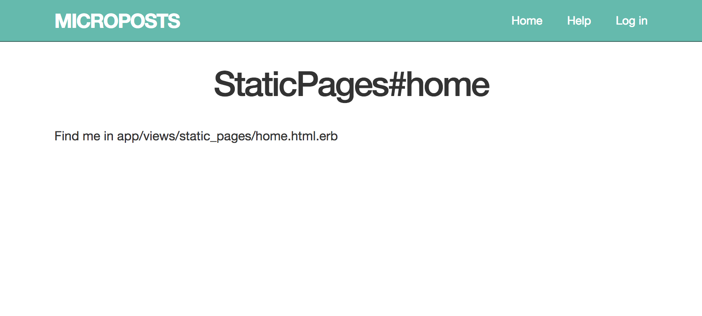

## 1. はじめに

前回のタスクボードは簡単なアプリでしたが、今回のレッスンから本格的なアプリを作っていきます。  
作成するアプリは、「マイクロポスト」のアプリケーションです。  
Twitterのようなアプリをつくります。  

具体的には、以下の機能をもったアプリを作っていきます。

* ユーザの新規登録、サインアップ、ログイン機能
* つぶやきの投稿機能
* ユーザのフォロー機能
* つぶやきのタイムライン表示機能

それでは、Railsアプリを開発していきましょう。

## 2. アプリケーション設定

アプリケーションの設定をしていきます。  
ここから頑張りましょう！

### 2-1. アプリケーションの新規作成

アプリの初期設定をしてきましょう。
アプリケーションを新規に作成します。アプリケーション名を`microposts`として作成しましょう。

```
$ rails new microposts
```

Gitにもコミット&プッシュしておきましょう。  
リモートリポジトリは、先に作っておいてください。

```bash
$ git init
$ git add .
$ git commit -m "New Application Micropsts"
$ git remote add origin リモートリポジトリURL
$ git push -u origin master
```

### 2-2. Gemfileの設定

Bootstrapを使うためのライブラリを追加します。  
ついでに前のレッスンで利用したMariaDBを利用するためのライブラリや`rails c`をpryで起動するようにするためのライブラリも追加しておきましょう。

**Gemfile**

```ruby
source 'https://rubygems.org'

git_source(:github) do |repo_name|
  repo_name = "#{repo_name}/#{repo_name}" unless repo_name.include?("/")
  "https://github.com/#{repo_name}.git"
end

gem 'rails', '~> 5.0.3'
gem 'sqlite3'
gem 'puma', '~> 3.0'
gem 'sass-rails', '~> 5.0'
gem 'uglifier', '>= 1.3.0'
gem 'coffee-rails', '~> 4.2'
gem 'jquery-rails'
gem 'turbolinks', '~> 5'
gem 'jbuilder', '~> 2.5'

# 追加した部分です。 
gem 'mysql2'
gem 'bootstrap-sass', '~> 3.3.7'

group :development, :test do
  gem 'byebug', platform: :mri

  # 追加した部分です。
  gem 'pry-rails'
  gem 'pry-byebug'
  gem 'pry-doc'
end

group :development do
  gem 'web-console', '>= 3.3.0'
  gem 'listen', '~> 3.0.5'
  gem 'spring'
  gem 'spring-watcher-listen', '~> 2.0.0'
end

gem 'tzinfo-data', platforms: [:mingw, :mswin, :x64_mingw, :jruby]
```

今回からCSSの拡張である`Sass(Syntactically Awesome Style Sheets`を使っていまます。

Sassには、`SASS`と`SCSS`といった記述方法があるのですが、本勉強会ではSassの機能をCSSっぽく記述するために`SCSS`記法を使って記述していきす。

`Gemfile`の設定が完了したら、`bundle install`しておきましょう。

```
$ bunlde install
```

### 2-3. データベースの設定

RailsアプリからMariaDBに接続するために、`config/database.yml`の設定をしておきます。  
コピペでかまいません。

**config/database.yml**

```ruby
default: &default
  adapter: sqlite3
  pool: 5
  timeout: 5000

# developmentの部分を以下のように編集してください。
development:
  adapter: mysql2
  encoding: utf8
  database: ruby_lesson
  username: root
  host: localhost

test:
  <<: *default
  database: db/test.sqlite3

production:
  <<: *default
  database: db/production.sqlite3
```

## 3. レイアウトの設定

各種ファイルのレイアウトを設定しておきましょう。

### 3-1. カスタムSCSSの設定

Railsアプリでは、`rails g controller`コマンドでコントローラを作成する度にコントローラごとに分けられたSCSSファイルが自動的に生成されるのですが、これらのファイルを正しい順序で読み込みさせるのが面倒くさいです。  

本勉強会では、すべてのSCSSファイルを1つにまとめてしまうために、カスタムSCSSファイルを作成して進めていきます。

```bash
$ touch app/assets/stylesheets/custom.scss
```

以下のように編集してください。  
スタイルの部分ですのでここもコピペしちゃいましょう。

**app/assets/stylesheets/custom.scss**

```scss
@import "bootstrap-sprockets";
@import "bootstrap";

/* universal */

body {
  padding-top: 60px;
  font-family: monospace,sans-serif;
}

section {
  overflow: auto;
}

textarea {
  resize: vertical;
}

.center {
  text-align: center;
}

.center h1 {
  margin-bottom: 10px;
}

/* typography */

h1, h2, h3, h4, h5, h6 {
  line-height: 1;
}

h1 {
  font-size: 3em;
  letter-spacing: -2px;
  margin-bottom: 30px;
  text-align: center;
}

h2 {
  font-size: 1.2em;
  letter-spacing: -1px;
  margin-bottom: 30px;
  text-align: center;
  font-weight: normal;
  color: #777;
}

p {
  font-size: 1.1em;
  line-height: 1.7em;
}


/* header */

.navbar-inverse {
  background-color: #65baad;
  border-color: #3e6962;
}
.navbar-inverse .navbar-nav {
  li {
    a {
      color: #fff;
    }
    a:hover {
      color: #eee;
    }
    a:focus {
      color: #fff;
    }
  }
}

#logo {
  float: left;
  margin-right: 10px;
  font-size: 1.7em;
  color: #fff;
  text-transform: uppercase;
  letter-spacing: -1px;
  padding-top: 9px;
}

#logo:hover {
  color: #fff;
  text-decoration: none;
}

/* forms */

input, textarea, select, .uneditable-input {
  border: 1px solid #bbb;
  width: 100%;
  margin-bottom: 15px;
}
```


冒頭の2行でBootstrap (とそれに関連するSprockets) を読み込みんでいます。残りの部分がアプリケーションに設定するスタイルになっています。  
説明については省略します。


### 3-2. JavaScriptの設定

**app/assets/javascripts/application.js**

```
//= require rails-ujs
//= require turbolinks
//= require bootstrap-sprockets
//= require_tree .
```

### 3-3. HTMLレイアウト

アプリで使用するビューの共通レイアウトを設定しておきましょう。
`app/views/layouts/application.html.erb`を以下のように編集してください。コピペしましょう！

```erb
<!DOCTYPE html>
<html>
  <head>
    <title>Microposts</title>
    <%= csrf_meta_tags %>
    <%= stylesheet_link_tag    'application', media: 'all' %>
    <%= javascript_include_tag 'application' %>
  </head>
  <body>
    <%= render "layouts/header" %>
    <div class="container">
      <%= yield %>
    </div>
  </body>
</html>
```

`yeild`の部分に各ビューのページが描画されます。  
また、以下の部分は、ヘッダーになります。部分テンプレートを指定しています。

```erb
<%= render "layouts/header" %>
```

ヘッダー用の部分テンプレートを作成してしまいましょう。  
部分テンプレートファイルは、ファイル名が`_`から始まります。

**app/views/layouts/_header.html.erb**

```erb
<header class="navbar navbar-fixed-top navbar-inverse">
  <div class="container">
    <%= link_to "Microposts", '#', id: "logo" %>
    <nav>
      <ul class="nav navbar-nav navbar-right">
        <li><%= link_to "Home", '#' %></li>
        <li><%= link_to "Help", '#' %></li>
        <li><%= link_to "Log in", '#' %></li>
      </ul>
    </nav>
  </div>
</header>
```

ここまででコミットしておきましょう。

```bash
$ git add .
$ git commit -m "initial setup ended"
$ git push -u origin master
```

## 4. トップページの作成

トップページを作成していきましょう。  
まずはコントローラを作ります。

ここでは、`static_pages`という名前のコントローラを作って`home`アクションも同時に定義しましょう。

```
$ rails g controller static_pages home
Running via Spring preloader in process 85913
      create  app/controllers/static_pages_controller.rb
       route  get 'static_pages/home'
      invoke  erb
      create    app/views/static_pages
      create    app/views/static_pages/home.html.erb
      invoke  test_unit
      create    test/controllers/static_pages_controller_test.rb
      invoke  helper
      create    app/helpers/static_pages_helper.rb
      invoke    test_unit
      invoke  assets
      invoke    coffee
      create      app/assets/javascripts/static_pages.coffee
      invoke    scss
      create      app/assets/stylesheets/static_pages.scss
```

### 4-1. ルーティングの設定

ルーティングを確認しましょう。
`config/routes.rb`ファイル開いてみてください。  
以下のようになっているはずです。

**config/routes.rb**

```ruby
Rails.application.routes.draw do
  get 'static_pages/home'
end
```

`rails routes`コマンドからもルーティングを確認すると、このように表示されるはずです。

```
$ rails routes
           Prefix Verb URI Pattern                  Controller#Action
static_pages_home GET  /static_pages/home(.:format) static_pages#home
```

この状態だと、`/static_pages/home`のURLでトップページにアクセスすることになるので、`/`でアクセスできるように変更しましょう。  
`config/routes.rb`を以下のように変更してください。

**config/routes/.rb**

```ruby
Rails.application.routes.draw do
  root "static_pages#home"
end
```

### 4-2. コントローラの確認

`rails g controller`コマンドで生成されたコントローラも確認しておきましょう。以下のようになっています。

**app/controllers/static_pages_controller.rb**

```ruby
class StaticPagesController < ApplicationController
  def home
  end
end
```

トップページは単にビューを表示するのみですので、`home`アクションの定義は空のままでOKです。あとで編集していきます。

## 4-3. ビューの確認

ビューについても`rails g controller`コマンドで自動生成されているので一応中身を確認しておきましょう。  

**app/views/static_pages/home.html.erb**

```erb
<h1>StaticPages#home</h1>
<p>Find me in app/views/static_pages/home.html.erb</p>
```

データの操作などはまだ実装する必要性がないので、このままでOKです。あとで編集していきます。

### 4-4. サーバの起動と確認

ここまでできたらRailsアプリを起動しましょう。


```
$ rails s -p $PORT -b $IP
```

以下のように表示できていたらOKです。




Gitにコミットしておきましょう。

```
$ git add .
$ git commit -m "add top page"
```

## 5. ユーザモデルの作成

ユーザの新規登録機能を実装するために、ユーザのモデルを作ります。

### 5-1. モデルの作成

`rails g model`コマンドでユーザモデルを作成します。

今回、ユーザモデルに保持する項目は、以下のとおりです。  
すべて文字列型として定義します。

* name: ユーザ名
* email: メールアドレス
* password_digest: パスワードを暗号化したもの

それでは、コマンドを実行してユーザモデルを定義しましょう。

```
$ rails g model User name:string email:string password_digest:string
Running via Spring preloader in process 87504
      invoke  active_record
      create    db/migrate/20170915031058_create_users.rb
      create    app/models/user.rb
      invoke    test_unit
      create      test/models/user_test.rb
      create      test/fixtures/users.yml
```

### 5-2. マイグレーション

マイグレーションを実行してテーブルを作成していくのですが、その前にマイグレーションファイルを以下のように編集します。

**db/migrate/2017XXXXXXXXXXXX_create_users.rb**

```ruby
class CreateUsers < ActiveRecord::Migration[5.1]
  def change
    create_table :users do |t|
      t.string :name
      t.string :email
      t.string :password_digest

      t.timestamps

      # メールアドレスがユニークになるように、
      # ユニークインデックスを追加
      t.index :email, unique: true
    end
  end
end
```

usersテーブルがメールアドレスでユニークになるようにしています。  
メールアドレスの重複を許さないように設定しているのです。

マイグレーションを実行しましょう。

```
$ rails db:migrate
== 20170915031058 CreateUsers: migrating ======================================
-- create_table(:users)
   -> 0.0569s
== 20170915031058 CreateUsers: migrated (0.0570s) =============================
```

`rails db`コマンドを起動してテーブルが本当にできているか確認してましょう。

```
$ rails db
mysql> show tables;
+-----------------------+
| Tables_in_ruby_lesson |
+-----------------------+
| ar_internal_metadata  |
| schema_migrations     |
| tasks                 |
| users                 |
+-----------------------+
4 rows in set (0.00 sec)


mysql> desc users;
+-----------------+--------------+------+-----+---------+----------------+
| Field           | Type         | Null | Key | Default | Extra          |
+-----------------+--------------+------+-----+---------+----------------+
| id              | bigint(20)   | NO   | PRI | NULL    | auto_increment |
| name            | varchar(255) | YES  |     | NULL    |                |
| email           | varchar(255) | YES  | UNI | NULL    |                |
| password_digest | varchar(255) | YES  |     | NULL    |                |
| created_at      | datetime     | NO   |     | NULL    |                |
| updated_at      | datetime     | NO   |     | NULL    |                |
+-----------------+--------------+------+-----+---------+----------------+
6 rows in set (0.00 sec)
```

また、メールアドレスの重複を許さないようになっているか、`rails c`コマンドを使って確認しておきましょう。

```
$ rails c --sandbox

> user1 = User.new(name: "Onbu", email: "user@example.com")
> user2 = User.new(name: "Dakko", email: "user@example.com")
> user1.save
 => true
> user2.save
ActiveRecord::RecordNotUnique: Mysql2::Error: Duplicate entry 'user@example.com' for key 'index_users_on_email': INSERT INTO `users` (`name`, `email`, `created_at`, `updated_at`) VALUES ('Dakko', 'user@example.com', '2017-09-15 03:32:25', '2017-09-15 03:32:25')
```

重複エラーが発生しているのが分かると思います。  
ユニークインデックスが有効である証拠です。

補足になりますが、`rails c`コマンドのオプションで`--sandbox`を指定しています。  
これは、データを変更することなくコードをテストしたい時などに使います。  
上記では、`user1`オブジェクトの`save`メソッドの結果が`true`で返却されていますが、実際にはテーブルに反映されていません。

話が逸れてしまいましたが、ここまで完了したらGitにコミットしてリモートリポジトリにプッシュしておきましょう。

```
$ git add .
$ git commit -m "generated User model"
$ git push -u origin master
```

## 6. ユーザの新規登録機能

ユーザの新規登録機能を実装していきましょう。
ここからは機能ごとにブランチを切って開発していきましょう。  
`dev_signup`ブランチを作ることにします。

```
$ git branch dev_signup
$ git checkout dev_signup
Switched to branch 'dev_signup'

$ git branch
* dev_signup
  master
```

### 6-1. ルーティング

まずは、ルーティングを定義します。  
`resources`を利用して定義してしまいます。

**config/routes.rb**

```ruby
Rails.application.routes.draw do
  root "static_pages#home"
  resources :users
end
```

おなじみの`rails routes`コマンドで以下のようにルーティングが定義できていればOKです。

```
$ rails routes
   Prefix Verb   URI Pattern               Controller#Action
     root GET    /                         static_pages#home
    users GET    /users(.:format)          users#index
          POST   /users(.:format)          users#create
 new_user GET    /users/new(.:format)      users#new
edit_user GET    /users/:id/edit(.:format) users#edit
     user GET    /users/:id(.:format)      users#show
          PATCH  /users/:id(.:format)      users#update
          PUT    /users/:id(.:format)      users#update
          DELETE /users/:id(.:format)      users#destroy
```

まずは、新規登録機能を作っていくので、以下の部分に該当する`create`アクションと`new`アクションをユーザコントローラに定義していきます。

```
          POST   /users(.:format)          users#create
 new_user GET    /users/new(.:format)      users#new
```

前回のタスクボードのおさらいになりますが、以下の流れでユーザの新規登録処理を実施します。

1. ブラウザからGETで`/users/new`にアクセスすると、ルーターがコントローラにルーティングします。
1. コントローラは、`new`アクションを実行してユーザモデルのオブジェクトを生成して、ビュー(ユーザ新規登録用)に対してオブジェクトを渡します。
1. ビュー(ユーザ新規登録用)に必要な情報をセットして、送信ボタンを押します。送信ボタンはPOSTで`/users`にアクセスします。すると、ルーターがコントローラにルーティングします。
1. コントローラは、`create`アクションを実行して、オブジェクトをデータベースに保存します。

### 6-2. コントローラ

ユーザのコントローラを`rails g contorller`コマンドで生成します。  
名詞は複数形で指定してください。

```
$ rails g contorller users
Running via Spring preloader in process 89001
      create  app/controllers/users_controller.rb
      invoke  erb
      create    app/views/users
      invoke  test_unit
      create    test/controllers/users_controller_test.rb
      invoke  helper
      create    app/helpers/users_helper.rb
      invoke    test_unit
      invoke  assets
      invoke    coffee
      create      app/assets/javascripts/users.coffee
      invoke    scss
      create      app/assets/stylesheets/users.scss
```

コントローラに`new`アクションを定義しておきます。  
(新規登録のためには`create`アクションも必要ですが、あとで実装します。)

**app/controllers/users_controller.rb**

```ruby
class UsersController < ApplicationController

  def new
    @user = User.new
  end

end
```

`new`アクションでは、`User`モデルからオブジェクトを生成してインスタンス変数`@user`に代入しています。


### 6-3. ビューの作成

新規登録用のビューを作成します。  
ビューは、フォームで作成していきます。

ビューは新規に作成してください。

```
$ touch app/views/users/new.html.erb
```

ビューを以下のように編集してください。

**app/views/users/new.html.erb**

```erb
<h1>Sign up</h1>

<div class="row">
  <div class="col-md-6 col-md-offset-3">
    <%= form_for(@user) do |f| %>

      <%= f.label :name, "Name" %>
      <%= f.text_field :name, class: "form-control" %>

      <%= f.label :email, "E-mail" %>
      <%= f.text_field :email, class: "form-control" %>

      <%= f.label :password, "Password" %>
      <%= f.password_field :password, class: "form-control" %>

      <%= f.label :password_confirmation, "Confirmation" %>
      <%= f.password_field :password_confirmation, class: "form-control" %>

      <%= f.submit "Create my account", class: "btn btn-primary btn-block" %>
    <% end %>
  </div>
</div>
```

フォームビルダを使った`f.password_field`の部分が新しくでてきたコードですね。  
これによって、パスワードを入力した際には文字が●●●●●●●●のような伏せ字で表示されます。

ここまでできたら、いったんRailsサーバを起動して確認しましょう。

```
$ rails s -p $PORT -b $IP
```

`/users/new`にアクセスして以下のように表示できていたらOKです。


### 6-4. ルーティングの追加

ユーザの新規登録画面へのアクセスは、`/users/new`を指定しています。  
ただ、一般的にユーザの新規登録画面へのアクセスは、`/signup`を指定するのが自然かと筆者は考えます。

ルーティングを追加して、`/users/new`と`/signup`のどちらを指定しても新規登録画面が表示されるようにしてみましょう。

`config/routes.rb`を以下のように編集してください。

**config/routes.rb**

```ruby
Rails.application.routes.draw do
  root "static_pages#home"
  # この部分を追加
  get "/signup" => "users#new"
  resources :users
end
```

`rails routes`コマンドで確認するとルーティングが追加されていることがわかります。

```
$ rails routes
  Prefix Verb   URI Pattern               Controller#Action
     root GET    /                         static_pages#home
   signup GET    /signup(.:format)         users#new
    users GET    /users(.:format)          users#index
          POST   /users(.:format)          users#create
 new_user GET    /users/new(.:format)      users#new
edit_user GET    /users/:id/edit(.:format) users#edit
     user GET    /users/:id(.:format)      users#show
          PATCH  /users/:id(.:format)      users#update
          PUT    /users/:id(.:format)      users#update
          DELETE /users/:id(.:format)      users#destroy
```

また、URLに`/signup`を指定して新規登録画面が表示できることを確認しておいてください。

### 6-5. モデルの実装

フォームから送信されたデータを受け取って、データベースに保存する実装をやっていきます。

モデルに対しては、以下を実装します。

* パスワードの暗号化(has_secure_passwordを有効にする)
* バリデーションチェック

ひとつずつクリアしていきましょう。

#### 6-5-1. パスワードの暗号化(has_secure_passwordを有効にする)

パスワードを暗号化するために、Rails標準で用意されている`has_secure_password`メソッドを使っていきます。

ただし、`has_secure_password`メソッドを使う場合には、以下の2点の事前準備が必要になります。

1. モデルに`password_digest`という属性が存在していること
1. 最先端のハッシュ関数である`bcrypt`がインストールされていること


1点目については、既にマイグレーションで設定しています。ユーザのモデルに`password_digest`が設定されているはずです。  

```
$ rails db

mysql> desc users;
+-----------------+--------------+------+-----+---------+----------------+
| Field           | Type         | Null | Key | Default | Extra          |
+-----------------+--------------+------+-----+---------+----------------+
| id              | bigint(20)   | NO   | PRI | NULL    | auto_increment |
| name            | varchar(255) | YES  |     | NULL    |                |
| email           | varchar(255) | YES  | UNI | NULL    |                |
| password_digest | varchar(255) | YES  |     | NULL    |                |
| created_at      | datetime     | NO   |     | NULL    |                |
| updated_at      | datetime     | NO   |     | NULL    |                |
+-----------------+--------------+------+-----+---------+----------------+
6 rows in set (0.00 sec)
```

2点目については対応必要です。
`Gemfile`にコメントの部分のライブラリを追加してください。

**Gemfile**

```ruby
source 'https://rubygems.org'

git_source(:github) do |repo_name|
  repo_name = "#{repo_name}/#{repo_name}" unless repo_name.include?("/")
  "https://github.com/#{repo_name}.git"
end

gem 'rails', '~> 5.0.3'
gem 'sqlite3'
gem 'puma', '~> 3.0'
gem 'sass-rails', '~> 5.0'
gem 'uglifier', '>= 1.3.0'
gem 'coffee-rails', '~> 4.2'
gem 'jquery-rails'
gem 'turbolinks', '~> 5'
gem 'jbuilder', '~> 2.5'

gem 'mysql2'
gem 'bootstrap-sass', '~> 3.3.7'

# Use ActiveModel has_secure_password
gem 'bcrypt', '~> 3.1.7'

group :development, :test do
  gem 'byebug', platform: :mri
  gem 'pry-rails'
  gem 'pry-byebug'
  gem 'pry-doc'
end

group :development do
  gem 'web-console', '>= 3.3.0'
  gem 'listen', '~> 3.0.5'
  gem 'spring'
  gem 'spring-watcher-listen', '~> 2.0.0'
end

gem 'tzinfo-data', platforms: [:mingw, :mswin, :x64_mingw, :jruby]
```

`bundle install`でインストールします。  
Railsサーバが起動している場合には、一度停止してからコマンドを実行してください。

```
$ bundle install
```

インストールできたら、`app/models/user.rb`に`has_secure_password`メソッドを追加してください。1行追加するだけです。

**app/models/user.rb**

```ruby
class User < ApplicationRecord
  has_secure_password
end
```

このメソッドを追加すると次のような機能が追加されます。

* セキュアにハッシュ化したパスワードを`password_digest`に保持できるようになる。
* `password`と`password_confirmation`を**仮想的に**モデルに追加する。
* `authenticate`メソッドが使えるようになる。(引数の文字列がパスワードと一致するとモデルのオブジェクトを返し、一致しない場合は`false`を返す。)

この説明だけだと分かり辛いと思いますので、`rails c`で確認してみましょう。

```
$ rails c --sandbox

> # passwordとpassword_confirmationが同じ
> user1 = User.new(name: "onbu", email: "onbu@example.com", password: "hogehoge", password_confirmation: "hogehoge")
  => #<User:0x007ff0f13a1d28
  id: nil,
  name: "onbu",
  email: "onbu@example.com",
  password_digest:
    "$2a$10$rtCQbbvPu3Lb4o4M4zV4bOVrFpiK2ctcy//DUBVGPnTqq8Od6n.qy",
  created_at: nil,
  updated_at: nil>

> user1.save
 => true

> # passwordとpassword_confirmationが異なる場合
> user2 = User.new(name: "dakko", email: "dakko@example.com", password: "hogehoge", password_confirmation: "valid")
  => #<User:0x007ff0f139b928
  id: nil,
  name: "dakko",
  email: "dakko@example.com",
  password_digest:
    "$2a$10$VyXVuGCBfzxFQQEvqTwjYOVPG8eqG1zkEGV0IcVvhYXFO126wcOkq",
  created_at: nil,
  updated_at: nil>

> user2.save
 => false

> # authenticateメソッドに正しいパスワードを与えると、モデルオブジェクトが返却される
> user1.authenticate("hogehoge")
  => #<User:0x007ff0ece26820
  id: 5,
  name: "onbu",
  email: "onbu@example.com",
  password_digest:
    "$2a$10$meq8YcETb/exOijQ/lzQUObWx5ZzAm8Y514fQdki1l1Xvy2fmoxGy",
  created_at: Fri, 15 Sep 2017 08:55:54 UTC +00:00,
  updated_at: Fri, 15 Sep 2017 08:55:54 UTC +00:00>

> # authenticateメソッドに間違ったパスワードを与えると、falseが返却される
> user1.authenticate("valid_password")
  => false
```

以上、魔術のような`has_secure_password`メソッドでした。  
メソッドを使うための事前条件と機能については抑えておくようにしましょう。

#### 6-5-2. バリデーションチェック

`name`と`email`にバリデーションチェックを実装しましょう。

<u>name</u>

* 必須
* 50文字以内

<u>email</u>

* 必須
* 255文字以内
* xxxxx@xxxx.xxxxの形式であること
* ユニークであること
* 小文字で保存

上記の要件を満たすコードは、以下の通りになります。  
コピペでかまいません。

**app/models/user.rb**

```ruby
class User < ActiveRecord
  before_save { self.email = self.email.downcase }
  validates :name, presence: true, length: { maximum: 50 }
  VALID_EMAIL_REGEX = /\A[\w+\-.]+@[a-z\d\-.]+\.[a-z]+\z/i
  validates :email, presence: true, length: { maximum: 255 },
                    format: { with: VALID_EMAIL_REGEX },
                    uniqueness: true
  has_secure_password
end
```

ソースの詳細については割愛します。  
`rails c`でコンソールを立ち上げて、要件を満たすバリデーションチェックができているか確認しておくとよいでしょう。

### 6-6. コントローラの実装

フォームから受け取ったデータをデータベースに保存するために、コントローラを実装しましょう。

`create`アクションとストロングパラメータを実装します。(ストロングパラメータについて忘れてしまった方はタスクボードのレッスンを復習しておくといいでしょう。)

`app/controllers/users_controller.rb`を以下のように編集してください。

**app/controllers/users_controller.rb**

```ruby
class UsersController < ApplicationController

  def new
    @user = User.new
  end

  # createアクションの実装
  def create
    @user = User.new(user_params)
    if @user.save
      # データベース保存が成功した場合は、トップページにリダイレクト
      # リダイレクト先は、あとでユーザ詳細ページに変更します。
      redirect_to root_path
    else
      # データベース保存に失敗した場合は、new.html.erbを描画
      # リダイレクトは発生させない
      render "new"
    end
  end

  private

  # ストロングパラメータの実装
  def user_params
    # フォームから受け取るパラメータをname,email,password,password_confirmationに制限
    params.require(:user).permit(:name,:email,:password,:pasword_confirmation)
  end

end
```

ここまでできたら、Railsサーバを起動して`/signup`にアクセスし、以下の事項を確認しましょう。

* 新規登録に成功した場合、トップページにリダイレクトされること
* 新規登録に失敗した場合、リダイレクトされないこと。

失敗した場合のエラーメッセージの表示は、次の節で実装します。

### 6-7. エラー表示

登録に失敗した場合にエラーメッセージを表示するようにしましょう。  
`app/views/users/new.html.erb`を以下のように編集してください。

**app/views/users/new.html.erb**

```erb
<h1>Sign up</h1>

<div class="row">
  <div class="col-md-6 col-md-offset-3">
    <%= form_for(@user) do |f| %>

       <%# ここが追加した部分。 %>
       <%# renderメソッドでshared/_error_messages.html.erbを描画する %>
       <%# その際にobjectを渡している。objectには、@userが入る %>
      <%= render "shared/error_messages", object: f.object %>

      <%= f.label :name, "Name" %>
      <%= f.text_field :name, class: "form-control" %>

      <%= f.label :email, "E-mail" %>
      <%= f.text_field :email, class: "form-control" %>

      <%= f.label :password, "Password" %>
      <%= f.password_field :password, class: "form-control" %>

      <%= f.label :password_confirmation, "Confirmation" %>
      <%= f.password_field :password_confirmation, class: "form-control" %>

      <%= f.submit "Create my account", class: "btn btn-primary btn-block" %>
    <% end %>
  </div>
</div>
```

`render`メソッドを使って部分テンプレート`app/views/shared/_error_messages.html.erb`を描画しています。  
`f.object`の`object`には、`@user`が入っています。これを部分テンプレート側で`object`という変数名で利用できりょうに`render`メソッドの引数として渡しています。

`app/views/shared/_error_messages.html.erb`を作成していきましょう。

```
$ mkdir app/views/shared
$ touch app/views/shared/_error_messages.html.erb 
```

**app/views/shared/_error_messages.html.erb**

```erb
<% if object.errors.any? %>
  <div class="alert alert-danger">
    <ul>
      <% object.errors.full_messages.each do |msg| %>
        <li><%= msg %></li>
      <% end %>
    </ul>
  </div>
<% end %>
```

前述したように、`object`には、`@user`が入っています。  `object.errors.any?`と`object.errors.full_messages`について忘れてしまった方もいると思うので、復習を兼ねて`rails c`で確かめておきましょう。

```
$ rails c --sandbox

> # 意図的に保存に失敗
> user = User.new(name: "", email: "invalid", password: "vaid_pass", password_confirmation: "invalid_pass")
> user.save
  => false

> # エラーが発生したかどうか確認する。
> user.errors.any?
  => true

> # エラーが発生した場合のエラーメッセージを取得する
> user.errors.full_messages
  => ["Name can't be blank",
  "Email is invalid",
  "Password confirmation doesn't match Password"]
```

思い出しましたか？  
すこし難しいですが、よく出てくる実装なので頑張って覚えておくとよいでしょう。

さて、ここまでできたらRailsサーバを起動してエラー表示ができているか確認しましょう！  
新規登録画面にアクセスして、バリデーションチェックでエラーの場合に以下のような表示ができたらOKです。


### 6-8. ユーザ詳細画面の作成

ユーザ詳細画面を作る前に、ルーティングを確認しましょう。

```
$ rails routes
   Prefix Verb   URI Pattern               Controller#Action
     root GET    /                         static_pages#home
   signup GET    /signup(.:format)         users#new
    users GET    /users(.:format)          users#index
          POST   /users(.:format)          users#create
 new_user GET    /users/new(.:format)      users#new
edit_user GET    /users/:id/edit(.:format) users#edit
     user GET    /users/:id(.:format)      users#show
          PATCH  /users/:id(.:format)      users#update
          PUT    /users/:id(.:format)      users#update
          DELETE /users/:id(.:format)      users#destroy
```

ユーザ詳細は以下の部分が該当します。  

```
     user GET    /users/:id(.:format)      users#show
```

つまり、コントローラファイル`app/controllers/users_controller.rb`に`show`アクションの定義、ビューファイル`app/views/users/show.html.erb`の作成が必要になります。

`app/controllers/users_controller.rb`から編集していきましょう。  

**app/controllers/users_controller.rb**

```ruby
class UsersController < ApplicationController

  def new
    @user = User.new
  end

  def create
    @user = User.new(user_params)
    if @user.save
      # ユーザ詳細ページにリダイレクトするように修正
      redirect_to user_path(@user.id)
    else
      render "new"
    end
  end

  # showアクションの実装
  def show
    @user = User.find(params[:id])
  end

  private

  def user_params
    params.require(:user).permit(:name,:email,:password,:pasword_confirmation)
  end

end
```

`create`アクションでデータベース保存が成功した場合のリダイレクト先の変更と`show`アクションを定義しました。

つぎに、ビューファイル`app/views/users/show.html.erb`を作成しましょう。

**app/views/users/show.html.erb**

```erb
<h1>
  <%= gravatar_for(@user) %>
  <%= @user.name %>
</h1>
```

`gravatar_for`ヘルパーメソッドを使ってGravatarの画像を利用できるようにします。  

**ヘルパーメソッド**とは、ビューで扱えるメソッドです。  
ビューで利用する共通部品の役割を果たします。  

ヘルパーメソッドは、`app/helpers/users_helper.rb`に定義します。  
以下のように編集してください。

**app/helpers/users_helper.rb**

```ruby
module UsersHelper
  def gravatar_for(user, options={ size: 80 })
    gravatar_id = Digest::MD5::hexdigest(user.email.downcase)
    size = options[:size]
    gravatar_url = "https://secure.gravatar.com/avatar/#{gravatar_id}?d=monsterid&s=#{size}"
    image_tag(gravatar_url, alt: user.name, class: "gravatar")
  end
end
```

GravatarのURLはユーザーのメールアドレスをMD5という仕組みでハッシュ化しています。  
Digestライブラリの`hexdigest`メソッドを使うと、MD5のハッシュ化が実現できます。  
MD5ハッシュでは大文字と小文字が区別されるので、`downcase`メソッドを使ってメールアドレスを小文字に変換しています。

`gravatar_url`という変数にURLの文字列を代入し、`image_tag`メソッドで``タグを生成しているのです。

新規登録画面でユーザを新規に作成した後、ユーザ詳細画面にリダイレクトされればOKです。


### 6-9. フラッシュメッセージの追加

最後に、一時的なメッセージ（フラッシュメッセージ）を表示できるようにしておきましょう。特殊な変数`flash`を使います。

`app/controllers/users_controller.rb`を以下のように修正します。  
変更箇所はコメントの部分だけです。

**app/controllers/users_controller.rb**

```ruby
class UsersController < ApplicationController

  def new
    @user = User.new
  end

  def create
    @user = User.new(user_params)
    if @user.save
      # フラッシュメッセージを追加
      flash[:success] = "Welcome to the MicroPost App!"
      redirect_to user_path(@user.id)
    else
      render "new"
    end
  end

  def show
    @user = User.find(params[:id])
  end

  private

  def user_params
    params.require(:user).permit(:name,:email,:password,:pasword_confirmation)
  end

end
```

フラッシュメッセージをビューに表示するために、`app/views/layouts/application.html.erb`を編集します。

**app/views/layouts/application.html.erb**

```erb
<!DOCTYPE html>
<html>
  <head>
    <title>Microposts</title>
    <%= csrf_meta_tags %>
    <%= stylesheet_link_tag    'application', media: 'all' %>
    <%= javascript_include_tag 'application' %>
  </head>
  <body>
    <%= render "layouts/header" %>
    <div class="container">
      <%# 追加した箇所 %>
      <% flash.each do |type, message| %>
        <div class="alert alert-<%= type %>">
          <%= message %>
        </div>
      <% end %>

      <%= yield %>
    </div>
  </body>
</html>
```

`flash`変数はハッシュオブジェクトであるため、eachメソッドのブロックに渡す変数でキー`type`とバリュー`message`を渡しています。

新規登録画面で登録後、ユーザ詳細画面でフラッシュメッセージが以下のように表示できていればOKです。


確認が完了したら、Gitにコミットしてブランチをマージしておきましょう。

```
$ git add .
$ git commit -m "complete signup"

$ git checkout master
$ git merge dev_signup

$ git push -u origin master
```


## 7. 演習問題

ユーザのプロフィール編集機能を作ってみましょう!

* ブランチを切って作成しましょう。ブランチ名は`edit_profile`としてください。
* 編集画面は`edit`アクション、更新処理は`update`アクションとしてください。ルーティングは`rails routes`で確認しましょう。
* 編集できる項目は以下とします。  
  * name(名前)
  * email(メールアドレス)
  * password(パスワード)
  * gender(性別)

<u>(ヒント)</u>  
`gender`属性を追加するためにマイグレーションが必要になります。  
マイグレーションファイルは、以下のように生成します。

```
$ rails g migration AddColumnToUser gender:string
Running via Spring preloader in process 97696
      invoke  active_record
      create    db/migrate/20170915145947_add_column_to_user.rb
```

## 8. まとめ

おつかれさまです。今回のレッスンでは新しく学ぶことは少なかったと思います。前回作成したタスクボードで学んだことの復習がほとんどでした。

次回は、ユーザのログイン機能とつぶやきの投稿機能を実装していきます。これまでに学んだことを復習しておくといいでしょう！