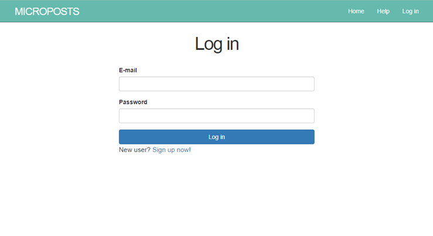
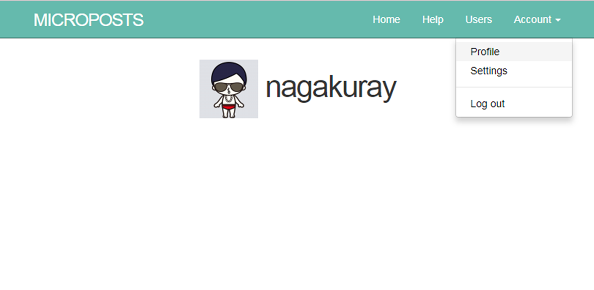
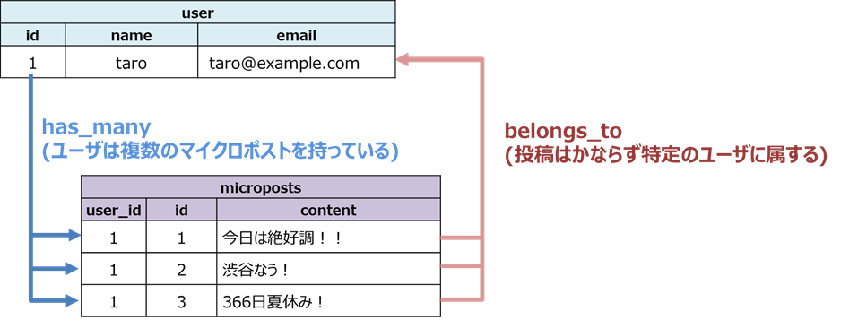
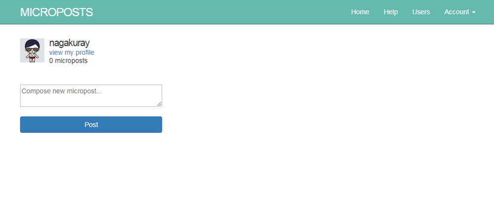
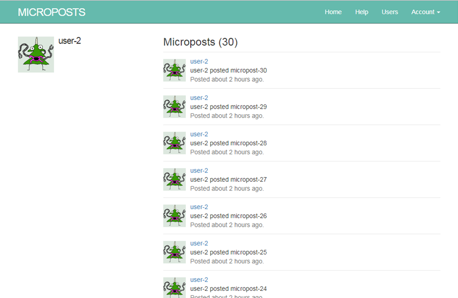
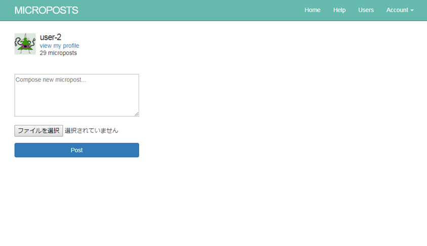
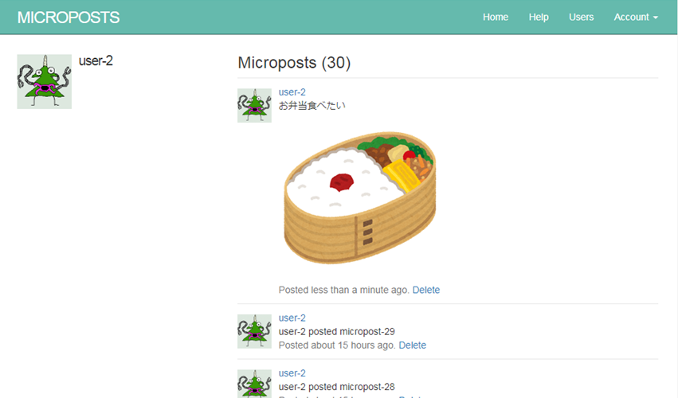
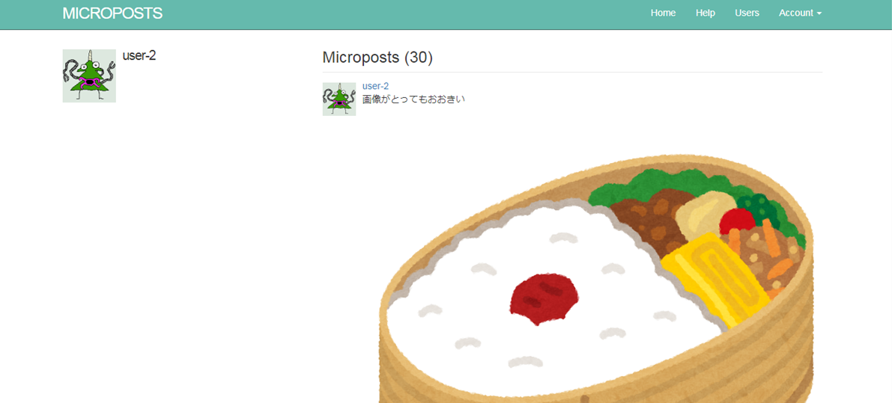
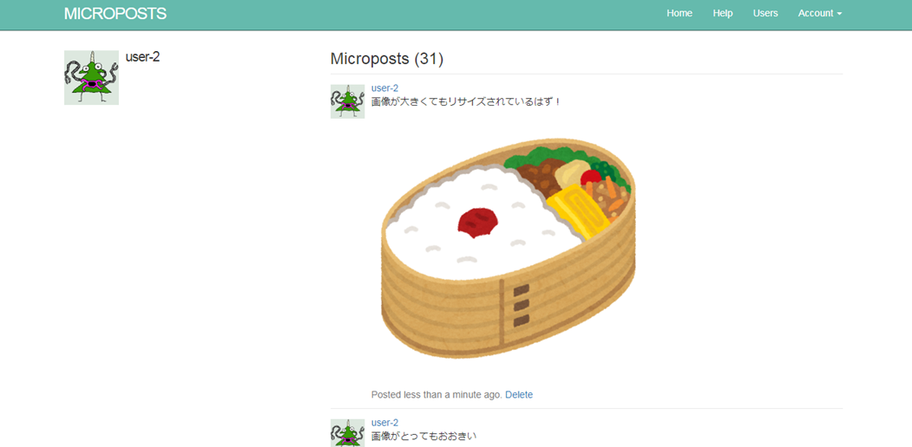
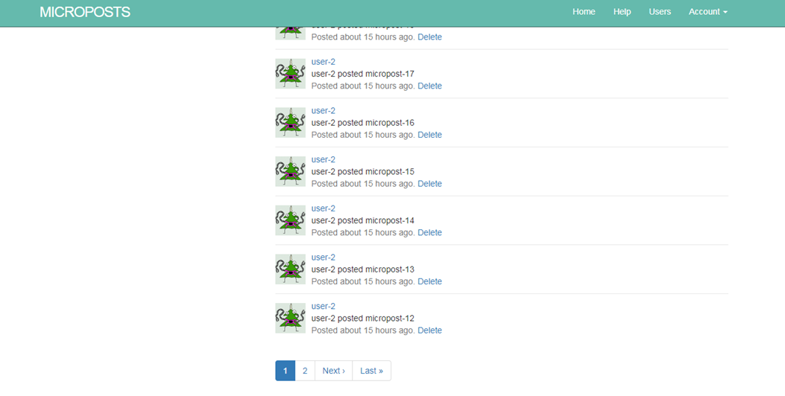

## 1. はじめに

今回のレッスンでは、前回作った機能に以下の機能を追加実装していきます。

* ユーザのログイン機能
* つぶやきの投稿機能

## 2. ログイン機能

前回までのレッスンでユーザの新規登録ができるようになったので、ログインできるように実装していきます。

まずは、ブランチを作成しましょう。

```
$ git branch login_feat
$ git checkout login_feat
```

ログインする場合には、ログインの情報をセッションとして、サーバ、ブラウザに保持します。  
今回は、Railsで用意されている`session`という特殊な変数にユーザの`id`を代入することによって、ログインの機能を実装します。

ログイン時には、`session[:user_id]`にユーザのIDを代入します。  
ログアウト時には、`session[:user_id]`に`nil`を代入することによって、セッションを破棄します。

### 2-1. コントローラの作成とルーティングの定義

`sessions`コントローラを作成します。
コマンドは以下の通りです。

```
$ rails g contorller sessions
```

次に、`confifg/routes.rb`を以下のように編集してください。

**config/routes.rb**

```ruby
Rails.application.routes.draw do
  root "static_pages#home"
  get "/signup" => "users#new"

  # 追加する箇所
  get "/login" => "sessions#new"
  post "/login" => "sessions#create"
  delete "/logout" => "sessions#destroy"

  resources :users
end
```

### 2-2. ログイン画面の作成

ログイン画面を作成しましょう。  
`app/views/sessions/new.html.erb`を作成します。

```
$ touch app/views/sessions/new.html.erb
```

以下のように編集してください。

**app/views/sessions/new.html.erb**

```erb
<h1>Log in</h1>

<div class="row">
  <div class="col-md-6 col-md-offset-3">
    <%= form_for(:session, url: login_path) do |f| %>

      <%= f.label :email, "E-mail" %>
      <%= f.email_field :email, class: "form-control" %>

      <%= f.label :password, "Password" %>
      <%= f.password_field :password, class: "form-control" %>

      <%= f.submit "Log in", class: "btn btn-primary btn-block" %>
    <% end %>

    <p>New user? <%= link_to "Sign up now!", signup_path %></p>

  </div>
</div>
```

ログインに使うのは、メールアドレスとパスワードになります。  
`f.email_field :email`と`f.password_field :password`によって、必要なフィールドを作成しています。

`f.email_field`、`f.password_field`によって、以下のHTMLが生成されます。

```html
<input class="form-control" type="email" name="session[email]" id="session_email">

<input class="form-control" type="password" name="session[password]" id="session_password">
```

また、`form_for`の最初の引数に`:session`を取ることによって、`<input>`の`name`属性が`session[email]`、`session[password]`となります。  
今回はセッションを作成するので、`user[email]`、`user[password]`でないことに注意してください。

ブラウザで`/login`を開くと以下のような画面が表示されるでしょう。



### 2-3. セッションコントローラの実装

`app/controllers/sessions_controller.rb`を実装します。

```ruby
class SessionsController < ApplicationController
  def new
  end

  # セッション作成
  def create
    @user = User.find_by(email: params[:session][:email].downcase)
    if @user && @user.authenticate(params[:session][:password])
      session[:user_id] = @user.id
      flash[:info] = "logged in as #{@user.name}"
      redirect_to user_path(@user.id)
    else
      # パスワード認証に失敗した場合は、/loginページを表示する 
      flash[:danger] = "invalid email/password combination"
      render "new"
    end
  end

  # セッション破棄
  def destroy
    session[:user_id] = nil
    redirect_to root_path
  end

end
```

解説していきます。

ログインページのフォームで入力したメールアドレスとパスワードは`params[:session]`に入っています。

ログイン処理の`create`アクションの内容から解説していきます。

1. ユーザーをメールアドレスから検索します。  
    ```ruby
    @user = User.find_by(email: params[:session][:email]
    ```
1. ユーザーが見つかった場合は、`authenticate`メソッドでパスワードが正しいか調べます。  
    ```ruby
    if @user && @user.authenticate(params[:session][:password])
    ```
    * パスワードが正しい場合は、`session[:user_id]`にユーザーIDを入れ、ユーザーの詳細ページにリダイレクトします。  
      ```ruby
      if @user && @user.authenticate(params[:session][:password])
        session[:user_id] = @user.id
        flash[:info] = "logged in as #{@user.name}"
        redirect_to user_path(@user.id)
      ```  
    * パスワードが間違っている場合は`new`テンプレートを表示します。
      ```ruby
      else
        # パスワード認証に失敗した場合は、/loginページを表示する 
        flash[:danger] = "invalid email/password combination"
        render "new"
      end
      ```

1. 次に、ログアウト処理の`destroy`アクションです。   
`session[:user_id]`を`nil`にしています。サーバーとブラウザの両方でセッションの情報が破棄されます。その後、ルート`/`にリダイレクトします。  
    ```ruby
    session[:user_id] = nil
    redirecet_to root_path
    ```

### 2-4. ヘルパメソッドの定義

おさらいですが、ヘルパメソッドは、**ビュー**から使えるメソッドです。  
今回は、以下のメソッドをヘルパメソッドとして定義していきます。

* 現在のログインしているユーザを返却する`current_user`メソッド
* ユーザがログインしているかどうかを判定する`logged_in?`メソッド

これらのメソッドを`app/helpers/session_helper.rb`に定義していきましょう。  
ここの部分は難しいと思いますが、がんばりましょう！

以下のように編集してください。

**app/helpers/session_helper.rb**

```ruby
module SessionsHelper
  # ログイン中の場合は、ログインしているユーザを返し、ログインしていない場合は、nilを返す
  def current_user
    @current_user ||= User.find_by(id: session[:user_id])
  end

  # current_userが存在する場合は、trueを返し、nilを返す
  def logged_in?
    !!current_user
  end

  # リクエストがGETの場合は、session[:forwarding_url]のリクエストURLを代入する
  def store_location
    session[:forwarding_url] = requerst.url if request.get?
  end

end
```

順を追って解説していきます。

<u>**current_userメソッドについて**</u>

コードを再掲します。

```ruby
  def current_user
    @current_user ||= User.find_by(id: session[:user_id])
  end
```

`current_user`メソッドでは、ログインしている場合には、ログイン中のユーザを返し、ログインしていない場合には、`nil`を返します。

`User.find_by(id: session[:user_id])`の`session[:user_id]`に正規のIDと`nil`を代入してみると分かると思います。以下は、`rails c`での確認例です。

```
$ rails c

> User.find_by(id: 7)
   (0.6ms)  SET NAMES utf8,  @@SESSION.sql_mode = CONCAT(CONCAT(@@sql_mode, ',STRICT_ALL_TABLES'), ',NO_AUTO_VALUE_ON_ZERO'),  @@SESSION.sql_auto_is_null = 0, @@SESSION.wait_timeout = 2147483
  User Load (0.3ms)  SELECT  `users`.* FROM `users` WHERE `users`.`id` = 7 LIMIT 1
=> #<User:0x007fb6da6c3408
 id: 7,
 name: "nagakuray",
 email: "naruhodo.u1@icloud.com",
 password_digest:
  "$2a$10$dp/y1Pps6CZbuAS8Qfj4seufFIcffeIucB291iTkE4DdvBcCIV5I6",
 created_at: Fri, 15 Sep 2017 09:37:58 UTC +00:00,
 updated_at: Fri, 15 Sep 2017 09:37:58 UTC +00:00,
 gender: nil>

> User.find_by(id: nil)
  User Load (2.1ms)  SELECT  `users`.* FROM `users` WHERE `users`.`id` IS NULL LIMIT 1
=> nil
```

`@current_user ||= User.find_by(id: session[:user_id])`の`||=`の部分も初めてでてきましたね。`||=`は、変数を初期化する際によく使われるイディオムです。

`||=`は、左辺の値が`false`もしくは`nil`の場合に右辺の値の代入を行います。左辺に値が入っている場合には、右辺が実行されないため、DBアクセスが毎回走らなくて済むようになります。

これも`rails c`で簡単に確認しておきましょう。

```ruby
# current_userに初期値が入っている場合. ||=の右辺は実行されない
> current_user = User.find(8)
> current_user ||= User.find_by(id: 7)
=> #<User:0x007fb6db126f30
...

> # current_userに値が入っていない(nilの)場合. ||=の右辺が実行される
> current_user = nil
=> nil
> current_user ||= User.find_by(id: 7)
  User Load (0.4ms)  SELECT  `users`.* FROM `users` WHERE `users`.`id` = 7 LIMIT 1
=> #<User:0x007fb6d5c042a0
```

<u>**logged_in?メソッドについて**</u>

コードを再掲します。

```ruby
def logged_in?
  !!current_user
end
```

`logged_in?`メソッドでは、`current_user`メソッドを実行し、戻り値として、値が存在すれば`true`、`nil`の場合には`false`を返します。

`!!`演算子を使って、二重否定になっていてわかりづらいかと思いますが、これも`rails c`で簡単に確認しておきましょう。

```ruby
> # current_userに値が入っている場合
> current_user = User.first
  User Load (0.4ms)  SELECT  `users`.* FROM `users` ORDER BY `users`.`id` ASC LIMIT 1
> !current_user
=> false
> !!current_user
=> true

> # current_userに値が入っていない(nilの)場合
> current_user = nil
=> nil
> !current_user
=> true
> !!current_user
=> false
```

<u>**store_locationメソッドについて**</u>

コードを再掲します。

```ruby
def store_location
  session[:forwarding_url] = requerst.url if request.get?
end
```

`store_location`メソッドでは、リクエストがGETの場合、`session[:forwarding_url]`にリクエストのURLを代入しています。  
ログインが必要なページにアクセスしようとした際に、ページのURLを一旦保存しておき、ログイン画面に遷移してログイン後に再び保存したURLにアクセスする場合にこのメソッドを使用します。

### 2-5. ヘルパメソッドをコントローラから使えるようにする

ヘルパメソッドは、基本的にビューからしか利用できないのですが、コントローラ側でヘルパモジュールをインクルードすることによって、コントローラ側からも利用可能になります。

**app/controllers/application_controller.rb**

```ruby
class ApplicationController < ActionController::Base
  protect_from_forgery with: :exception
  include SessionsHelper

  private
  def logged_in_user
    unless logged_in?
      store_location
      flash[:danger] = "Please log in."
      redirect_to login_url
    end
  end

end
```

`include SessionsHelper`によって、先程定義したヘルパメソッドを使えるようになっています。

`logged_in_user`メソッドをプライベートメソッドとして定義していますが、このメソッドは、ログインしていないユーザが、ログイン必須のページにアクセスしたときに、ページ内容を表示せずにログインページへリダイレクトさせるメソッドになっています。

このメソッドをログイン必須のページに対応する`Controller`のアクションに予め設定しておけば、ログイン必須のページを作ることができます。

`ApplicationController`は全ての`Controller`が継承しているため、`logged_in_user`メソッドを全ての`Controller`から呼び出せます。  

ログイン必須のページに対応した`Controller`のアクションで`logged_in_user`を呼び出せば、アクセス制御できます。  
`logged_in_user`メソッドはあとで利用します。いまは役割だけ覚えておいてください。


### 2-6. ナビゲーションの改修

`app/views/layouts/_header.html.erb`を以下のように編集してください。

```erb
<header class="navbar navbar-fixed-top navbar-inverse">
  <div class="container">
    <%= link_to "Microposts", root_path, id: "logo" %>
    <nav>
      <ul class="nav navbar-nav navbar-right">
        <li><%= link_to "Home", root_path %></li>
        <li><%= link_to "Help", '#' %></li>
        <!-- logged_in?メソッドでログインしているかどうかを判定 -->
        <% if logged_in? %>
          <li><%= link_to "Users", '#' %></li>
          <li class="dropdown">
            <a href="#" class="dropdown-toggle" data-toggle="dropdown">
              Account <b class="caret"></b>
            </a>
            <ul class="dropdown-menu">
              <!-- current_userメソッドを使っているが、user_path(current_user.id)と同じ意味です。 -->
              <li><%= link_to "Profile", current_user %></li>
              <li><%= link_to "Settings", '#' %></li>
              <li class="divider"></li>
              <li>
                <%= link_to "Log out", logout_path, method: :delete %>
              </li>
            </ul>
          </li>
        <% else %>
          <li><%= link_to "Log in", login_path %></li>
        <% end %>
      </ul>
    </nav>
  </div>
</header>
```

Railsサーバを起動して、確認してみてください。
以下のような画面が表示され、実装した機能が動作することを確認してください。



ここまで完了したら、コミットして`master`ブランチにマージしておきましょう。

```
$ git add .
$ git commit -m "completed login_feat
$ git checkout master
$ git merege login_feat
```


## 3. マイクロポスト機能

ここからは、つぶやきの投稿機能（マイクロポスト機能）をつくっていきましょう。  
新しくブランチを作って作業しましょう。

```
$ git branch microposts_feat
$ git checkout microposts_feat
```

## 3-1. モデルの作成

さいしょに、`Micropost`モデルをつくります。  
以下のコマンドを実行してください。

```
$ rails g model Micropost user:references content:text
```

`user`に`references`を指定することによって、`User`モデルと関連付けを設定しています。  
`content`のタイプに`text`を指定しています。

生成されたマイグレーションファイルは、以下のようになっているはずです。

**db/migrate/2017XXXXXXXXX_create_microposts.rb**

```ruby
class CreateMicroposts < ActiveRecord::Migration[5.1]
  def change
    create_table :microposts do |t|
      t.references :user, foreign_key: true
      t.text :content

      t.timestamps
    end
  end
end
```

解説します。  
`t.references :user, foreign_key: true`では、以下のことをしています。

* `user_id`を外部キーとして、カラムに追加することによって、ユーザとマイクロソフトの関連付けをしています。
* `foreign_key: true`を指定し、外部キー制約を設定して、`users`テーブルに存在する`id`のみ`user_id`に入るようにしています。

以降の実装で、ユーザの投稿を作成時間の降順で表示することがあるため、インデックスを追加しておきます。ファイルを以下のように編集してください。

**db/migrate/2017XXXXXXXXX_create_microposts.rb**


```ruby
class CreateMicroposts < ActiveRecord::Migration[5.1]
  def change
    create_table :microposts do |t|
      t.references :user, foreign_key: true
      t.text :content

      t.timestamps

      # 複合インデックスを追加
      # 投稿を指定ユーザで絞り込んだ後の作成日時で検索や並び替え処理が高速になります。
      t.index [:user_id, :created_at]
    end
  end
end
```

ファイルの編集が完了したら、マイグレーションを実行しましょう！

```
$ rails db:migrate
== 20171117125634 CreateMicroposts: migrating =================================
-- create_table(:microposts)
   -> 0.0201s
== 20171117125634 CreateMicroposts: migrated (0.0202s) ========================
```

マイグレーションが完了したら、`rails db`コマンドから新規テーブル`microposts`を確認してみるのもいいでしょう。

```
mysql> desc microposts;
+------------+------------+------+-----+---------+----------------+
| Field      | Type       | Null | Key | Default | Extra          |
+------------+------------+------+-----+---------+----------------+
| id         | bigint(20) | NO   | PRI | NULL    | auto_increment |
| user_id    | bigint(20) | YES  | MUL | NULL    |                |
| content    | text       | YES  |     | NULL    |                |
| created_at | datetime   | NO   |     | NULL    |                |
| updated_at | datetime   | NO   |     | NULL    |                |
+------------+------------+------+-----+---------+----------------+
5 rows in set (0.00 sec)
```

そして、テストデータも敷き込んでおきましょう。
`db/seeds.rb`を編集してください。

**db/seeds.rb**

```ruby
User.destroy_all
Micropost.destroy_all

(1..25).each do |i|
  user = User.new(name: "user-#{i}", email: "user-#{i}@example.com", password: "password", password_confirmation: "password")
  user.save
  
  (1..30).each do |j|
    micropost = Micropost.new(user_id: user.id, content: "user-#{i} posted micropost-#{j}")
    micropost.save
  end

end
```

ファイルを編集したら、以下のコマンドを実行しましょう。

```
$ rails db:seed
```

上記のコマンド実行後、`rails c`を起動してユーザが10アカウント分、マイクロポストが30ポスト×25ユーザ分 = 750ポストできていることを確認しましょう。

```
$ rails c

> User.count
   (0.3ms)  SET NAMES utf8,  @@SESSION.sql_mode = CONCAT(CONCAT(@@sql_mode, ',STRICT_ALL_TABLES'), ',NO_AUTO_VALUE_ON_ZERO'),  @@SESSION.sql_auto_is_null = 0,@@SESSION.wait_timeout = 2147483
   (0.3ms)  SELECT COUNT(*) FROM `users`
=> 25

> Micropost.count
   (0.3ms)  SELECT COUNT(*) FROM `microposts`
=> 750
```

ここで敷き込んだテストデータは後で使います。

### 3-2. バリデーションの追加

`Micropost`モデルにバリデーションを実装しておきましょう。  
要件は、以下のとおりです。

* `user_id`
    * 存在すること
* `content`
    * 存在すること
    * 文字数の最大は140文字

**app/models/micropost.rb**

```ruby
class Micropost < ApplicationRecord
  belongs_to :user
  # バリデーションの追加
  validates :user_id, presence: true
  validates :content, presence: true, length: {maximum: 140}
end
```

また、上記ファイルで`belongs_to :user`に注目してみてください。  
これは、マイクロポストが、いずれかのユーザに所属することを意味しています。  
`:user`が単数形となっていることも大事なポイントです。

### 3-3. ユーザとマイクロポストの関連付け

次に、`User`モデルとマイクロポストに関連付けをします。
`User`モデルに`has_many :microposts`を実装してください。

**app/models/user.rb**

```ruby
class User < ApplicationRecord
  before_save { self.email = self.email.downcase }
  validates :name, presence: true, length: { maximum: 50 }
  VALID_EMAIL_REGEX = /\A[\w+\-.]+@[a-z\d\-.]+\.[a-z]+\z/i
  validates :email, presence: true, length: { maximum: 255 },
                    format: { with: VALID_EMAIL_REGEX },
                    uniqueness: true
  has_secure_password

  # この部分を追加
  has_many :microposts
end
```

前節で設定したように、`Micropost`モデルにも`belogns_to :user`を指定しているので、ユーザとマイクロポストの関連づけは、以下のようになっています。

* それぞれのユーザは、複数のマイクロポストを持つ。
    * `has_many :microposts`
* それぞれのマイクロポストは、特定のユーザに属する。
    * `belongs_to :user`



<u>**関連付けによって自動生成されるメソッド**</u>

`has_many :microposts`、`belogns_to :user`によって、Railsは以下のメソッドを自動生成してくれます。

* `user.microposts`  
  * ユーザに紐づく全てのマイクロポスト  
* `micropost.user`  
  * マイクロポストに関連付けされたユーザ  

また、`user.microposts`によって、ユーザのマイクロソフトを新規に作成するするには、以下のメソッドを使用します。

* `user.microposts.new`  
  * ユーザのマイクロポストを作成する    
* `user.microposts.build`  
  * `user.microposts.new`と同じ。慣習的にはこちらを使う。  
* `user.microposts.create`  
  * ユーザのマイクロポストを作成して保存する  

これらを`rails c`でREPLを起動して確認しておきましょう。

```
$ rails c

> user = User.first
> user.microposts

> micropost = Micropost.first
> micropost.user

> new_micropost1 = user.microposts.new(content: "test message1")
> new_micropost1.save
> Micropost.last

> new_micropost2 = user.microposts.new(content: "test message2")
> new_micropost2.save
> Micropost.last

> user.microposts.create(content: "test message3")
> Micropost.last
```

### 3-4. コントローラの作成

コントローラを作成します。  
まずは以下のコマンドを実行してください。

```
$ rails g controller Microposts
Running via Spring preloader in process 4425
      create  app/controllers/microposts_controller.rb
      invoke  erb
      create    app/views/microposts
      invoke  test_unit
      create    test/controllers/microposts_controller_test.rb
      invoke  helper
      create    app/helpers/microposts_helper.rb
      invoke    test_unit
      invoke  assets
      invoke    coffee
      create      app/assets/javascripts/microposts.coffee
      invoke    scss
      create      app/assets/stylesheets/microposts.scss
```

上記コマンド実行後に作成された`app/controllers/microposts_controller.rb`ファイルを以下のように編集してください。

**app/controllers/microposts_controller.rb**

```ruby
class MicropostsController < ApplicationController
  # logged_in_userメソッドを実行する。
  # ログインしていない場合はcreateメソッドは実行せ図に/loginにリダイレクトさせる。
  before_action :logged_in_user, only: [:create]

  def create
    # current_user.microposts.buildは、current_user.microposts.newと同じ。
    # 確実にuser_idに紐づくデータを作成できる。
    @micropost = current_user.microposts.build(micropost_params)

    if @micropost.save
      flash[:success] = "Micropost created!"
      redirect_to root_path
    else
      render "static_pages/home"
    end
  end

  private
  # ストロングパラメータ
  def micropost_params
    params.require(:micropost).permit(:content)
  end
end
```

内容については、コメントを参照してください。

`app/controllers/static_pages_controller.rb`も後々トップページにマイクロポスト用の投稿フォームを設置するため、編集しておきます。

**app/controllers/static_pages_controller.rb**

```ruby
class StaticPagesController < ApplicationController
  def home
    # current_user.microposts.buildは、current_user.newと同じ意味。
    # 確実にuser_idに紐づくデータを作成できる。
    @micropost = current_user.microposts.build if logged_in?
  end
end
```

ログインしている場合に、ユーザに紐づくマイクロポストのオブジェクトを生成しています。

### 3-5. ルーティングの定義

つづいて、ルーティングを定義します。
`config/routes.rb`を以下のように編集してください。

**config/routes.rb**

```ruby
Rails.application.routes.draw do
  root "static_pages#home"
  get "/signup" => "users#new"
  get "/login" => "sessions#new"
  post "/login" => "sessions#create"
  delete "/logout" => "sessions#destroy"
  
  resources :users
  # 追加したルーティング
  resources :microposts
end
```

`rails routes`コマンドで確認しておきましょう。

```
$ rails routes
        Prefix Verb   URI Pattern                    Controller#Action
          root GET    /                              static_pages#home
...
    microposts GET    /microposts(.:format)          microposts#index
               POST   /microposts(.:format)          microposts#create
 new_micropost GET    /microposts/new(.:format)      microposts#new
edit_micropost GET    /microposts/:id/edit(.:format) microposts#edit
     micropost GET    /microposts/:id(.:format)      microposts#show
               PATCH  /microposts/:id(.:format)      microposts#update
               PUT    /microposts/:id(.:format)      microposts#update
               DELETE /microposts/:id(.:format)      microposts#destroy
```

### 3-6. フォームの作成

ホーム画面にマイクロポストのフォームを配置します。  
`app/views/static_pages/home.html.erb`を編集してください。

**app/views/static_pages/home.html.erb**

```erb
<% if logged_in? %>
  <div class="row">
    <aside class="col-md-4">
      <section class="user_info">
        <%= render "shared/user_info" %>
      </section>
      <section class="micropost_form">
        <%= render "shared/micropost_form" %>
      </section>
    </aside>
  </div>
<% else %>
  <div class="center jumboron">
    <h1>Welcome to Microposts</h1>
    <%= link_to "Sign up now!", signup_path, class: "btn  btn-lg btn-primary" %>
  </div>
<% end %>
```

`app/views/shared/_user_info.html.erb`を作成し、以下のように編集してください。

**app/views/shared/_user_info.html.erb**

```erb
<%= link_to gravatar_for(current_user, size: 50), current_user %>
<h1><%= current_user.name %></h1>
<span><%= link_to "view my profile", current_user %></span>
<span><%= pluralize(current_user.microposts.count, "micropost") %></span>
```

ちなみに、上記で`pluralize`メソッドが初めてでてきました。  
`pluralize`メソッドは、第一引数に与えられた数に対応して、第二引数で与えられてた名詞を複数形に変換してくれるメソッドになります。参考までに載せておきます。

```
$ rails c 
> include ActionView::Helpers::TextHelper
> user = User.first
> pluralize(user.microposts.count, "micropost")
=> "13 microposts"
```

話は逸れましたが、  
同様に、`app/views/shared/_micropost_form.html.erb`を作成し、以下のように編集してください。

**app/views/shared/_micropost_form.html.erb**

```erb
<%= form_for(@micropost) do |f| %>
  <%= render 'shared/error_messages', object: f.object %>
  <div class="field">
    <%= f.text_area :content, placeholder: "Compose new micropost..." %>
  </div>
  <%= f.submit "Post", class: "btn btn-primary" %>
<% end %>
```

`app/assets/stylesheets/custom.scss`にも手を加えておきます。

```scss
@import "bootstrap-sprockets";
@import "bootstrap";

/* universal */

body {
  padding-top: 60px;
}

section {
  overflow: auto;
}

textarea {
  resize: vertical;
}

.center {
  text-align: center;
}

.center h1 {
  margin-bottom: 10px;
}

/* typography */

h1, h2, h3, h4, h5, h6 {
  line-height: 1;
}

h1 {
  font-size: 3em;
  letter-spacing: -2px;
  margin-bottom: 30px;
  text-align: center;
}

h2 {
  font-size: 1.2em;
  letter-spacing: -1px;
  margin-bottom: 30px;
  text-align: center;
  font-weight: normal;
  color: #777;
}

p {
  font-size: 1.1em;
  line-height: 1.7em;
}


/* header */

.navbar-inverse {
  background-color: #65baad;
  border-color: #3e6962;
}

.navbar-inverse .navbar-nav {
  li {
    a {
      color: #fff;
    }
    a:hover {
      color: #eee;
    }
    a:focus {
      color: #fff;
    }
  }
  .open{
    a:focus {
        background-color: #65baad;
        border-color: #3e6962;
    }
  }
  .dropdown{
    li {
        a {
            color: #000;
        }
    }  
  }
}

#logo {
  float: left;
  margin-right: 10px;
  font-size: 1.7em;
  color: #fff;
  text-transform: uppercase;
  letter-spacing: -1px;
  padding-top: 9px;
}

#logo:hover {
  color: #fff;
  text-decoration: none;
}

/* forms */

input, textarea, select, .uneditable-input {
  border: 1px solid #bbb;
  width: 100%;
  margin-bottom: 15px;
}

// ここから追加しています。
/* sidebar */

aside {
  section.user_info {
    margin-top: 20px;
  }
  section {
    padding: 10px 0;
    margin-top: 20px;
    &:first-child {
      border: 0;
      padding-top: 0;
    }
    span {
      display: block;
      margin-bottom: 3px;
      line-height: 1;
    }
    h1 {
      font-size: 1.4em;
      text-align: left;
      letter-spacing: -1px;
      margin-bottom: 3px;
      margin-top: 0px;
    }
  }
}

.gravatar {
  float: left;
  margin-right: 10px;
}
```

Railsサーバを起動し、ホーム画面を確認ておきましょう。  
ホーム画面は、以下のようになっていて、フォームに書き込み後、Postボタンを押したときの動作が想定どおりであることを確認してください。




### 3-7. ユーザー画面でのマイクロポスト一覧表示

ここまでの実装でマイクロポストのフォームは動作するようになりましたが、今の段階ではマイクロポストをすぐに確認できません。  
ユーザ詳細画面でマイクロポストの一覧を表示できるようにしていきましょう。

まずは、`app/controllers/users_controller.rb`を編集してください。

**app/controllers/users_controller.rb**

```ruby
class UsersController < ApplicationController

  def new
    @user = User.new
  end

  def create
    @user = User.new(user_params)
    if @user.save
      flash[:success] = "Welcome to the MicroPost App!"
      redirect_to user_path(@user.id)
    else
      render "new"
    end
  end

  def show
    @user = User.find(params[:id])
    # ここを追加しています。
    @microposts = @user.microposts.order(created_at: :desc)
  end

  private

  def user_params
    params.require(:user).permit(:name,:email,:password,:pasword_confirmation)
  end

end
```
ユーザに紐付いたマイクロポストを取得して、作成日時の降順でソートしています。

マイクロポストを表示できるように、以下の部分テンプレートを作成しておきます。

```
$ touch app/views/microposts/_micropost.html.erb
```

空ファイルを作成後、以下のように編集してください。コピペで構いません。

**app/views/microposts/_micropost.html.erb**

```erb
<li id="micropost-<%= micropost.id %>">
  <%= link_to gravatar_for(micropost.user, size: 50), micropost.user %>
  <span class="user"><%= link_to micropost.user.name, micropost.user %></span>
  <span class="content"><%= micropost.content %></span>
  <span class="timestamp">
    Posted <%= time_ago_in_words(micropost.created_at) %> ago.
  </span>
</li>
```

この部分テンプレートを利用するために、`app/views/users/show.html.erb`を編集します。

**app/views/users/show.html.erb**

```erb
<div class="row">
  <aside class="col-md-4">
    <section class="user_info">
      <h1>
        <%= gravatar_for @user %>
        <%= @user.name %>
      </h1>
    </section>
  </aside>
  <div class="col-md-8">
    <% if @user.microposts.any? %>
      <h3>Microposts (<%= @user.microposts.count %>)</h3>
      <ol class="microposts">
        <%= render @microposts %>
      </ol>
    <% end %>
  </div>
</div>
```

この部分ですが、

```erb
<%= render @microposts %>
```

以下のように書いたのと同じようです。

```erb
<%= render partial: 'microposts/micropost', collection: @microposts %>
```

もしくは、以下のように書いても同じようです。

```erb
<% @microposts.each do |micropost| %>
  <%= render partial: 'microposts/micropost', locals: { micropost: micropost } %>
<% end %>
```

つまり、`@microposts`をループで取り出し、`micropost`という変数として、部分テンプレート`app/views/microposts/_micropost.html.erb`に渡しているということです。  
そういうものだと記憶にとどめておいてください。

見栄えをよくするために、`app/assets/stylesheets/custom.scss`も編集しておきましょう。

```scss
@import "bootstrap-sprockets";
@import "bootstrap";

/* universal */

body {
  padding-top: 60px;
}

section {
  overflow: auto;
}

textarea {
  resize: vertical;
}

.center {
  text-align: center;
}

.center h1 {
  margin-bottom: 10px;
}

/* typography */

h1, h2, h3, h4, h5, h6 {
  line-height: 1;
}

h1 {
  font-size: 3em;
  letter-spacing: -2px;
  margin-bottom: 30px;
  text-align: center;
}

h2 {
  font-size: 1.2em;
  letter-spacing: -1px;
  margin-bottom: 30px;
  text-align: center;
  font-weight: normal;
  color: #777;
}

p {
  font-size: 1.1em;
  line-height: 1.7em;
}


/* header */

.navbar-inverse {
  background-color: #65baad;
  border-color: #3e6962;
}

.navbar-inverse .navbar-nav {
  li {
    a {
      color: #fff;
    }
    a:hover {
      color: #eee;
    }
    a:focus {
      color: #fff;
    }
  }
  .open{
    a:focus {
        background-color: #65baad;
        border-color: #3e6962;
    }
  }
  .dropdown{
    li {
        a {
            color: #000;
        }
    }
  }
}

#logo {
  float: left;
  margin-right: 10px;
  font-size: 1.7em;
  color: #fff;
  text-transform: uppercase;
  letter-spacing: -1px;
  padding-top: 9px;
}

#logo:hover {
  color: #fff;
  text-decoration: none;
}

/* forms */

input, textarea, select, .uneditable-input {
  border: 1px solid #bbb;
  width: 100%;
  margin-bottom: 15px;
}

/* sidebar */

aside {
  section.user_info {
    margin-top: 20px;
  }
  section {
    padding: 10px 0;
    margin-top: 20px;
    &:first-child {
      border: 0;
      padding-top: 0;
    }
    span {
      display: block;
      margin-bottom: 3px;
      line-height: 1;
    }
    h1 {
      font-size: 1.4em;
      text-align: left;
      letter-spacing: -1px;
      margin-bottom: 3px;
      margin-top: 0px;
    }
  }
}

.gravatar {
  float: left;
  margin-right: 10px;
}

// ここから追加しています。
/* microposts */

.microposts {
  list-style: none;
  padding: 0;
  li {
    padding: 10px 0;
    border-top: 1px solid #e8e8e8;
  }
  .user {
    margin-top: 5em;
    padding-top: 0;
  }
  .content {
    display: block;
    margin-left: 60px;
    img {
      display: block;
      padding: 5px 0;
    }
  }
  .timestamp {
    color: $gray-light;
    display: block;
    margin-left: 60px;
  }
  .gravatar {
    float: left;
    margin-right: 10px;
    margin-top: 5px;
  }
}

aside {
  textarea {
    height: 100px;
    margin-bottom: 5px;
  }
}
```

こおまでできたら、Railsサーバを起動して、ユーザ詳細画面を確認してみましょう。  
以下のように表示できていたらOKです。




### 3-8. マイクロポストの削除

マイクロポストの削除機能を実装していきましょう。

部分テンプレート`app/views/microposts/_micropost.html.erb`を編集して削除リンクをつけておきます。

**app/views/microposts/_micropost.html.erb**

```erb
<li id="micropost-<%= micropost.id %>">
  <%= link_to gravatar_for(micropost.user, size: 50), micropost.user %>
  <span class="user"><%= link_to micropost.user.name, micropost.user %></span>
  <span class="content"><%= micropost.content %></span>
  <span class="timestamp">
    Posted <%= time_ago_in_words(micropost.created_at) %> ago.
    <!-- ここが追加した部分です。 -->
    <% if current_user == micropost.user %>
      <%= link_to "Delete", micropost_path(micropost), 
        method: :delete, data: {confirm: "You sure?"} %>
    <% end %>
  </span>
</li>
```

マイクロポストの投稿者が現在のユーザと一致する場合、リンクにDELETEメソッドを指定して`/microposts/:id`のURLに対してリクエストを送ります。

コントローラの実装が残っていますので、実装しましょう。  
追加部分が3つほどあるので注意してください。

```ruby
class MicropostsController < ApplicationController
  before_action :logged_in_user, only: [:create]
  # 追加部分
  before_action :correct_user, only: [:destroy]

  def create
    @micropost = current_user.microposts.build(micropost_params)

    if @micropost.save
      flash[:success] = "Micropost created!"
      redirect_to root_path
    else
      render "static_pages/home"
    end
  end

  # 追加部分
  def destroy
    @micropost.destroy
    flash[:success] = "Micropost deleted"
    redirect_to request.referrer || root_url
  end

  private

  def micropost_params
    params.require(:micropost).permit(:content)
  end

  # 追加部分
  def correct_user
    @micropost = current_user.microposts.find_by(id: params[:id])
    redirect_to root_url if @micropost.nil?
  end

end
```

注意するのは、この部分です。

```ruby
redirect_to request.referrer || root_url
```

ここでは`request.referrer`というメソッドを使っていて、一つ前のURLを返します。

マイクロポストがホームページから削除された場合でも、ユーザ詳細ページから削除された場合でも、`request.referrer`を使うことによって、**DELETEのリクエストが発行されたページに戻せる**ので、非常に便利です。

また、`|| root_url`があるのは、`request.referrer`で戻す先のURLがなかった場合(`nil`の場合)には、ホームページ戻すようにしたいからです。


Railsサーバを起動して削除できることを確認しておいてください。  


確認できたら、区切りがいいのでコミットしておきましょう。

```
$ git add .
$ git commit -m "implemented posting micropost"
```

## 4. 画像のアップロード

投稿した画像を扱ったり、その画像を`Micropost`モデルと関連付けするために、今回はCarrierWaveという画像アップローダーを使います。  

まずは`carrierwave`を`Gemfile`に追加しましょう。  
あとで必要になる`mini_magick`と`fog`も含めている点に注目してください。  
これらのgemは画像をリサイズしたり、本番環境で画像をアップロードするために使います。

**Gemfile**

```ruby
source 'https://rubygems.org'

git_source(:github) do |repo_name|
  repo_name = "#{repo_name}/#{repo_name}" unless repo_name.include?("/")
  "https://github.com/#{repo_name}.git"
end

gem 'rails', '~> 5.0.5'
gem 'sqlite3'
gem 'puma', '~> 3.0'
gem 'sass-rails', '~> 5.0'
gem 'uglifier', '>= 1.3.0'
gem 'coffee-rails', '~> 4.2'
gem 'jquery-rails'
gem 'turbolinks', '~> 5'
gem 'jbuilder', '~> 2.5'

gem 'mysql2'
gem 'bootstrap-sass', '~> 3.3.7'

# この3行を追加しています。
gem 'carrierwave',             '1.1.0'
gem 'mini_magick',             '4.7.0'
gem 'fog',                     '1.40.0'

gem 'bcrypt', '~> 3.1.7'

group :development, :test do
  gem 'byebug', platform: :mri
  gem 'pry-rails'
  gem 'pry-byebug'
  gem 'pry-doc'
end

group :development do
  gem 'web-console', '>= 3.3.0'
  gem 'listen', '~> 3.0.5'
  gem 'spring'
  gem 'spring-watcher-listen', '~> 2.0.0'
end

gem 'tzinfo-data', platforms: [:mingw, :mswin, :x64_mingw, :jruby]
```

`Gemfile`の設定が完了したら、`bundle install`してください。

```
$ bundle install
```

CarrierWaveを導入すると、Railsのジェネレーターで画像アップローダーが生成できるようになります。早速、次のコマンドを実行してみましょう

```
$ rails generate uploader Image
Running via Spring preloader in process 8806
      create  app/uploaders/image_uploader.rb
```


CarrierWaveでアップロードされた画像は、Active Recordモデルの属性と関連付けされているべきです。関連付けされる属性には画像のファイル名が格納されるため、文字列型にしておきます。

**Micropostのデータモデル**

* id:integer
* content:text
* user_id:integer
* created_at:datetime
* image:string

`image`フィールドは、現在のMicropostモデルに存在しないため、マイグレーションファイルを生成します。
以下のコマンドを実行してください。

```
$ rails g migration add_image_to_microposts image:string
Running via Spring preloader in process 8209
      invoke  active_record
      create    db/migrate/20171119073657_add_image_to_microposts.rb
```

マイグレーションファイルが生成されたら、データベースに適用します。
以下のコマンドを実行します。

```
$ rails db:migrate
== 20171119073657 AddImageToMicroposts: migrating =============================
-- add_column(:microposts, :image, :string)
   -> 0.0518s
== 20171119073657 AddImageToMicroposts: migrated (0.0519s) ====================
```

おまじないとして、`config/application.rb`を以下のように編集しておいてください。

```ruby
require_relative 'boot'

require 'rails/all'

Bundler.require(*Rails.groups)

module Microposts
  class Application < Rails::Application
    # コピペせずにこの部分だけ付け加えてください。
    config.autoload_paths += Dir[Rails.root.join('app', 'uploaders')]
 end
end
```

### 4-1. 画像とモデルの関連付け

CarrierWaveに画像と関連付けたモデルを伝えるためには、`mount_uploader`というメソッドを使います。  
このメソッドは、引数にフィールドと生成されたアップローダーのクラス名を取ります。
`app/models/micropost.rb`を以下のように編集してください。

**app/models/micropost.rb**

```ruby
class Micropost < ApplicationRecord
  belongs_to :user
  # 追加する箇所
  mount_uploader :image, ImageUploader

  validates :user_id, presence: true
  validates :content, presence: true, length: {maximum: 140}
end
```

ホームページにアップローダーを追加するために、マイクロポストのフォームに`f.file_field`を追加します。`app/views/shared/_micropost_form.html.erb`を編集してください。

**app/views/shared/_micropost_form.html.erb**

```erb
<%= form_for(@micropost) do |f| %>
  <%= render 'shared/error_messages', object: f.object %>
  <div class="field">
    <%= f.text_area :content, placeholder: "Compose new micropost..." %>
  </div>
  <!-- 追加部分 -->
  <span class="picture">
    <%= f.file_field :image %>
  </span>

  <%= f.submit "Post", class: "btn btn-primary" %>
<% end %>
```

このままだと、パラメータ`:image`をコントロール側で受け取ることができないので、ストロングパラメータに`:image`を追加しておきましょう。
`app/controllers/microposts_controller.rb`を以下のように編集してください。

**app/controllers/microposts_controller.rb**

```ruby
class MicropostsController < ApplicationController
  before_action :logged_in_user, only: [:create]
  before_action :correct_user, only: [:destroy]

  def create
    @micropost = current_user.microposts.build(micropost_params)

    if @micropost.save
      flash[:success] = "Micropost created!"
      redirect_to root_path
    else
      render "static_pages/home"
    end
  end

  def destroy
    @micropost.destroy
    flash[:success] = "Micropost deleted"
    redirect_to request.referrer || root_url
  end

  private
  def micropost_params
    # 編集部分はここです。
    # リクエストパラメータとして、:imageを許可してください。
    params.require(:micropost).permit(:content, :image)
  end

  def correct_user
    @micropost = current_user.microposts.find_by(id: params[:id])
    redirect_to root_url if @micropost.nil?
  end

end
```

ユーザ詳細画面のマイクロポスト一覧表示部分に投稿した画像を表示できるようにしましょう。以下のように編集してください。

**app/views/microposts/_micropost.html.erb**

```erb
<li id="micropost-<%= micropost.id %>">
  <%= link_to gravatar_for(micropost.user, size: 50), micropost.user %>
  <span class="user"><%= link_to micropost.user.name, micropost.user %></span>
  <span class="content">
    <%= micropost.content %>
    <!-- ここが追加した部分 -->
    <%= image_tag micropost.image.url if micropost.image? %>
  </span>
  <span class="timestamp">
    Posted <%= time_ago_in_words(micropost.created_at) %> ago.
    <% if current_user == micropost.user %>
      <%= link_to "Delete", micropost_path(micropost), 
        method: :delete, data: {confirm: "You sure?"} %>
    <% end %>
  </span>
</li>
```

また、スタイルの定義も追加しておきましょう。

```scss
@import "bootstrap-sprockets";
@import "bootstrap";

/* universal */

body {
  padding-top: 60px;
}

section {
  overflow: auto;
}

textarea {
  resize: vertical;
}

.center {
  text-align: center;
}

.center h1 {
  margin-bottom: 10px;
}

/* typography */

h1, h2, h3, h4, h5, h6 {
  line-height: 1;
}

h1 {
  font-size: 3em;
  letter-spacing: -2px;
  margin-bottom: 30px;
  text-align: center;
}

h2 {
  font-size: 1.2em;
  letter-spacing: -1px;
  margin-bottom: 30px;
  text-align: center;
  font-weight: normal;
  color: #777;
}

p {                   
  font-size: 1.1em;
  line-height: 1.7em;
}


/* header */

.navbar-inverse {
  background-color: #65baad;
  border-color: #3e6962;
}

.navbar-inverse .navbar-nav {
  li {
    a {
      color: #fff;
    }
    a:hover {
      color: #eee;
    }
    a:focus {
      color: #fff;
    }
  }
  .open{
    a:focus {
        background-color: #65baad;
        border-color: #3e6962;
    }
  }
  .dropdown{
    li {
        a {
            color: #000;
        }
    }  
  }
}

#logo {
  float: left;
  margin-right: 10px;
  font-size: 1.7em;
  color: #fff;
  text-transform: uppercase;
  letter-spacing: -1px;
  padding-top: 9px;
}

#logo:hover {
  color: #fff;
  text-decoration: none;
}

/* forms */

input, textarea, select, .uneditable-input {
  border: 1px solid #bbb;
  width: 100%;
  margin-bottom: 15px;
}


/* sidebar */

aside {
  section.user_info {
    margin-top: 20px;
  }
  section {
    padding: 10px 0;
    margin-top: 20px;
    &:first-child {
      border: 0;
      padding-top: 0;
    }
    span {
      display: block;
      margin-bottom: 3px;
      line-height: 1;
    }
    h1 {
      font-size: 1.4em;
      text-align: left;
      letter-spacing: -1px;
      margin-bottom: 3px;
      margin-top: 0px;
    }
  }
}

.gravatar {
  float: left;
  margin-right: 10px;
}


.microposts {
  list-style: none;
  padding: 0;
  li {
    padding: 10px 0;
    border-top: 1px solid #e8e8e8;
  }
  .user {
    margin-top: 5em;
    padding-top: 0;
  }
  .content {
    display: block;
    margin-left: 60px;
    img {
      display: block;
      padding: 5px 0;
    }
  }
  .timestamp {
    color: $gray-light;
    display: block;
    margin-left: 60px;
  }
  .gravatar {
    float: left;
    margin-right: 10px;
    margin-top: 5px;
  }
}

aside {
  textarea {
    height: 100px;
    margin-bottom: 5px;
  }
}

// ここから追加しています。

span.picture {
  margin-top: 10px;
  input {
    border: 0;
  }
}
```

ここまで実装したら、Railsサーバを起動して画像がアップロードできること、アップロードした画像が表示できることを確認しておいてください。







## 4-2. 画像のリサイズ

このままだと、画像サイズ (縦横の長さ) に対する制限はないので、大きすぎる画像サイズがアップロードされるとレイアウトが崩れてしまいます。



ユーザーに手元で画像サイズを変更させるのは不便ですので、画像を表示させる前にサイズを変更する (リサイズする) ように実装していきます。

画像をリサイズするためには、画像を操作するプログラムが必要になります。今回は`ImageMagick`というプログラムを環境にインストールします。

```
$ sudo apt-get update
$ sudo apt-get install imagemagick --fix-missing
```

縦横どちらかが400pxを超えていた場合、適切なサイズに縮小するように、`app/uploaders/image_uploader.rb`を編集します。

**app/uploaders/image_uploader.rb**

```ruby
class ImageUploader < CarrierWave::Uploader::Base
  include CarrierWave::MiniMagick
  # 縦横どちらかが400pxを超えていた場合、適切なサイズに縮小する
  process resize_to_limit: [400, 400]

  storage :file

  # アップロードファイルの保存先ディレクトリは上書き可能
  # 下記はデフォルトの保存先 
  def store_dir
    "uploads/#{model.class.to_s.underscore}/#{mounted_as}/#{model.id}"
  end

end
```

ここまでできたら、実際に確認してみましょう！  
縦横サイズが大きいサイズでもリサイズされて表示されていればOKです。




## 5. ページネーションの実装

簡単なので、ここまでの段階でページネーションを実装しておきましょう。  
ユーザ詳細ページでマイクロポストを20件ずつ表示するようにページネーションを実装していきます。

まずは、`Gemfile`に`kaminari`を追加して`bundle install`しましょう。

**Gemfile**

```ruby
source 'https://rubygems.org'

git_source(:github) do |repo_name|
  repo_name = "#{repo_name}/#{repo_name}" unless repo_name.include?("/")
  "https://github.com/#{repo_name}.git"
end

gem 'rails', '~> 5.0.5'
gem 'sqlite3'
gem 'puma', '~> 3.0'
gem 'sass-rails', '~> 5.0'
gem 'uglifier', '>= 1.3.0'
gem 'coffee-rails', '~> 4.2'
gem 'jquery-rails'
gem 'turbolinks', '~> 5'
gem 'jbuilder', '~> 2.5'

gem 'mysql2'
gem 'bootstrap-sass', '~> 3.3.7'

gem 'carrierwave',             '1.1.0'
gem 'mini_magick',             '4.7.0'
gem 'fog',                     '1.40.0'

# この2行を追加しています。
gem 'kaminari', '~> 0.17.0'
gem 'kaminari-bootstrap', '~> 3.0.1'

gem 'bcrypt', '~> 3.1.7'

group :development, :test do
  gem 'byebug', platform: :mri
  gem 'pry-rails'
  gem 'pry-byebug'
  gem 'pry-doc'
end

group :development do
  gem 'web-console', '>= 3.3.0'
  gem 'listen', '~> 3.0.5'
  gem 'spring'
  gem 'spring-watcher-listen', '~> 2.0.0'
end

gem 'tzinfo-data', platforms: [:mingw, :mswin, :x64_mingw, :jruby]
```

```
$ bundle install
```

コントローラ側からユーザ詳細ページに渡すマイクロポストを20件ずつにします。`app/controllers/users_controller.rb`を編集してください。

**app/controllers/users_controller.rb**

```ruby
class UsersController < ApplicationController

  def new
    @user = User.new
  end

  def create
    @user = User.new(user_params)
    if @user.save
      flash[:success] = "Welcome to the MicroPost App!"
      redirect_to user_path(@user.id)
    else
      render "new"
    end
  end

  def show
    @user = User.find(params[:id])
    # ここの部分でページネーションを実装しています。
    @microposts = @user.microposts.order(created_at: :desc).page(params[:page]).per(20)
  end

  private

  def user_params
    params.require(:user).permit(:name,:email,:password,:pasword_confirmation)
  end

end
```

ユーザ詳細ページ側でページネーションのパラメータを送るように、`app/views/users/show.html.erb`を以下のように編集してください。

**app/views/users/show.html.erb**

```erb
<div class="row">
  <aside class="col-md-4">
    <section class="user_info">
      <h1>
        <%= gravatar_for @user %>
        <%= @user.name %>
      </h1>
    </section>
  </aside>
  <div class="col-md-8">
    <% if @user.microposts.any? %>
      <h3>Microposts (<%= @user.microposts.count %>)</h3>
      <ol class="microposts">
        <%= render @microposts %>
      </ol>
      <!-- この一行を追加してください。 -->
      <%= paginate @microposts %>
    <% end %>
  </div>

</div>
```

これでページネーションの実装が現段階で完了しました。
Railsサーバを起動して確認しておきましょう！



確認を終えたら、Gitにコミットしておきましょう。

```
$ git add .
$ git commit -m "image uploader completed"

$ git checkout master
$ git merge microposts_feat

$ git push -u origin master
```

## 6. まとめ

おつかれさまです。新しいことも多く、大変でしたね。  
しかし、学習は続きます。
これまで学んだことをもう一度復習しておくと、今後の学習がスムーズになるでしょう。

ではでは！